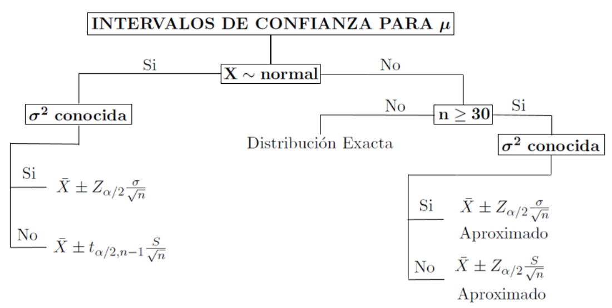

```{r setup, include=FALSE}
knitr::opts_chunk$set(echo = FALSE,fig.align = "center",warning = F,message = F,
                      dpi=300,fig.width = 7,fig.height = 6)

xaringanExtra::use_panelset()
library(BSDA)
PropCI<-function(replicas=100,n=15,p=0.5,conf.level=0.95,arcsin=F)
{
   q<-1-p
   Adkblue <- "#0080FF"
   Aorange <- "#FF4C0C"
   alpha <- 1 - conf.level
   CL <- conf.level * 100
   N<-replicas
   if (N <= 1 || n <= 1)
      stop("Número de réplicas de CIs y tamaños de muestra deben ser al menos 2")
   if (!missing(conf.level) && (length(conf.level) != 1 || !is.finite(conf.level) ||
                                conf.level <= 0 || conf.level >= 1))
      stop("'conf.level' debe estar entre 0 y 1")
   if (p<0 || p>1)
      stop("'p' debe estar entre 0 y 1")
   muestras <- rbinom(N*n,1,p)
   Mtrx <- matrix(muestras,n)
   xbar <- apply(Mtrx, 2, mean)
   if(arcsin)
   {
      ap<-asin(sqrt(p))
      arc<-asin(sqrt(xbar))
      ll <- sin(arc - qnorm(1-alpha/2)/sqrt(n))^2
      ul <- sin(arc + qnorm(1-alpha/2)/sqrt(n))^2
      fuera <- sum((ll > p) + (ul < p))
      percentage <- round((fuera/N) * 100, 2)
   }else{
      ll <- xbar - qnorm(1 - alpha/2) * sqrt((p*q)/n)
      ul <- xbar + qnorm(1 - alpha/2) * sqrt((p*q)/n)
      fuera <- sum((ll > p) + (ul < p))
      percentage <- round((fuera/N) * 100, 2)
   }

   plot(ll,type="n", ylim=c(min(ll),max(ul)),xlab="",
        ylab="",las=1)
   title(sub = bquote(paste("Nota: ",.(percentage),"% de los CI no contienen el valor de p=",
                            .(p))))
   if(arcsin)
   {
      title(main = bquote(paste(.(N)," Intervalos de confianza del ",.(CL),
                                "% para arcsin=",.(round(ap,4))," con n=",.(n))))
   }else{
      title(main = bquote(paste(.(N)," IC del ",.(CL),"% para p=",.(p)," con n=",.(n))))
   }
   if(arcsin)
   {
      for (i in 1:N) {
         low <- ll[i]
         high <- ul[i]
         if (low < p & high > p)
         {
            segments(i, low, i, high)
         }
         else if (low > p & high > p) {
            segments(i, low, i, high, col = Aorange, lwd = 3)
         }
         else {
            segments(i, low, i, high, col = Adkblue, lwd = 3)
         }
      }
   }else{
      for (i in 1:N) {
         low <- ll[i]
         high <- ul[i]
         if (low < p & high > p)
         {
            segments(i, low, i, high)
         }
         else if (low > p & high > p) {
            segments(i, low, i, high, col = Aorange, lwd = 3)
         }
         else {
            segments(i, low, i, high, col = Adkblue, lwd = 3)
         }
      }
   }
   abline(h = ifelse(arcsin,ap,p))
}
coverProp <- function(p,n,conf.level,exact=F) {
    stopifnot(is.numeric(p))
    stopifnot(length(p) == 1)
    stopifnot(0 <= p & p <= 1)
    x <- 0:n
    fpx <- dbinom(x, n, p)
    phat <- x / n
    if(!exact){
       crit.val <- qnorm((1 + conf.level) / 2)
       low <- phat - crit.val * sqrt(phat * (1 - phat) / n)
       hig <- phat + crit.val * sqrt(phat * (1 - phat) / n)
       inies <- as.numeric(low <= p & p <= hig)
       s <- sum(inies * fpx)  
    }else{
       require(PropCIs)
       low <- sapply(x, function(x) exactci(x,n,conf.level = conf.level)$conf[1])
       hig <- sapply(x, function(x) exactci(x,n,conf.level = conf.level)$conf[2])
       inies <- as.numeric(low <= p & p <= hig)
       s <- sum(inies * fpx)  
    }
    return(s)
}
NormCI<-function(n=30,replica=100,mu=0,sigma=1,conf.level=0.95,seed=NULL)
{
   if(!is.null(seed)) set.seed(seed)
   Adkblue <- "#0080FF"
   Aorange <- "#FF4C0C"
   alpha <- 1 - conf.level
   CL <- conf.level * 100
   N <- replica
   if (N <= 1 || n <= 1)
      stop("Número de réplicas de CIs y tamaños de muestra deben ser al menos 2")
   if (!missing(conf.level) && (length(conf.level) != 1 || !is.finite(conf.level) ||
                                conf.level <= 0 || conf.level >= 1))
      stop("'conf.level' debe estar entre 0 y 1")
   if (sigma <= 0)
      stop("La varianza debe ser un número positivo")

   muestras <- rnorm(N * n, mu, sigma)
   Mtrx <- matrix(muestras,n)
   xbar <- apply(Mtrx, 2, mean)
   ll <- xbar - qnorm(1 - alpha/2) * sigma/sqrt(n)
   ul <- xbar + qnorm(1 - alpha/2) * sigma/sqrt(n)
   fuera <- sum((ll > mu) + (ul < mu))
   percentage <- round((fuera/N) * 100, 2)
   plot(ll,type="n", ylim=c(floor(min(ll)),ceiling(max(ul))),xlab="",
        ylab="",las=1)
   title(sub = bquote(paste("Nota: ", .(percentage), "% de los CI no contienen el valor de ",
                            mu, "=", .(mu))))
   title(main = bquote(paste(.(N)," IC del ",.(CL),"% para N(",
                             .(mu),",",.(sigma),")"," y n=",.(n))))
   for (i in 1:N) {
      low <- ll[i]
      high <- ul[i]
      if (low < mu & high > mu) {
         segments(i, low, i, high)
      }
      else if (low > mu & high > mu) {
         segments(i, low, i, high, col = Aorange, lwd = 3)
      }
      else {
         segments(i, low, i, high, col = Adkblue, lwd = 3)
      }
   }
   abline(h = c(mu,mu+sigma,mu-sigma),lty=c(1,3,3))
}
NormCover<-function(n=30,mu=0,sigma=1,conf.level=0.95,seed=NULL)
{
   require(ggplot2)
   require(gridExtra)
   require(scales)
   if(!is.null(seed)) set.seed(seed)
   Nsim<-12800
   alpha<-1-conf.level
   CL <- conf.level * 100
   x<-50
   for(i in 1:9) ifelse(x[i]<Nsim,x[i+1]<-x[i]*2,break)
   if (n <= 1)
      stop("Número de tamaños de muestra deben ser al menos 2")
   if (!missing(conf.level) && (length(conf.level) != 1 || !is.finite(conf.level) ||
                                conf.level <= 0 || conf.level >= 1))
      stop("'conf.level' debe estar entre 0 y 1")
   if (sigma <= 0)
      stop("La varianza debe ser un número positivo")

   #cover<-NULL
   muestras <- rnorm(Nsim * n, mu, sigma)
   Mtrx <- matrix(muestras,n)
   xbar <- apply(Mtrx, 2, mean)
   ll <- xbar - qnorm(1 - alpha/2) * sigma/sqrt(n)
   ul <- xbar + qnorm(1 - alpha/2) * sigma/sqrt(n)
   fuera<-unlist(lapply(1:Nsim,function(x) sum((ll[1:x] > mu) + (ul[1:x] < mu))))
   cover<-c(round((1-fuera/1:Nsim),6))
   titulo<-bquote(paste("IC al ",.(conf.level*100),"% de Confianza N(",
                        .(mu),",",.(sigma),") con n=",.(n)))
   qplot(1:Nsim,cover[1:Nsim],geom = "line")+
      scale_x_sqrt("Número de Simulaciones",label=comma,breaks=x)+
      scale_y_continuous("Proporción de Intervalos\nque contienen le verdadero valor",label=percent)+
      geom_hline(yintercept = conf.level,colour=2)+labs(title=titulo)+theme_bw()+
      theme(axis.text.x=element_text(angle = 45,hjust=1,size=7))
   
}
NormCI<-function(n=30,replica=100,mu=0,sigma=1,conf.level=0.95,seed=NULL)
{
   if(!is.null(seed)) set.seed(seed)
   Adkblue <- "#0080FF"
   Aorange <- "#FF4C0C"
   alpha <- 1 - conf.level
   CL <- conf.level * 100
   N <- replica
   if (N <= 1 || n <= 1)
      stop("Número de réplicas de CIs y tamaños de muestra deben ser al menos 2")
   if (!missing(conf.level) && (length(conf.level) != 1 || !is.finite(conf.level) ||
                                conf.level <= 0 || conf.level >= 1))
      stop("'conf.level' debe estar entre 0 y 1")
   if (sigma <= 0)
      stop("La varianza debe ser un número positivo")

   muestras <- rnorm(N * n, mu, sigma)
   Mtrx <- matrix(muestras,n)
   xbar <- apply(Mtrx, 2, mean)
   ll <- xbar - qnorm(1 - alpha/2) * sigma/sqrt(n)
   ul <- xbar + qnorm(1 - alpha/2) * sigma/sqrt(n)
   fuera <- sum((ll > mu) + (ul < mu))
   percentage <- round((fuera/N) * 100, 2)
   plot(ll,type="n", ylim=c(floor(min(ll)),ceiling(max(ul))),xlab="",
        ylab="",las=1)
   title(sub = bquote(paste("Nota: ", .(percentage), "% de los CI no contienen el valor de ",
                            mu, "=", .(mu))))
   title(main = bquote(paste(.(N)," IC del ",.(CL),"% para N(",
                             .(mu),",",.(sigma),")"," y n=",.(n))))
   for (i in 1:N) {
      low <- ll[i]
      high <- ul[i]
      if (low < mu & high > mu) {
         segments(i, low, i, high)
      }
      else if (low > mu & high > mu) {
         segments(i, low, i, high, col = Aorange, lwd = 3)
      }
      else {
         segments(i, low, i, high, col = Adkblue, lwd = 3)
      }
   }
   abline(h = c(mu,mu+sigma,mu-sigma),lty=c(1,3,3))
}
NormCover<-function(n=30,mu=0,sigma=1,conf.level=0.95,seed=NULL)
{
   require(ggplot2)
   require(gridExtra)
   require(scales)
   if(!is.null(seed)) set.seed(seed)
   Nsim<-12800
   alpha<-1-conf.level
   CL <- conf.level * 100
   x<-50
   for(i in 1:9) ifelse(x[i]<Nsim,x[i+1]<-x[i]*2,break)
   if (n <= 1)
      stop("Número de tamaños de muestra deben ser al menos 2")
   if (!missing(conf.level) && (length(conf.level) != 1 || !is.finite(conf.level) ||
                                conf.level <= 0 || conf.level >= 1))
      stop("'conf.level' debe estar entre 0 y 1")
   if (sigma <= 0)
      stop("La varianza debe ser un número positivo")

   #cover<-NULL
   muestras <- rnorm(Nsim * n, mu, sigma)
   Mtrx <- matrix(muestras,n)
   xbar <- apply(Mtrx, 2, mean)
   ll <- xbar - qnorm(1 - alpha/2) * sigma/sqrt(n)
   ul <- xbar + qnorm(1 - alpha/2) * sigma/sqrt(n)
   fuera<-unlist(lapply(1:Nsim,function(x) sum((ll[1:x] > mu) + (ul[1:x] < mu))))
   cover<-c(round((1-fuera/1:Nsim),6))
   titulo<-bquote(paste("IC al ",.(conf.level*100),"% de Confianza N(",
                        .(mu),",",.(sigma),") con n=",.(n)))
   qplot(1:Nsim,cover[1:Nsim],geom = "line")+
      scale_x_sqrt("Número de Simulaciones",label=comma,breaks=x)+
      scale_y_continuous("Proporción de Intervalos\nque contienen le verdadero valor",label=percent)+
      geom_hline(yintercept = conf.level,colour=2)+labs(title=titulo)+theme_bw()+
      theme(axis.text.x=element_text(angle = 45,hjust=1,size=7))
   
}
```

# Introducción

Hasta ahora los estimadores estudiados son puntuales, es decir, exhiben un solo valor como estimación del parámetro de interés. Pero en muchos casos esto no es suficiente. A veces se requiere de un *rango de posibles valores* para el parámetro de interés, es decir, un intervalo real donde se cree estará el valor del parámetro con una alta confianza.

--

Sea $\theta$ un parámetro de interés y $\hat{\theta}$ un estimador puntual de $\theta$ en un intervalo real de la forma $(L_\hat\theta , U_\hat\theta)$ talque $(L_\hat\theta < \theta < U_\hat\theta)$, donde $L$ y $U$ dependen de y de la distribución de $\hat\theta$.

--

Cada muestra aleatoria proporcionará un valor diferente para $\hat\theta$ y por lo tanto valores diferentes para $L$ y $U$. Así, los extremos del intervalo en cuestión se convierten en variables aleatorias. El intervalo $(L , U)$ es llamado Intervalo Aleatorio. Usando $\hat\theta$ y su distribución es posible determinar $L$ y $U$ tales que:

$$P(L_\hat\theta < θ < U_\hat\theta) = 1 − \alpha,\quad \alpha \in (0,1)$$

--

Para una muestra particular se obtiene el intervalo $(l , u)$ donde se espera esté el verdadero
valor de $\theta$, Este intervalo será llamado un **Intervalo de Confianza al $100(1 − \alpha)\%$** para $\alpha$, además $l$ y $u$ son llamados *Límites de Confianza*.

---
# Intervalos de confianza para la proporción

Sea $X$ una variable aleatoria tal que $X\sim bin(n,p)$. El Teorema Central del Límite garantiza que:

$$\cfrac{X-np}{\sqrt{np(1-p)}} \stackrel{aprox}{\underset{n \rightarrow \infty}{\widetilde{\quad\quad}}} N(0,1)$$

--

Un estimador insesgado para $p$ es $\bar{p}=X/n$, entonces:

$$\frac{X-np}{\sqrt{np(1-p)}}=\frac{n[X/n-p]}{\sqrt{np(1-p)}}=\frac{X/n-p}{\sqrt{p(1-p)/n}}\stackrel{aprox}{\underset{n \rightarrow \infty}{\widetilde{\quad\quad}}} N(0,1)$$

--

Entonces un intervalo de confianza para $\hat{p}$ es de la forma:

$$\hat{p}\, \pm\, Z_{1-\alpha/2}\sqrt{\frac{\hat{p}(1-\hat{p})}{n}}$$

Lo que representa:

$$\left(\hat{p}-Z_{1-\alpha/2}\sqrt{\frac{\hat{p}(1-\hat{p})}{n}}\,\,;\,\, \hat{p}+Z_{1-\alpha/2}\sqrt{\frac{\hat{p}(1-\hat{p})}{n}} \right)$$

---
# Intervalos de confianza para la proporción
## Ejemplo

En una muestra de 85 recién nacidos, 10 presentaron riesgo de desnutrición. ¿Cuál es la proporción real de recién nacidos con riesgo de desnutrición con una confianza del 95%?

Sea $X$ el número de recién nacidos con riesgo de desnutrición, entonces $X\sim bin(85,p)$. Del enunciado se tiene que: $\hat{p}=x/85=10/85=0.1176471$

Un Intervalo de Confianza (IC) aproximado al 95% para $p$ es de la forma:

$$\frac{10}{85}\,\pm\,1.96\sqrt{\frac{(10/85)(75/85)}{85}}\,\Rightarrow\,0.1176\,\pm\,0.0685\,\Rightarrow(0.0492;0.1861)$$

En conclusión, con una confianza del 95% la proporción de recién nacidos que presentan riesgos de desnutrición se estiman entre (0.0492;0.1861), o (4.92%;18.61%).

---
# Intervalos de confianza para la proporción

El siguiente ejercicio de simulación muestra el concepto de la probabilidad de los intervalos de confianza y la influencia de los tamaños de muestra

```{r,dpi=90,fig.width=9,fig.height=5}
par(mfrow=c(2,2))
PropCI(replicas=100,n=30,p=0.2,conf.level=0.95,arcsin=F)
PropCI(replicas=100,n=30,p=0.4,conf.level=0.95,arcsin=F)
PropCI(replicas=100,n=30,p=0.6,conf.level=0.95,arcsin=F)
PropCI(replicas=100,n=30,p=0.8,conf.level=0.95,arcsin=F)
```

---
# Intervalos de confianza para la proporción
Cuando aumenta el tamaño de muestra los intervalos tienen menor amplitud, lo cual es lo deseado, ya que la amplitud es una medida de precisión.

```{r,dpi=90,fig.width=9,fig.height=5}
par(mfrow=c(2,2))
PropCI(replicas=100,n=100,p=0.2,conf.level=0.95,arcsin=F)
PropCI(replicas=100,n=100,p=0.4,conf.level=0.95,arcsin=F)
PropCI(replicas=100,n=100,p=0.6,conf.level=0.95,arcsin=F)
PropCI(replicas=100,n=100,p=0.8,conf.level=0.95,arcsin=F)

```

---
# Intervalos de confianza para la proporción

En términos de la cobertura del intervalo, se espera que para cualquier valor estimado de $p$ la probabilidad de cobertura sea cercana al nivel de confianza $100(1-\alpha)\%$.

```{r,dpi=90,fig.height=5.5,fig.width=7}
p <- seq(0.001, 0.999, 0.001)
par(mfrow=c(2,2))
plot(p, sapply(p,coverProp,15,.95),type="l",ylab="Probabilidad Cobertura",
     main="Cobertura del IC al 95% y n=15",xlab="Proporción estimada",las=1,
     ylim=c(0,1))
abline(h = .95, lty = 2,col=2)

plot(p, sapply(p,coverProp,30,.95),type="l",ylab="Probabilidad Cobertura",
     main="Cobertura del IC al 95% y n=30",xlab="Proporción estimada",las=1,
     ylim=c(0,1))
abline(h = .95, lty = 2,col=2)

plot(p, sapply(p,coverProp,50,.95),type="l",ylab="Probabilidad Cobertura",
     main="Cobertura del IC al 90% y n=50",xlab="Proporción estimada",las=1,
     ylim=c(0,1))
abline(h = .95, lty = 2,col=2)

plot(p, sapply(p,coverProp,100,.95),type="l",ylab="Probabilidad Cobertura",
     main="Cobertura del IC al 95% y n=100",xlab="Proporción estimada",las=1,
     ylim=c(0,1))
abline(h = .95, lty = 2,col=2)
```

---
# Intervalos de confianza para la proporción

Este es el inconveniente que presenta esta propuesta de intervalo para la proporción llamada *método Wald*. En la literatura existe muchas propuestas para intervalos de confianza para la proporción, de hecho, sigue siendo un caso de estudio por varios estadísticos.

En 1934 Clopper y Pearson presentaron una propuesta para los intervalos de confianza basados en la *Distribución Beta* que, a su vez, está relacionada con la *Distribución F*, sin embargo, lo complejo de sus cálculos no le dio el protagonismo para la época. Ahora este intervalo se ha puesto a prueba gracias a los avances computacionales haciendo fácil el cálculo y entregando mejores resultados en términos de probabilidad de cobertura.

$$B(\alpha/2;\,x,\,n-x+1)<\hat{p}<B(1-\alpha/2;\,x+1,\,n-x)$$

O parametrizada con la Distribución F

$${\displaystyle \left(1+{\frac {n-x+1}{x\,F\!\left[{\frac {\alpha }{2}};2x,2(n-x+1)\right]}}\right)^{-1}<\hat{p} <\left(1+{\frac {n-x}{(x+1)\,\,F\!\left[1-{\frac {\alpha }{2}};2(x+1),2(n-x)\right]}}\right)^{-1}}$$

---
# Intervalos de confianza para la proporción

En `R` es fácil hacer este cálculo, el primer método es hacer la fórmula con `qbeta` y otra forma es con el paquete `PropCIs`

```{r,eval=FALSE,echo=TRUE}
install.packages("PropCIs")
```

```{r,echo=TRUE}
# Para el ejercicio del riesgo de desnutrición
qbeta(0.05/2,shape1 = 10,shape2 = 85-10+1) #Límite inferior
qbeta(1-0.05/2,shape1 = 10+1,shape2 = 85-10) #Límite superior
require(PropCIs)
exactci(x = 10,n = 85,conf.level = 0.95)$conf.int
```

---
# Intervalos de confianza para la proporción

```{r,dpi=90,fig.height=6.5,fig.width=9}
p <- seq(0.001, 0.999, 0.001)
par(mfrow=c(2,2))
plot(p, sapply(p,coverProp,15,.95,T),type="l",ylab="Probabilidad Cobertura",
     main="Cobertura del IC al 95% y n=15\nClopper-Pearson",xlab="Proporción estimada",las=1,
     ylim=c(0,1))
abline(h = .95, lty = 2,col=2)

plot(p, sapply(p,coverProp,30,.95,T),type="l",ylab="Probabilidad Cobertura",
     main="Cobertura del IC al 95% y n=30\nClopper-Pearson",xlab="Proporción estimada",las=1,
     ylim=c(0,1))
abline(h = .95, lty = 2,col=2)

plot(p, sapply(p,coverProp,50,.95,T),type="l",ylab="Probabilidad Cobertura",
     main="Cobertura del IC al 95% y n=50\nClopper-Pearson",xlab="Proporción estimada",las=1,
     ylim=c(0,1))
abline(h = .95, lty = 2,col=2)

plot(p, sapply(p,coverProp,100,.95,T),type="l",ylab="Probabilidad Cobertura",
     main="Cobertura del IC al 95% y n=100\nClopper-Pearson",xlab="Proporción estimada",las=1,
     ylim=c(0,1))
abline(h = .95, lty = 2,col=2)
```

---
# Intervalos de confianza para la proporción
## Ejercicios

.panelset[
.panel[.panel-name[Ejercicio 1]
La RedPaPAz realizó una encuesta a los hogares más vulnerables y que no entienden el etiquetado regular de alimentos en la ciudad de Medellín. Esta encuesta servirá como guía para plantear la política pública para el cambio de las etiquetas de información nutricional, se encontró que 472 hogares de 595 encuestados adquieren productos ultraporcesados. Con un nivel de confianza del 95% ¿Cuál es la verdadera proporción de hogares que adquieren productos ultraporcesados? ¿Qué significa este resultado?
]
.panel[.panel-name[Ejercicio 2]
Metro Salud en conjunto con la Universidad de Antioquia realizaron un estudio relacionado con el incremento de peso en los niños y niñas menores de 12 años. Se recolectó una muestra de 800 niños de los cuales el 57% fueron niñas, los resultados arrojaron que 63 niñas se clasifican en obesidad. Con un nivel de confianza del 97% ¿Cuál es la verdadera proporción de niñas en obesidad?
]
.panel[.panel-name[Ejercicio 3]
Gracias al impacto de las redes sociales y la desinformación de *influencers*, que se declaran expertos en nutrición, calidad de vida y salud, se piensa que la cantidad de bebés que no reciben leche materna ha disminuído significativamente, principalmente en los estratos Altos. Se sabe que la prevalencia de lactancia materna en esta población hace 5 años es del 75%. Neonatólogos del San Vicente realizaron una investigación en 254 bebés, de los cuales 171 reciben lactancia materna. Con un nivel de confianza del 95% ¿Cuál es la verdadera proporción de bebes que reciben leche materna? ¿Este valor disminuyó con respecto al quinquenio pasado?
]
.panel[.panel-name[Ejercicio 4]
La medidas estatales tomadas durante la pandemia del COVID-19 se han perdido empleos en el país. El DANE realizó un estudio en todo el país para determinar el nuevo porcentaje de desempleo, se realizó una encuesta 1876 personas de las cuales 259 manifestaron estar desempleadas. Con un nivel de confianza del 90% ¿Cuál es la verdadera proporción de desempleados en Colombia? Si se sabe que antes de la pandemia, el índice de desempleo era del 10.2% ¿Aumentó significativamente la cifra de desempleo?
]
]

---
class: inverse, center, middle

# Intervalos de confianza para la media

--

## La estimación del parámetro $\mu$ a través de intervalos de confianza, dependerá de dos situaciones.

--

### 1. Si la muestra aleatoria es de tamaño relativamente grande y no necesariamente provenga de una distribución normal.
### 2. Si la muestra aleatoria proviene de una distribución normal.

---
# Intervalos de confianza para la media
## IC para poblaciones no normales

Sea $X_1,\dots,X_n$ una muestra aleatoria de una población con media desconocida y **varianza conocida** $\mu$. Un intervalo de confianza para $\mu$ con muestras grnades al $100(1-\alpha)\%$ está dado por:

$$\bar{X}\,\pm\,Z_{1-\alpha/2}\frac{\sigma}{\sqrt{n}}$$
--

### Ejemplo

Una nutricionista de una clínica es la encargada de los planes de ganancia de peso en embarazadas. De acuerdo a los parámetros se sabe que la variación de la ganancia de peso al final de la gestación es de $4\,kg$. Se escogen al azar $45$ embarazadas adultas con IMC normal y se registra sus ganancias de peso al final de la gestación y la ganancia promedio resultó en $14.5\,kg$. Calcule el I.C. al $95\%$ para la ganancia de peso media real de estas embarazadas.

---
# IC para poblaciones no normales
### Ejemplo

Se tiene que $X_1,\dots,X_{45}$ es una muestra aleatoria que representa las ganancias de peso de las embarazadas de 45 mujeres, además de la muestra se obtiene que $\bar{X}=14.5\,\text{kg}$

Un IC al 95% para $\mu$ está dado por:

$$14.5\,\pm\,Z_{0.975}\frac{4}{\sqrt{45}} \,\Rightarrow\, (13.3313;\,15.6687) $$

<hr>

En el caso de que en la muestra aleatoria no se tenga información de $\sigma$, es decir, que tiene **varianza desconocida** entonces se puede reemplazar $\sigma^2$ por $S^2$ siempre y cuando se tenga *tamaños de muestra grandes* tal que:

$$\bar{X}\,\pm\,Z_{1-\alpha/2}\frac{S}{\sqrt{n}}$$

<hr>

---
# IC para poblaciones no normales

El siguiente ejercicio de simulación muestra el concepto de la probabilidad de los intervalos de confianza y la influencia de los tamaños de muestra

```{r,dpi=90,fig.width=9,fig.height=5.5}
par(mfrow=c(2,2))
NormCI(n=50,replica=100,mu=0,sigma=1,conf.level=0.95,seed=12)
NormCI(n=80,replica=100,mu=0,sigma=1,conf.level=0.95,seed=12)
NormCI(n=100,replica=100,mu=0,sigma=1,conf.level=0.95,seed=12)
NormCI(n=1000,replica=100,mu=0,sigma=1,conf.level=0.95,seed=12)
```

---
# IC para poblaciones no normales

En términos de la cobertura del intervalo, se espera que para cualquier valor estimado de $\mu$ la probabilidad de cobertura sea cercana al nivel de confianza $100(1-\alpha)\%$.

```{r,dpi=90,fig.width=9,fig.height=5.5}
a<-NormCover(n=50,mu=0,sigma=1,conf.level=0.95,seed=12)
b<-NormCover(n=80,mu=0,sigma=1,conf.level=0.95,seed=12)
c<-NormCover(n=100,mu=0,sigma=1,conf.level=0.95,seed=12)
d<-NormCover(n=1000,mu=0,sigma=1,conf.level=0.95,seed=12)
grid.arrange(a,b,c,d)
```

---
# IC para poblaciones no normales
En `R` existe un paquete para calcular el intervalo de confianza basado en los resultados de una muestra. Es necesario instalar el paquete `BSDA` y la función de interés es `zsum.test`.

```{r,echo=TRUE,eval=FALSE}
install.packages("BSDA")
library(BSDA)
```


.pull-left[
```{r,echo=TRUE}
# Para el ejemplo de la ganancia de peso
zsum.test(mean.x = 14.5,sigma.x = 4,
    n.x = 45,conf.level = 0.95)
```
]
.pull-right[
```{r,echo=TRUE}
# Extraer solo el intervalo
zsum.test(mean.x = 14.5,sigma.x = 4,
    n.x = 45,conf.level = 0.95)$conf.int
```
]

---
# IC para poblaciones normales

Sea $X_1,\dots,X_n$ una muestra aleatoria de una población normal $N(\mu,\sigma^2)$ con media desconocida y **varianza conocida**. Un intervalo de confianza para $\mu$ al $100(1-\alpha)\%$ está dado por:

$$\bar{X}\,\pm\,Z_{1-\alpha/2}\frac{\sigma}{\sqrt{n}}$$

## Ejemplo

Una planta de procesamiento de alimentos preparan una nueva línea de pechugas de pollo. Se sabe que la energía aportada por las pechugas de pollo tiene una distribución *aproximadamente normal*. De acuerdo a la investigación de los nutricionistas de la planta se ha encontrado que la dispersión en la energía es aproximadamente de $0.05\,kcal$. Se escogen al azar $15$ pechucgas y se estima su aporte energético. La energía promedio resultó en $74.04\,kcal$.

1. Calcule un Intervalo de Confianza al $95\%$ para la energía media real de las pechugas.

2. Si se desea que la precisión del intervalo sea inferior a $0.01$, con una confianza del $95\%$. ¿Cuál debe ser el mínimo tamaño de muestra para cumplir éste objetivo?

---
# Ejemplo

.panelset[
.panel[.panel-name[Parte 1]
Para la primera parte se tiene que $X_1,\dots,X_{15}$ es una muestra aleatoria que representa la energía de las 15 pechugas de pollo, cada $X_i\sim N(\mu,0.05^2)$, además de la muestra se obtiene que $\bar{X}=74.04\,\text{kcal}$

Un IC al 95% para $\mu$ está dado por:

$$74.04\,\pm\,Z_{0.975}\frac{0.05}{\sqrt{15}} \,\Rightarrow\, (74.0147;\,74.0653) $$
]
.panel[.panel-name[Parte 2]
La precisión de un intervalo está dado por $max\{\theta-L,U-\theta\}$, en este caso tenemos un intervalo simétrico entonces la magnitud está dada por el término del error $Z_{0.975}(0.05/\sqrt{n})$, entonces:

$$\begin{align*}
\cfrac{1.96\times 0.05}{\sqrt{n}}&<0.01\\\\
\cfrac{1.96\times0.05}{0.01}&<\sqrt{n}\\\\
n&>96.03647 \approx 97
\end{align*}$$
]
.panel[.panel-name[en `R`]
```{r,echo=TRUE}
# Para el ejemplo de las pechugas de pollo
zsum.test(mean.x = 74.04,sigma.x = 0.05,
    n.x = 15,conf.level = 0.95)$conf.int
zsum.test(mean.x = 74.04,sigma.x = 0.05,
    n.x = 97,conf.level = 0.95)$conf.int
diff(zsum.test(mean.x = 74.04,sigma.x = 0.05,
    n.x = 97,conf.level = 0.95)$conf.int)/2
```
]
]


---
# IC para poblaciones normales

Suponga que $X_1,\dots,X_n$ es una muestra aleatoria de una $N(\mu,\sigma^2)$, si la **varianza es desconocida** la distribución de $\bar{X}$ estandarizada **NO** es normal. Si reemplazamos $\sigma$ por $S$, el estadístico resultante es:

$$T=\cfrac{\bar{X}-\mu}{\frac{S}{\sqrt{n}}} \sim t_{(n-1)}$$

La distribución *t-de Student* es una distribución de probabilidad que surge del problema de estimar la media de una población normalmente distribuida cuando el tamaño de la muestra es pequeño. Su *f.d.p* está dada por:

$$f(x) = \frac{\Gamma\left(\dfrac{\nu + 1}{2}\right)}{\Gamma\left(\dfrac{\nu}{2}\right)\sqrt{\pi\nu}\sigma} \left[1+\frac{1}{\nu}\left(\frac{x-\mu}{\sigma}\right)^2\right]^{-\tfrac{\nu+1}{2}}$$

---
# Distribución *t*-student

```{r t,fig.height=7,fig.width=14,dpi=80}
par(mfrow=c(1,2))
curve(dnorm(x),xlim=c(-5,5),main='Distribución t-Student',ylab='Densidad',lwd=2)
curve(dt(x,df = 1),col=2,add=T,lwd=2)
curve(dt(x,df = 2),col=3,add=T,lwd=2)
curve(dt(x,df = 5),col=4,add=T,lwd=2)
curve(dt(x,df = 30),col=6,add=T,lwd=2)

legend('topleft',lty=1,col=c(1:4,6),lwd=2,cex=0.9,
       legend=c('Normal (0,1)','Cauchy','t(v=2)','t(v=5)','t(v=30)'))

curve(dnorm(x),xlim=c(-4,-2),las=1,
      main='Distribución t-Student\n (ZOOM)',ylab='Densidad',lwd=2)
curve(dt(x,df = 1),col=2,add=T,lwd=2)
curve(dt(x,df = 2),col=3,add=T,lwd=2)
curve(dt(x,df = 5),col=4,add=T,lwd=2)
curve(dt(x,df = 30),col=6,add=T,lwd=2)
legend('topleft',lty=1,col=c(1:4,6),lwd=2,cex=0.9,
       legend=c('Normal (0,1)','Cauchy','t(v=2)','t(v=5)','t(v=30)'))
```

---
# Distribución *t*-student

En la gráfica anterior podemos apreciar la relación que existe entre las distribuciones *Cauchy*, *t-de Student* y la *Normal Estandarizada*. Se observa que la distribución *t-de Student* con $v = 1$ grado de libertad es una *distribución Cauchy* la cual es la más achatada y presenta las colas mas pesadas en comparación las demás distribuciones presentes en la gráfica. Además se puede evidenciar que a medida que aumentan los grados de libertad en la *distribución t*, ésta tiende a la *Normal*.

```{r,dpi=90,fig.width=8,fig.height=5}
ns <- seq(6,150,by=0.1)-1
plot(ns,qt(0.95,df=ns),type="l",las=1,ylim=c(1.6,2),lwd=2,axes=F,
     main="Cuantiles de la t-student en diferentes grados de libertad\ncomparado con el cuantil de la normal al 95%",xlab="Grados de Libertad (n-1)",ylab="Valor del Cuantil (t)")
axis(1,at=c(5,10,15,20,30,50,75,100,150),cex.axis=0.7,srt=45)
axis(2,cex.axis=0.7,las=1)
box()
abline(h=seq(1.9,2.6,by=0.1),lty=3,col="grey80")
abline(v=c(5,10,15,20,30,50,75,100,150),lty=3,col="grey80")
abline(h=qnorm(0.95),col=2,lty=2)
```

---
# IC para poblaciones normales

Realizando un proceso similar al caso de muestras aleatorias con media desconocida, se puede encontrar que un IC al $100(1 − \alpha)\%$ para $\mu$ es de la forma:

$$\bar{X} \pm t_{(1-\alpha/2,\,n-1)}\frac{S}{\sqrt{n}}$$

<br>
<center>
<button>
<b>
<p style="font-size: 18pt">
<a href="./Tabla_t.pdf" target="_blank">Tabla Distribución <i>t-student</i></a>
</p>
</b>
</button>
</center>

---
# IC para poblaciones normales
## Ejemplo

De acuerdo a estudios sobre la fuerza prensil manual en adultos mayores que la fuerza de prensión se distribuye normalmente. Se toma una muestra aleatoria de 16 adultos mayores y se obtiene un fuerza de prensión promedio para la mano débil de $15.63\,kgf$ con una desviación estándar de $5.18\,kgf$. Estime la fuerza prensil manual débil de los adultos mayores usando un IC al $97\%$.

--

Sea $X_1,\dots,X_{16}$ una muestra aleatoria que representa la fuerza prensil de la mano débil de los adultos mayores. Suponga que $E[X_i]=\mu$ y $Var[X_i]=\sigma^2$ ambas desconocidas, además del enunciado se tiene que $\bar{x}=15.63$, $S=5.18$ y $n=16$ entonces un IC al 97% para $\mu$ está dado por:

$$\begin{align*}
\bar{X}\,&\pm\,t_{0.985,n-1}\frac{S}{\sqrt{n}} \Rightarrow 15.63\,\pm\,t_{0.985,15}\frac{5.18}{\sqrt{16}}\\\\
15.63\,&\pm\,2.397005\frac{5.18}{\sqrt{16}} \Rightarrow 15.63\,\pm\,3.104122
\end{align*}$$

Se espera que la fuerza prensil media real de la mano débil de los adultos mayores esté entre 12.53 kgf y 18.73 kgf con una confianza del 97%.

---
# IC para poblaciones normales

Por lo general en `R`, la forma de calcular los intervalos de confianza es con un vector de datos o una base de datos para utilizar la función `t.test` del básico de `R`. No obstante, en el paquete `BSDA` existe una función para calcular el intervalo de confianza basado en los resultados de una muestra, la función de interés es `tsum.test`.

```{r,echo=TRUE}
library(BSDA)
```


.pull-left[
```{r,echo=TRUE}
# Para el ejemplo de la resistencia
tsum.test(mean.x = 15.63,s.x = 5.18,
      n.x = 16,conf.level = 0.97)
```
]
.pull-right[
```{r,echo=TRUE}
# Extraer únicamente el intervalo
tsum.test(mean.x = 15.63,s.x = 5.18,
      n.x = 16,conf.level = 0.97)$conf.int
```
]

---
# Resumen

<center>

</center>

---
# Ejercicios

.panelset[
.panel[.panel-name[Ejercicio 1]
Se desea estimar el contenido promedio (en gramos) de las cajas de cierto tipo de cereal. Se seleccionan aleatoriamente 64 de estas cajas y se miden sus contenidos. De esta muestra se obtiene un contenido promedio de 512 gr, con una desviación estándar de 8.1 gr. ¿Cuál es la longitud del intervalo de confianza simétrico del 98% para el contenido promedio de este tipo de cajas de cereal?
]
.panel[.panel-name[Ejercicio 2]
La distribución del llenado de una máquina embotelladora es normal $N(\mu,\sigma^2)$, ambas desconocidas. Se toman 20 botellas al azar y se obtiene un promedio de 377.6 ml, con una desviación estándar de 8.5 ml. La máquina está programada para llenar en promedio 375 ml por botella. Con una confianza del 95% ¿La máquina llena más de lo requerido?
]
.panel[.panel-name[Ejercicio 3]
Las estaturas de las personas mayores de 12 años en cierta comunidad, tienen una distribución continua con media $\mu$ y varianza de 25 cm^2^. Si se desea un límite en el error de estimación inferior a 1.5 cm, con una probabilidad aproximada del 95%, ¿Cuál es el tamaño de muestra mínimo requerido?
]
.panel[.panel-name[Ejercicio 4]
La cantidad de Histamina contenida en el veneno del aguijon de cierto tipo de abeja, es una variable aleatoria $N(\mu,\sigma^2)$, ambas desconocidas. Se seleccionaron 16 abejas de este tipo y a cada una se le calculó el contenido de histamina (en nanogramos) en el veneno de su aguijon. De esta muestra se obtuvo un promedio de 753.21 ng y una desviacíón estándar de 189.65 ng. Calcule Un intervalo de confianza al 95% para el contenido promedio de Histamina en este tipo de abejas.
]
.panel[.panel-name[Ejercicio 5]
Se tomó una muestra aleatoria de 100 colegios oficiales de una región y se calculó el promedio mensual de inasistencias de los profesores en los últimos años. Los datos se resumieron así: promedio mensual de faltas por colegio 25.31 días, error estándar estimado de dicha media muestral ($\hat\sigma_\bar{X}$), 0.5 días. Calcule un intervalo de confianza aproximado del 98% para el promedio mensual de inasistencias.
]
]
