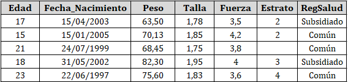

```{r setup, include=FALSE}
knitr::opts_chunk$set(echo = FALSE,fig.align = "center",warning = F,message = F,
                      dpi=300,fig.width = 7,fig.height = 6,cache=TRUE)

SelPlot <- function(sel=NULL,seed=NULL){
  if(!is.null(seed)) {set.seed(seed)}
  # x1 <- runif(1000,-1,1)
  # x2 <- runif(1000,-1,1)
  x1 <- sample(1000,1000)
  x2 <- sample(1000,1000)
  y <- runif(1000,5,12)
  par(mar=c(2,2,2,2))
  plot(x1,x2,axes = F,ylab="",xlab="",ylim = c(1,1100))
  symbols(x1,x2,circles = y,inches = F, bg="grey50",add=T)
  text(50,10800,labels = "N = 1000",cex=1.5)
  if(!is.null(sel)){
    aux <- sample(length(x1),sel)
    symbols(x1[aux],x2[aux],circles = y[aux],inches = F,bg = 2,add=T)
  }
}

Precision <- function(type="A"){
  set.seed(1234)
  if(type=="A"){
    x <- runif(20,-0.2,0.2)
    y <- runif(20,-0.2,0.2)
  }else if(type=="B"){
    x <- runif(20,-0.4,-0)
    y <- runif(20,-0.4,-0)
  }else if(type=="C"){
    x <- runif(20,-0.4,0.4)
    y <- runif(20,-0.4,0.4)
  }else if(type=="D"){
    x <- runif(20,-0.7,0.7)
    y <- runif(20,-1,0.3)
  }
  par(mar=c(0,0,0,0))
  plot(x,y,asp=1,xlim = c(-1,1),ylim = c(-1,1),ylab="",xlab="",axes = F,
       pch=21,bg="lightblue",cex=1.5)
  plotrix::draw.circle(0,0,1,nv=1000,border = NULL,col=NA,lty=1,lwd=1)
  segments(-1,0,1,0)
  segments(0,-1,0,1)
}

varplot <- function(n,x,sd){
  e1 <- rnorm(n,x,sd)
  e2 <- rnorm(n,x,sd)
  e3 <- rnorm(n,x,sd)
  e4 <- rnorm(n,x,sd)
  
  s1 <- sd(e1);s2 <- sd(e2);
  s3 <- sd(e3);s4 <- sd(e4);
  m1 <- mean(e1);m2 <- mean(e2);
  m3 <- mean(e3);m4 <- mean(e4);
  
  par(mar=c(3,5,3,2))
  plot(x=x,y=3,axes = F,type="n",ylab="",xlab="",
       ylim=c(0,4.5),xlim=c(x-4*sd,x+4*sd),
       main=paste("Comportamiento de las",n,"muestras\nMedia =",x,"Desviación =",sd))
  points(x=e1,y=rep(0.5,n),pch=20)
  points(x=e2,y=rep(1.5,n),pch=20)
  points(x=e3,y=rep(2.5,n),pch=20)
  points(x=e4,y=rep(3.5,n),pch=20)
  
  points(x=m1,y=1,pch=19,col=2,cex=1.5)
  points(x=m2,y=2,pch=19,col=2,cex=1.5)
  points(x=m3,y=3,pch=19,col=2,cex=1.5)
  points(x=m4,y=4,pch=19,col=2,cex=1.5)
  
  arrows(x0 = m1-s1,y0 = 1,x1 = m1+s1,y1 = 1,angle = 90,code=3,length = 0.1,col=2,lwd=2)
  arrows(x0 = m2-s2,y0 = 2,x1 = m2+s2,y1 = 2,angle = 90,code=3,length = 0.1,col=2,lwd=2)
  arrows(x0 = m3-s3,y0 = 3,x1 = m3+s3,y1 = 3,angle = 90,code=3,length = 0.1,col=2,lwd=2)
  arrows(x0 = m4-s4,y0 = 4,x1 = m4+s4,y1 = 4,angle = 90,code=3,length = 0.1,col=2,lwd=2)
  
  box()
  
  axis(1,cex.axis=0.8)
  axis(2,at=c(0.5,1.5,2.5,3.5),las=1,cex.axis=0.8,
       labels = paste("Muestra",1:4))
}
```

<hr>

## Introducción

La Estadística es la ciencia que se encarga de observar, agrupar, clasificar y organizar datos para su posterior interpretación, análisis y toma de decisiones. El Universo está compuesto de infinidad de datos cuantitativos y cualitativos, desde las diferentes disciplinas pueden interpretarse con el fin de comprender profundamente todos los fenómenos, pero la estadística puede abarcar, sin atreverse a reemplazar, las diferentes esferas del conocimiento para darle soporte a los descubrimientos.

Los métodos estadísticos están enfocados para tratar con la complejidad de la realidad, no obstante es importante que aquel que aplique la estadística comprenda profundamente, tanto los fenómenos a estudiar en su movimiento, como las herramientas propicias y su correcta interpretación.

>En la actualidad, se ha tratado la estadística como conjunto de métodos complementarios a la disciplina original del investigador, llevando a que éstos menosprecien la seriedad que amerita la comprensión de todo su universo; a su vez la estadística ha sido empleada con fines pseudocientíficos para justificar comportamientos sociales, leyes jurídicas y económicas o publicación de fármacos ineficientes o peligrosos. 

## Generalidad y Oportunidad

Cuando se escucha la palabra Estadística, la primera asociación es con la **oficialidad**, con las estadísticas del Estado: índices de pobreza, desempleo, violencia, entre otras. Si bien dichas cifras en ocasiones no reflejan la realidad de un país, esto no quiere decir que los métodos estadísticos o la Estadística en general es equívoca, pues la ciencia no es neutral, es decir, son los seres humanos quienes desarrollan técnicas y hacen descubrimientos en medio de relaciones sociales que son reflejo de la dinámica económica actual, por tanto los intereses de grupos de personas se ven reflejados en el desarrollo de la ciencia, en su uso y sus objetivos.

> Es menester de los investigadores, que realmente respetan la ciencia, hacer una valoración epistemológica de su qué hacer científico, es decir, la motivación del **para qué** de la investigación, pues el papel de la ciencia debe estar enfocada en buscar la verdad tal y como es, sin importar si conviene o no a un grupo en particular.

## Tipos de Estadística

La Estadística presenta dos etapas para el estudio de los datos, la estadística descriptiva y la analítica. La *estadística descriptiva* o *deductiva* comprende todo el conjunto de herramientas para organizar, clasificar y evidenciar aspectos característicos de los datos, que sirve para efectuar comparaciones sin pretender sacar conclusiones, es simplemente apreciativo y el primer paso para realizar hipótesis. Estas descripciones se logran a través de la construcción de tablas, gráficas, cuadros, cálculos de promedios, varianzas y proporciones.

La *estadística analítica* o *inferencial* busca dar explicaciones al comportamiento particular de un conjunto de observaciones, probar significación o validez de las hipótesis planteadas e intenta descubrir las causas que originan dichos comportamientos. Con la inferencia se puede hacer conclusiones contundentes sobre las comparaciones o el modelamiento de las muestras.

Una parte fundamental de la estadística es la que comprende el *muestreo*, que trata de las técnicas para la determinación de tamaños de muestra de acuerdo al tipo de población de estudio, a su vez el muestreo comprende las formas de recolección de los datos, buscando completa aleatorización del proceso para evitar errores o sesgos en el desarrollo de la investigación.

> Sin muestras no es posible hacer **estadística descriptiva**, sin los datos organizados y bien descritos no es posible hacer **inferencias** sobre los resultados y sin comprender las técnicas e interpretar bien la estadística inferencial no es posible utilizar correctamente las técnicas de **muestreo**.

La estadística no es un proceso lineal, más bien, como toda ciencia, tiene proceso en espiral, y la principal forma de hacer buena estadística es comprender profundamente sus conceptos, la correcta interpretación de los resultados.

## Definiciones

Antes de realizar un estudio para utilizar herramientas estadísticas, es necesario comprender algunos conceptos básicos sobre los individuos que se estudian.

- **Población:** es el conjunto de medidas, individuos u objetos que comparten características en común. La población se basa en cuatro tipos: contenido, unidades y elementos, ubicación espacial y ubicación temporal.

- **Muestra:** es un conjunto de elementos representativos extraídos de la población. Los resultados obtenidos en la muestra sirven para <u>estimar</u> el comportamiento de la población. Para que los resultados de la muestra puedan generalizarse a la población, ésta debe ser seleccionada adecuadamente, de tal forma que todos los elementos de la población tengan la oportunidad de ser escogido, a este tipo de muestra se le llama *muestra aleatoria*.

- **Censo:** es *cada uno* de los miembros de la población.

- **Unidad:** es el elemento seleccionado de la población.

El **parámetro** son aquellos valores que explican numéricamente a una población, en estos términos la población puede tener muchas características o parámetros de interés, en este sentido una de las formas de determinarlo es a partir de las **medidas de tendencia central** que comprende los valores de *la media*, *la moda*, *la mediana*, *los cuartiles*, *los deciles* y *los percentiles* que indican la posición de un valor respecto al comportamiento de la población.

Otras características de la población se determinan a partir de las **medidas de dispersión** que comprende los valores de *la varianza*, *la desviación estándar* y *el coeficiente de variación* que nos permite observar qué tan alejados están los elementos unos de otros. Establecer estas medidas permite determinar el grado de eficacia de los instrumentos de medición para evitar errores de sesgo. Estas medidas solo pueden ser calculadas para datos cuantitativos, pues para los datos cualitativos solo se pueden describir mediante la organización de los conteos.

Cuando se trata de una *muestra extraída* de una población, el cálculo de las características *cambiará*, y ya no hablaremos de parámetro sino de **estadístico**.

>Se puede concluir que un **parámetro** es a una **población**, como un **estadístico** es a una **muestra**.

En general para describir los parámetros se utilizan letras del alfabeto griego ($\mu$, $\sigma$, $\tau$, $\rho$) y para los estadísticos se utilizan letras del alfabeto latino ($S$, $M_o$, $\bar{X}$).

El objetivo es medir, categorizar o cuantificar las características de cada unidad seleccionada, estas características se les conoce como **variables**. Si cada uno de los elementos seleccionados hacen parte de una *muestra aleatoria*, entonces las variables extraídas de cada unidad son **variables aleatorias**, ya que, al ser medida en diferentes unidades es susceptible de adoptar diferentes valores.

#### Ejemplo {.tabset .tabset-fade .tabset-pills}

##### Población

```{r fig.width = 6,fig.height = 3.5}
SelPlot(seed=1234)
```

##### 10 muestras

```{r fig.width = 6,fig.height = 3.5}
SelPlot(sel=10,seed=1234)
```

##### 50 muestras

```{r fig.width = 6,fig.height = 3.5}
SelPlot(sel=50,seed=1234)
```

##### 200 muestras

```{r fig.width = 6,fig.height = 3.5}
SelPlot(sel=200,seed=1234)
```

##### 1000 muestras

```{r fig.width = 6,fig.height = 3.5}
SelPlot(sel=600,seed=1234)
```

### Medición

> Medición es el proceso de asignar numerales a los objetos de acuerdo con ciertas reglas. *(Stevens, 1951)*

- Seleccionar eventos empíricos observables
- Usar números o símbolos para representar aspectos del evento
- Asociar cada observación con la representación del evento

Todo proceso de medición implica

- Seleccionar un instrumento de medición adecuado, válido y confiable.
- Construir un instrumento de medición y validarlo.
- Aplicar el instrumento y obtener registros del comportamiento sobre las variables de estudio.
- Codificar, analizar e interpretar estas respuestas o mediciones

> "Los Instrumentos son aquellos objetos materiales que nos permiten adquirir y analizar datos mediante los cuales pueden ser comprobadas las hipótesis de la investigación" *(Best, 1973).*

> "Los instrumentos son procedimientos sistemáticos y estandarizados que permiten observar la conducta humana, a fin de hacer inferencias sobre determinados constructos, rasgos, dimensiones o atributos." *(Ruiz, 2002)*

La **validez** es la capacidad de un instrumento de medición de cuantificar de forma significativa y adecuada la variable que pretende medir. Antes de seleccionar un instrumento de medición es necesario plantearse estas preguntas:

- ¿Cuán representativo es el comportamiento elegido como muestra del universo que se intenta representar? *(validez de contenido)*

- ¿Hasta dónde un instrumento mide realmente una determinada rasgo latente o una característica de las personas y con cuánta eficiencia lo hace? *(validez de constructo)*

- ¿Hasta dónde se puede predecir su aprendizaje en un programa de entrenamiento (o hasta dónde se puede anticipar su nivel de desempeño en el trabajo), a partir de su ejecución en la prueba? *(validez predictiva)*

<div class="panel-group">
 <div class="panel panel-default">
  <div class="panel-heading">
   <h5 class="panel-title">
    <a data-toggle="collapse" href="#collapse1">Ejemplos</a>
   </h5>
  </div>
  <div id="collapse1" class="panel-collapse collapse">
   <div class="panel-body">
- *Un instrumento para medir la <b>inteligencia</b> válido debe medir la inteligencia y no la <b>memoria</b>.*

- *Una prueba sobre conocimientos de <b>Anatomía</b> debe medir esto y no conocimientos de <b>Biología</b>.*
   </div>
   </div>
  </div>
</div>

Existen factores que afectan la confiabilidad y validez de un instrumento:

- La improvisación para seleccionar o generar un instrumento.

- Que el instrumento sea externo y no esté validado en el contexto donde se pretende aplicar.

- Que el instrumento resulte inadecuado para los sujetos.

- Que haya condiciones adversas para su aplicación (ruido, fatiga en los sujetos, etc.)

- Aspectos técnicos (digitación, que no se entiendan las instrucciones, etc.)

La **confiabilidad** está relacionada con el grado en el cual la aplicación repetida de un instrumento al mismo sujeto produce resultados iguales. Existen diversos métodos para determinar la confiabilidad.

- El que responde u observa es una **fuente de error**.

- Errores de escala.

- Errores aleatorios.

- Errores sistemáticos.

### Precisión y Exactitud {.tabset .tabset-fade .tabset-pills}

¿Cuál es el mejor escenario?

#### Alta y Alta

```{r fig.width = 4,fig.height = 4,dpi=60}
Precision(type = "A")
```

#### Alta y (?)

```{r fig.width = 4,fig.height = 4,dpi=60}
Precision(type = "B")
```

#### Baja y Alta

```{r fig.width = 4,fig.height = 4,dpi=60}
Precision(type = "C")
```

#### Baja y Baja

```{r fig.width = 4,fig.height = 4,dpi=60}
Precision(type = "D")
```

<hr>

## Tipos de variable

Los **datos** son las observaciones recolectadas de las unidades, entonces, los *datos muestrales* son las observaciones recolectadas de las muestras. Ahora, los datos tienen sentido y no se deben tomar como meramente números o cantidades, por ejemplo, las cédulas son números de identificación únicos para llevar el registro de personas en un país, en consecuencia, no tiene sentido hacer análisis sobre estos números como calcular promedios o medianas.

Dependiendo de la naturaleza de los datos, se seleccionan los métodos estadísticos para describir, analizar o modelar. Existen dos tipos de datos en lo fundamental: *datos cualitativos* y *datos cuantitativos*

- Los **datos cualitativos** o también conocidos como **categóricos**, son aquellos que describen una cualidad y se cuantifica a través de su ocurrencia o conteo. Por ejemplo, el sexo de los atletas o el estrato socio-económico.

- Los **datos cuantitativos** consisten en números que representan conteos o mediciones precisas. Por ejemplo, la presión sanguínea, los segundos recorridos de un atleta, el número de pases logrados de un jugador de baloncesto.

Tanto los datos cualitativos como cuantitativos tienen subdivisiones, los cuales dependen de la escala de medición:

### Escalas de medición {.tabset .tabset-fade .tabset-pills}

#### Nominal

Esta escala diferencia entre ítems basándose únicamente en sus nombres o meta-categorías y otras clasificaciones cualitativas a las que pertenecen. Los números puede usarse para representar las variables, sin embargo, no tienen ningún valor numérico o relación. Por otra parte, estas categorías no guarda ninguna relación jerárquica y no tiene sentido un orden plausible. Por ejemplo:

- Nombres o Apellidos
- Número de Identificación
- Sexo
- Etnicidad
- Nacionalidad
- Especie biológica
- Deporte

Si los números se asignan como etiquetas en la medición nominal, no tienen un valor numérico específico o significado. No se puede realizar ninguna forma de cálculo aritmético ($+$, $-$, $\times$, etc.) en medidas nominales. El nivel nominal es el **nivel de medición más bajo** utilizado desde un punto de vista estadístico.

#### Ordinal

El tipo ordinal permite el orden de rango (1°, 2°, 3°, etc.) por el cual se pueden ordenar los datos, pero aún no permite un grado relativo de diferencia entre ellos. Las órdenes de rango representan escalas ordinales y se utilizan con frecuencia en investigaciones relacionadas con fenómenos cualitativos. 

El puesto de un atleta en una carrera implica el uso de una escala ordinal. Hay que tener mucho cuidado al hacer una declaración sobre las puntuaciones basadas en escalas ordinales. Por ejemplo, si la posición de Alejandra es 2 y la posición de Claudia es 8, no se puede decir que la posición de Alejandra sea cuatro veces mejor que la de Claudia La declaración no tendría ningún sentido. Las escalas ordinales solo permiten clasificar los elementos de mayor a menor. Por ejemplo:

- Estrato Socio económico
- Clasificación IMC
- Escolaridad
- Ranking profesional

#### Intervalo

El tipo de intervalo permite el grado de diferencia entre los elementos, pero no la relación entre ellos.  Las variables de tipo de intervalo a veces también se denominan "variables escaladas", pero el término matemático formal es un espacio afín (en este caso, una línea afín).

- Temperatura en Celsius (°C)
- Épocas o Fechas
- Índice de acciones
- Metros sobre el nivel del mar
- Coordenadas cartesianas (GPS)

#### Razón

El tipo de razón toma su nombre del hecho de que la medición es la estimación de la razón entre una magnitud de una cantidad continua y una unidad de magnitud del mismo tipo *(Michell, 1997, 1999)*. Una escala de razón posee un valor cero significativo (único y no arbitrario). Por ejemplo:

- Estatura
- Peso
- Presión arterial
- Calorías
- Energía
- Tiempo

A diferencia de las escalas de intervalo, las proporciones ahora son significativas porque tener un punto cero no arbitrario hace que sea significativo decir, por ejemplo, que un objeto tiene "el doble de longitud".

### {.toc-ignore}

<hr>

Las **variables cualitativas** o categóricas se dividen en:

- *Nominal:* son categorías que no representan cantidad y orden.
- *Ordinal:* son categorías que pueden representar cantidad y poseen orden.

Las **variables cuantitativas** se dividen en:

- *Discretas:* son variables que se expresan con números enteros.
- *Continua:* son variables que se expresan con números reales, pertenecen a un intervalo o razón.

La relación entre escalas y variables es la siguiente:

$$\text{Escala Nominal} \Longrightarrow \text{Cualitativa Nominal}$$

$$\text{Escala Ordinal} \Longrightarrow \text{Cualitativa Ordinal}$$

$$\text{Escala de Intervalo y Razón} \Longrightarrow \begin{cases} \text{Cuantitativa Discreta} \\ \text{Cuantitativa Continua} \end{cases}$$

### Identificación de variables en investigación

Para el desarrollo de cualquier investigación que requiera captura de datos, es necesario realizar un plan estadístico dentro de la metodología de la investigación. No importa el nivel de la investigación, si es de carácter descriptivo, diagnóstico, analítico o predictivo; o del área o disciplina en la que se desarrolle, se requiere seguir mínimamente las siguientes etapas:

- Determinación del objetivo.
- Identificación y análisis de estudios similares.
- Identificación de la población a estudiar.
- Identificación de las variables a medir.
- Organización de las variables, precisión de los datos e instrumentos de medición.
- Identificación de las fuentes de información.
- Estimación de costo-tiempo de medición y análisis.

Recuerde que para aplicar estadística en investigación es necesario que la selección de las muestras sean de carácter **aleatorio**, esto significa que se debe involucrar dentro del plan de investigación el método de selección de muestras.

Se recomienda construir una tabla para la identificación de variables de la siguiente forma:

- Nombre de la variable
- Descripción de la variable
- Escala de medición
- Unidades de medida
- Instrumento de medición
- Precisión o Incertidumbre (si aplica)
- Validación del instrumento (referencia)
- Costo de la medición por unidad

<div class="panel-group">
 <div class="panel panel-default">
  <div class="panel-heading">
   <h5 class="panel-title">
    <a data-toggle="collapse" href="#EVar">Ejemplo</a>
   </h5>
  </div>
  <div id="EVar" class="panel-collapse collapse">
   <div class="panel-body" style="font-size:11px">
- *Objetivo:* Determinar la resistencia del concreto reciclado para construcciones sostenibles.

| **Nombre** | **Descripción** | **Tipo Variable** | **Escala** | **Unidades** | **Instrumento** | **Precisión** | **Validación** | **Costo** |
|:----------:|:----------------------------------------:|:-----------------:|:----------:|:------------------:|:-----------------:|:-------------:|:--------------:|:---------:|
| ResidCons | Residuos de Consrucción | Contínua | Razón | Kg | OHAUS Defender 2000 | 0.1 kg | NTC 2031 | $3.6 Millones |
| TempAmb | Temperatura Ambiente | Continua | Intervalo | °C | Termómetro M120 | 1 °C | Anaheim Scientific | $0.45 Millones |
| TempConc | Temperatura del Concreto | Continua | Intervalo | °C | Dual Laser 42512 | 1% | CE | $3.6 Millones |
| AC | Relación Agua-Cemento | Contínua | Razón | l/kg | OHAUS Defender 2000 | 0.1 Kg | NTC 2031 | $100 |
| Dias | Edad del concreto | Discreta | Razón | N/A | N/A | N/A | N/A | $100 |
| Cilindro | Tipo de cilindro según dimensión | Cualitativa | Nominal | N/A | N/A | N/A | N/A | $100 |
| ResCon | Resistencia del Concreto | Continua | Razón | kN | Automax Multitest | 0.05% | N/A | $120 Millones |

   </div>
  </div>
 </div>
</div>

<hr><br>

## Métodos gráficos para resumir la información

En la etapa de diseño de la investigación se establece la identificación de variables, la estrategia de recolección de datos de acuerdo al diseño de estudio, el plan de captura y estructuración de la información y finalmente se establece el plan de análisis estadístico.

La primera parte de plan de análisis siempre necesita de la organización y presentación de los resultados, es decir, todo lo correspondiente al análisis descriptivo de los datos. Para esto, se cuenta con una colección de métodos de presentación de información: gráficos, tablas y medidas de resumen. Dado el tipo de variable y sus divisiones corresponde un conjunto de gráficos, tablas y medidas de resumen

### Elementos de un gráfico

Para la presentación de la información a través de gráficos, tenga en cuenta que las recomendaciones mínimas para la construcción de un buen gráfico:

- Facilidad para comparar e identificar comportamiento de los datos

- Lenguaje preciso y claro de tal manera que se eviten confusiones sobre las características de los datos mostrados

- Evitar gráficas donde el gran número de categorías, indicadores o variables dificulten su interpretación

- Distinción clara de las categorías o rótulos del gráfico

- Notación de cifras y de decimales claras

- Evitar el uso de abreviaturas

- Las siglas/acrónimos deben de ir en mayúsculas y sin puntos intermedios

- Aclarar la escala de los ejes

```{r,fig.height=5,fig.width=5,dpi=100}
oldpar <- par()
par(mar=c(6,6,5,5))
plot(0,ylab="",xlab="",axes = F,col=0)
box()
title(main = "Título del Gráfico\n",cex.main=1.5,col.main="forestgreen")
title(main = "\n(Qué, Dónde, Cuándo)",cex.main=1)
title(ylab="Título del Eje\n",cex.lab=1,col.lab="forestgreen")
title(ylab="\n(Descripción, Categorías)",cex.lab=0.8)
title(xlab="Título del Eje\n",cex.lab=1,col.lab="forestgreen")
title(xlab="\n(Descripción, Categorías)",cex.lab=0.8)
title(sub="Notas al pie, Fuentes",col.sub=2)
text(1,0,labels = "Contenido del\ngráfico",cex = 2.5,col="forestgreen")
```

Los errores comunes que se presentan en los gráficos técnicos son:

- Falta de títulos, convenciones y etiquetas

- Falta de escala en los ejes

- Congestionamiento o exceso de información

- Escasez de datos

- Mala calidad de la impresión

- Incluir un eje adicional sin sentido para dar efectos 3D

## Gráficos para Variables Cualitativas

En la sección anterior se explicó las clasificaciones de las variables, para el caso de las variables cualitativas se agrupan en **Nominales** y **Ordinales**. La construcción de gráficos adecuados para este tipo de variable se basan en la representación de los conteos, si se tiene más de una variable es posible mostrar su relación.

### Gráfico de barras

Este gráfico se caracteriza por identificar las categorías o niveles de una variable cualitativa a relacionando la frecuencia de ocurrencia (**frecuencia absoluta**) a través de barras *separadas*. Para que el gráfico cobre sentido e interpretación rápida se recomienda que cada barra tenga un color distinto.

<div class="row-fluid">
 <div class="col-xs-6 col-md-6">
 
```{r,fig.width=6,fig.height=6,dpi=120}
viviendas <- c(rep("Estrato 1",10),rep("Estrato 2",25),rep("Estrato 3",8),
              rep("Estrato 4",15),rep("Estrato 5",5),rep("Estrato 6",5))
tabviv <- table(viviendas)
b1 <- barplot(tabviv,las=1,main = "Estrato socioeconómico del área de estudio",
             ylab="Viviendas",xlab="Estrato Socioeconómic",col=rainbow(6),
             ylim=c(0,30),cex.names = 0.8,cex.axis = 0.8)
text(b1,tabviv+1,labels = tabviv)
```

 </div>
 <div class="col-xs-6 col-md-6">
 
```{r,fig.width=6,fig.height=6,dpi=120}
b2 <- barplot(tabviv,las=1,main = "Estrato socioeconómico del área de estudio",
             xlab="Viviendas",ylab="",col=rainbow(6),
             xlim=c(0,30),horiz = T,cex.names = 0.8,cex.axis = 0.8)
text(tabviv+1,b2,labels = tabviv)
```  

 </div>
</div>

Este gráfico también puede usarse para representar la **frecuencia relativa** o los porcentajes que que representa la ocurrencia de cada categoría.

En `R` es fácil construir este gráfico con el siguiente código:

```{r,eval=FALSE,echo=TRUE}
# Construya el vector de datos
# la función "c" concatena los elementos
# la función "rep" repite n veces los elementos
viviendas <- c(rep("Estrato 1",10),rep("Estrato 2",25),rep("Estrato 3",8),
              rep("Estrato 4",15),rep("Estrato 5",5),rep("Estrato 6",5))

# Construya la tabla de frecuencias con la función "table"
tabviv <- table(viviendas)

# La función "barplot" construye el gráfico de barras de una tabla
# en la función se ingresan los argumentos para dar el toque estético
b1 <- barplot(tabviv,las=1,main = "Estrato socioeconómico del área de estudio",
             ylab="Viviendas",xlab="Estrato Socioeconómic",col=rainbow(6),
             ylim=c(0,30),cex.names = 0.8,cex.axis = 0.8)

# Para añadir las frecuencias a las barras está este truco
text(b1,tabviv+1,labels = tabviv)

# Consulta la ayuda de las funciones
?barplot
?table
?c
?rep
?rainbow
?text
```

Este gráfico también es útil cuando se tiene dos variables categóricas, siempre y cuando los niveles de dicha variable sean pocas para no saturar el gráfico.

#### Ejemplo {.tabset .tabset-fade .tabset-pills}

##### Apilado

```{r,fig.width=6,fig.height=5,dpi=100}
set.seed(1234)
habit <- sample(2:5,68,replace = T)
habit <- factor(habit)
hacin <- sample(1:2,68,replace = T)
hacin <- ifelse(hacin==1,"Con\nHacinamiento","Sin\nHacinamiento")

EstHab <- table(viviendas,habit)
barplot(EstHab,las=1,
        main = "Estrato socioeconómico del área de estudio\nSegún el Número de habitaciones",
        ylab="Estrato socioeconómico",xlab="Viviendas",col=rainbow(4),
        ylim=c(0,30))
legend("top",fill=rainbow(4),legend = levels(habit),cex=0.8,ncol = 4)
```

##### Separado

```{r,fig.width=6,fig.height=5,dpi=100}
barplot(EstHab,las=1,
        main = "Estrato socioeconómico del área de estudio\nSegún el Número de habitaciones",
        ylab="Estrato socioeconómico",xlab="Viviendas",col=rainbow(4),
        ylim=c(0,12),beside = T)
legend("top",fill=rainbow(4),legend = levels(habit),cex=0.8,ncol = 4)
```

#### {.toc-ignore}

### Gráfico de torta

El gráfico de torta muestra por secciones de un círculo las proporciones o frecuencias de las categorías de una variable cualitativa

```{r,fig.width=5,fig.height=5,dpi=100}
pie(tabviv)
```

> Este gráfico tiene la dificultad en términos de interpretación, ya que la disposición circular no permite hacer distinciones sencillas sobre la proporcionalidad a menos que la categorías sean claramente dispares

#### Ejemplo {.tabset .tabset-fade .tabset-pills}

##### Torta

```{r,fig.width=5,fig.height=5,dpi=100}
pie(table(c(rep("A",28),rep("B",25),rep("C",23))),
    main = "¿Las frecuencias de las\nCategorías son distintas?")
```

##### Barras

```{r,fig.width=5,fig.height=5,dpi=100}
barplot(table(c(rep("A",28),rep("B",25),rep("C",23))),las=1,
        col=c("white", "lightblue", "mistyrose"),ylim=c(0,30),
        main = "En efecto, sí")
```

#### {.toc-ignore}

Una opción para reducir la limitación de proporcionalidad en este gráfico es utilizar etiquetas para indicar las proporciones o frecuencias de cada categoría, o bien usar un *gráfico de dona*.

#### Ejemplo {.tabset .tabset-fade .tabset-pills}

##### Torta

```{r,fig.width=5,fig.height=5,dpi=100}
pie(tabviv,col = rainbow(6))
```

##### Dona

```{r,fig.width=5,fig.height=5,dpi=100}
pie(tabviv,col = rainbow(6))
plotrix::draw.circle(0,0,0.5,col=0)
```

#### {.toc-ignore}

En `R` es fácil construir este gráfico con el siguiente código:

```{r,eval=FALSE,echo=TRUE}
# Construya el vector de datos
# La función "c" concatena los elementos
# La función "rep" repite n veces los elementos
viviendas <- c(rep("Estrato 1",10),rep("Estrato 2",25),rep("Estrato 3",8),
              rep("Estrato 4",15),rep("Estrato 5",5),rep("Estrato 6",5))

# Construya la tabla de frecuencias con la función "table"
tabviv <- table(viviendas)

# La función "pie" construye el gráfico de tortas de una tabla
# En la función se ingresan los argumentos para dar el toque estético
# En el argumento labels, se puede usar la función "paste" para pegar
# la categoría ("names") con la frecuencia ("tabdep")
pie(tabviv,col = rainbow(6),
    labels = paste(names(tabviv),tabviv,sep = "\n"))

# Consulta la ayuda de las funciones
?pie
?paste
```

### Diagrama de puntos

Este gráfico también es similar al gráfico de barras, sirve para presentar las frecuencias absolutas o relativas de una variable cualitativa, y muestra un punto que representa el conteo del total de observaciones que hay para cada variable.

```{r}
dotchart(tabviv,pch = 19,xlab = "Frecuencia",
         main = "Estrato socioeconómico del área de estudio")
```

En `R` es fácil construir este gráfico con el siguiente código:

```{r,eval=FALSE,echo=TRUE}
# La función "dotchart" construye el diagrama de puntos de una tabla
# En la función se ingresan los argumentos para dar el toque estético
# En el argumento pch, se pone el número que representa el símbolo a usar
dotchart(tabviv,pch = 19,xlab = "Frecuencia",
         main = "Estrato socioeconómico del área de estudio")

# Consulta la ayuda de las funciones
?dotchart
```

### Gráfico de mosaico

En muchas ocasiones se tiene más de una variable categórica y un gráfico de barras compuesto no es suficiente para exponer con precisión la información. Para este caso, el gráfico de mosaico permite relacionar más de dos variables para analizar las frecuencias entre los cruces de niveles de las variables categóricas.

```{r,fig.width=7,fig.height=5,dpi=90}
par(mar=c(1,1,3,0.5))
mosaicplot(table(viviendas,habit),las=1,col=terrain.colors(4),
           main = "Relación entre el estrato y el número de habitaciones",
           cex=0.8)

par(mar=c(1,1,3,0.5))
mosaicplot(table(viviendas,habit,hacin),las=1,col=c("tomato","gold3"),
           main = "Relación entre estrato, el número de habitaciones y el hacinamiento",
           cex=0.5)
```

En `R` es fácil construir este gráfico con el siguiente código:

```{r,eval=FALSE,echo=TRUE}
# Construya el vector de datos
# La función "sample" extrae número aleatorios
# La función "set.seed" establece semillas de números aleatorios
# La función "factor" convierte el texto a factor
set.seed(1234)
habit <- sample(2:5,68,replace = T)
habit <- factor(habit)
hacin <- sample(1:2,68,replace = T)
hacin <- ifelse(hacin==1,"Con\nHacinamiento","Sin\nHacinamiento")

# Construya la tabla de frecuencias con la función "table"
EstHab <- table(viviendas,habit)

# La función "mosaicplot" construye el gráfico de mosaico de una tabla
# En la función se ingresan los argumentos para dar el toque estético
mosaicplot(EstHab,las=1,col=terrain.colors(4),
           main = "Relación entre el estrato y el número de habitaciones",
           cex=0.8)

# Consulta la ayuda de las funciones
?mosaicplot
?sample
?factor
?ifelse
?set.seed
```

### Diagrama de *Sankey*

Este gráfico relaciona las transferencia de frecuencias entre los niveles de varias variables categóricas, también se conoce como **Alluvial plot**. Lleva el nombre de *Sankey* por el capitán irlandés Matthew Henry Phineas Riall Sankey quién utilizó este diagrama en 1898 en una publicación sobre la eficiencia energética de la máquina de vapor. El gráfico más famoso de este tipo, y catalogado como el mejor gráfico de la historia, es el diagrama de la invasión napoleónica a Rusia.

<br>
<center>

</center>
<br>

Para utilizar este gráfico necesitamos de un paquete especial de `R` llamado `alluvial` el cual se instala de la siguiente forma:

```{r,eval=FALSE,echo=TRUE}
# código para instalar
install.packages("alluvial",dependencies = T)

# Una vez instalado, no es necesario repetir el proceso

# para cargarlo en el entorno de trabajo usamos
require(alluvial)
```

Siguiendo el ejemplo de las encuestas de las viviendas, es necesario hacer un cambio en cómo se entran los argumentos a la función, ya no necesitamos una tabla sino un marco de datos o `data.frame`.

```{r,echo=TRUE}
table(hacin,viviendas,habit)

# Con la función "as.data.frame.table" se convierte
# las tablas en marcos de datos o data.frame
(datos <- as.data.frame.table(table(hacin,viviendas,habit)))
```

Observe que se creó una nueva columna que indica la frecuencia de ocurrencia entre los cruces de las tres variables. El gráfico, para este caso, se vería así:

```{r,fig.height=5,fig.width=8,dpi=100}
alluvial::alluvial(datos[,1:3],freq = datos$Freq,col=c("forestgreen","tomato"),cex = 0.7)
```

En `R` es fácil construir este gráfico con el siguiente código:

```{r,eval=FALSE,echo=TRUE}
datos <- as.data.frame.table(table(hacin,viviendas,habit))

require(alluvial)
# La función "alluvial" construye el diagrama de Sankey
# En la función se ingresan los argumentos para dar el toque estético
alluvial(datos[,1:3],freq = datos$Freq,
         col=c("forestgreen","tomato"),
         cex = 0.8)

# Consulta la ayuda de las funciones
?as.data.frame.table
?alluvial
```

<hr>

## Gráficos para Variables Cuantitativas

La construcción de gráficos adecuados para este tipo de variable se basan en la representación de las frecuencias por intervalo, la densidad de probabilidad o las ubicaciones en un plano cartesiano, si se tiene más de una variable es posible mostrar su relación.

Para los siguientes ejemplos utilizaremos las bases de datos de *Fuerza de Compresión del Concreto* publicado por el profesor I-Cheng Yeh de la universidad Chung-Hua de Taiwan. Esta bases de datos las encontraremos en el paquete `MAVE`, la cual instalaremos así:

```{r,eval=F,echo=T}
install.packages("MAVE",dependencies = T)

# Para cargar el paquete
require(MAVE)
Concrete
```

```{r}
DT::datatable(MAVE::Concrete)
```

En la tabla anterior se muestran la base de datos de la fuerza de compresión del concreto,la cual contiene las siguientes variables:

<div class="panel-group">
 <div class="panel panel-default">
  <div class="panel-heading">
   <h5 class="panel-title">
    <a data-toggle="collapse" href="#Con">Concrete Dataset</a>
   </h5>
  </div>
  <div id="Con" class="panel-collapse collapse">
   <div class="panel-body" style="font-size:13px">

**Concrete Compressive Strength Data Set**

**Description**

Concrete strength is very important in civil engineering and is a highly nonlinear function of age and ingredients. This dataset contains 1030 instances and there are 8 features relevant to concrete strength. The description of the varaibles are given below. The description is from https://archive.ics.uci.edu/ml/datasets/Concrete+Compressive+Strength. Name – Data Type – Measurement – Description

**Format**

A data frame with 1030 rows and 8 covariate variables and 1 response variable

**Details**

`Cement` (component 1) – quantitative – kg in a m3 mixture – Input Variable

`Blast Furnace Slag` (component 2) – quantitative – kg in a m3 mixture – Input Variable

`Fly Ash` (component 3) – quantitative – kg in a m3 mixture – Input Variable

`Water` (component 4) – quantitative – kg in a m3 mixture – Input Variable

`Superplasticizer` (component 5) – quantitative – kg in a m3 mixture – Input Variable

`Coarse Aggregate` (component 6) – quantitative – kg in a m3 mixture – Input Variable

`Fine Aggregate` (component 7) – quantitative – kg in a m3 mixture – Input Variable

`Age` – quantitative – Day (1~365) – Input Variable

`Concrete compressive strength` – quantitative – MPa – Output Variable

**Source**

https://archive.ics.uci.edu/ml/datasets/Concrete+Compressive+Strength

**References**

- Cheng Yeh, "Modeling of strength of high performance concrete using artificial neural networks," Cement and Concrete Research, Vol. 28, No. 12, pp. 1797-1808 (1998).

   </div>
  </div>
 </div>
</div>

En la base de datos los nombres de las variables contienen espacios en blanco, esto dificulta el acceso a las variable ya que en necesario utilizar otros caracteres. Para este tipo de casos se recomienda cambiar los nombres de las variables o bien, quitar los espacios en blanco. Esto último lo podemos hacer con el paquete `janitor` de la siguiente forma:

```{r,eval=F}
install.packages("janitor",dependencies = T)

# Para cargar el paquete
require(janitor)

# Para limpiar los nombres usamos las siguiente función
Concrete <- clean_names(Concrete)
```

```{r}
Concrete <- janitor::clean_names(MAVE::Concrete)

DT::datatable(Concrete,rownames = F,
              options = list(initComplete = DT::JS(
        "function(settings, json) {",
        "$(this.api().table().header()).css({'font-size': '50%'});",
        "}")))
```

### Histograma

Este gráfico permite visualizar el comportamiento o distribución de una variable cuantitativa, divide la continuidad de la variable en intervalos equidistantes para visualizar las frecuencias por cada intervalo. La diferencia con el gráfico de barras, es que en el histograma las barras se encuentran pegadas unas de otras y se deben poner con el mismo color.

```{r,fig.width=6,fig.height=5,dpi=120}
hist(Concrete$fine_aggregate,col="darkcyan",las=1,cex.axis=0.7,
     main="Comportamiento del agregado fino",
     ylab="Frecuencia",xlab="Kilogramos")
```

Observe que en el eje opuesto se muestra la frecuencia de ocurrencia de los kilogramos de agregado fino, con este gráfico también podemos ver las frecuencias relativas o **densidades** que denotan las probabilidades de la variable aleatoria.

```{r,fig.width=6,fig.height=5,dpi=120}
hist(Concrete$fine_aggregate,col="darkcyan",las=1,cex.axis=0.7,
     main="Comportamiento del agregado fino",
     ylab="Densidad",xlab="Kilogramos",freq = F)
```

En `R` es fácil construir este gráfico con el siguiente código:

```{r,eval=FALSE,echo=TRUE}
# La finción "hist" construye el histograma
# En los argumentos de la función se hacen los toque estéticos
# El operador "$" sirve para seleccionar una variable de un
# data.frame
hist(Concrete$fine_aggregate,col="darkcyan",las=1,cex.axis=0.7,
     main="Comportamiento del agregado fino",
     ylab="Frecuencia",xlab="Kilogramos")

# Consulta la ayuda
?hist
```

### Diagrama de ojiva

Este gráfico muestra la frecuencia acumulada, sea absoluta o relativa, de una variable cuantitativa según los intervalos de clases creados en el histograma. Es muy útil para observar la tasa de crecimiento en términos de probabilidad de una variable. Para construir el gráfico de ojiva necesitamos el paquete de `agricolae` el cual se puede instalar así:

```{r,eval=F,echo=T}
install.packages("agricolae",dependencies = T)

# para cargar el paquete
require(agricolae)
```

La función de interés es `ogive.freq` y requiere de un histograma ya construido.

```{r,fig.width=6,fig.height=5,dpi=90}
require(agricolae)
a <- ogive.freq(hist(Concrete$fine_aggregate,plot = F),ylab="Densidad Acumulada",
           xlab="Kilogramos",pch=19,
           main="Comportamiento Acumulado del agregado fino")
box()
detach("package:agricolae", unload=TRUE)
require(e1071)
```

En `R` es fácil construir este gráfico con el siguiente código:

```{r,eval=FALSE,echo=TRUE}
# La finción "hist" construye el histograma
# La función "ogive.freq" contruye la ojiva
# En los argumentos de la función se hacen los toque estéticos
ogive.freq(hist(Concrete$fine_aggregate,plot = F),ylab="Densidad Acumulada",
           xlab="Kilogramos",pch=19,
           main="Comportamiento del agregado fino")

# Consulta la ayuda
?ogive.freq
```

### Gráfico densidad acumulada empírica

Este gráfico es similar a la ojiva, pero se diferencia en que hace la evaluación de la distribución cumulada de todos los datos cuantitativos.

```{r,fig.width=6,fig.height=5,dpi=90}
plot(ecdf(Concrete$fine_aggregate),ylab="Densidad Acumulada",
           xlab="Kilogramos",pch=20,las=1,
           main="Distribución acumulada del agregado fino")

```

En `R` es fácil construir este gráfico con el siguiente código:

```{r,eval=FALSE,echo=TRUE}
# La finción "ecdf" se calcula la densidad acumulada
# La función "plot" contruye el gráfico
# En los argumentos de la función se hacen los toque estéticos
plot(ecdf(Concrete$fine_aggregate),ylab="Densidad Acumulada",
           xlab="Kilogramos",pch=20,las=1,
           main="Distribución acumulada del agregado fino")

# Consulta la ayuda
?ecdf
```

### Gráfico de densidad

Este gráfico es una estimación de la curva característica de una variable continua, la estimación se realiza vía métodos numéricos, así que es una aproximación empírica de la distribución de probabilidad.

```{r,fig.width=6,fig.height=5,dpi=90}
plot(density(Concrete$fine_aggregate),ylab="Densidad",
           xlab="Kilogramos",las=1,cex.axis=0.8,
           main="Distribución empírica del agregado fino")

```

El modelamiento de la curva comparte el mismo comportamiento del histograma, en este sentido ambos gráficos están relacionados.

```{r,fig.width=6,fig.height=5,dpi=90}
hist(Concrete$fine_aggregate,col="darkcyan",las=1,cex.axis=0.8,
     main="Distribución empírica del agregado fino",
     ylab="Densidad",xlab="Kilogramos",freq = F,ylim=c(0,0.007))
lines(density(Concrete$fine_aggregate),col=2,lwd=2)
```

En `R` es fácil construir este gráfico con el siguiente código:

```{r,eval=FALSE,echo=TRUE}
# La finción "density" estima la curva de densidad
# La función "lines" agrega la línea al histograma
# En los argumentos de la función se hacen los toque estéticos
hist(Concrete$fine_aggregate,col="darkcyan",las=1,cex.axis=0.8,
     main="Distribución empírica del agregado fino",
     ylab="Densidad",xlab="Kilogramos",freq = F,ylim=c(0,0.007))
lines(density(Concrete$fine_aggregate),col=2,lwd=2)

# Consulta la ayuda
?density
?lines
```

### Box-Plot

El gráfico de cajas y bigotes (*boxplot*) es un diagrama que divide una variable continua en cuartiles, es muy útil para detectar posibles *valores atípicos*.

<center></center>

```{r,fig.width=6,fig.height=5,dpi=90}
boxplot(Concrete$fine_aggregate,pch=20,col="gold2",horizontal = T,
        main="Distribución empírica del agregado fino",
        xlab="Kilogramos")
```

En `R` es fácil construir este gráfico con el siguiente código:

```{r,eval=FALSE,echo=TRUE}
# La finción "boxplot" construye el gráfico
# El argumento "horizontal" gira el boxplot
# En los argumentos de la función se hacen los toque estéticos
boxplot(Concrete$fine_aggregate,pch=20,col="gold2",horizontal = T,
        main="Distribución empírica del agregado fino",
        xlab="Kilogramos")

# Consulta la ayuda
?boxplot
```

Este gráfico muestra por cuartiles la distribución de la variable aleatoria, en este sentido está relacionado con otros gráficos que muestran el comportamiento de los datos, como el histograma o la curva de densidad.

```{r,fig.width=6,fig.height=5,dpi=90}
nf <- layout(mat = matrix(c(1,2),2,1, byrow=TRUE),  height = c(3,1))
par(mar=c(3.1, 3.1, 1.1, 2.1))
hist(Concrete$fine_aggregate,col="darkcyan",las=1,cex.axis=0.8,
     main="Distribución empírica del agregado fino",xlim=c(500,1000),
     ylab="Densidad",xlab="Kilogramos",freq = F,ylim=c(0,0.007))
lines(density(Concrete$fine_aggregate),col=2,lwd=2)
rug(Concrete$fine_aggregate,col=2)
boxplot(Concrete$fine_aggregate,horizontal=TRUE,
        outline=TRUE,ylim=c(500,1000),cex.axis=0.8,
        frame=F,col="gold2",width=10,xaxs="n",pch=20)
```


<hr>

### Gráficos compuestos

Hasta ahora se han vistos casos para realizar gráficos univariados, y unos cuantos que relacionan *tablas de contingencias*. Existen varios gráficos compuestos para relacionar más de una variable, ya sean cuantitativas o cualitativas, a continuación se presentan los gráficos más usados para literatura científica con sus respectivos códigos en `R`.

Para los siguientes ejemplos se utilizará el paquete `ggplot2` para realizar gráficos más complejos, , pero fáciles de programar y el paquete `dplyr` para realizar filtros y agrupaciones de las bases de datos.

```{r,echo=T,eval=F}
install.packages(c("ggplot2","dplyr"),dependencies = T)
```

El **gráfico de dispersión** o *scatterplot* relaciona dos variables continuas, es útil para evaluar de manera visual la relación entre dos variables en términos de dependencia, sea creciente o decreciente.

```{r,fig.width=6,fig.height=5,dpi=90,echo=TRUE}
# para cargar la librería
require(ggplot2)
require(dplyr)

with(Concrete,plot(concrete_compressive_strength~cement,pch=20,las=1,
                   cex.axis=0.8,xlab="Cemento en kg",ylab="Fuerza de Compresión en MPa",
  main="Relación de la fuerza de compresión\ndel concreto con el cemento"))

Concrete %>% ggplot(aes(x=cement,y=concrete_compressive_strength))+
  geom_point()+
  ggtitle("Relación de la fuerza de compresión\ndel concreto con el cemento")+
  ylab("Fuerza de Compresión en MPa")+xlab("Cemento en Kg")
```

Este gráfico se puede mezclar con una variable cualitativa, ya sea para colorear los puntos e identificar los niveles o separar los gráficos, así mismo se puede filtrar la base de datos para mostrar secciones específicas de las mismas.

```{r,fig.width=6,fig.height=5,dpi=90,echo=TRUE}
Concrete %>% ggplot(aes(x=cement,y=concrete_compressive_strength,
                        colour=factor(age)))+
  geom_point()+labs(colour="Age")+
  ggtitle("Relación de la fuerza de compresión\ncon el cemento según la edad del concreto")+
  xlab("Cemento en Kg")+ylab("Fuerza de Compresión en MPa")

Concrete %>% mutate(flyAsh=ifelse(fly_ash>0,"With","Without")) %>%
  ggplot(aes(x=cement,y=concrete_compressive_strength,
             colour=factor(age)))+
  geom_point()+labs(colour="Age")+
  ggtitle("Relación de la fuerza de compresión\ncon el cemento según la edad del concreto y presencia de cenizas")+
  xlab("Cemento en Kg")+ylab("Fuerza de Compresión en MPa")+facet_wrap(~flyAsh)

Concrete %>% filter(age>=28 & age<=180) %>%
  mutate(flyAsh=ifelse(fly_ash>0,"With","Without")) %>%
  ggplot(aes(x=cement,y=concrete_compressive_strength,
             colour=factor(age)))+
  geom_point()+labs(colour="Age")+
  ggtitle("Relación de la fuerza de compresión con el cemento\nentre 28 y 180 días de edad y presencia de cenizas en el concreto")+
  xlab("Cemento en Kg")+ylab("Fuerza de Compresión en MPa")+facet_wrap(~flyAsh)
```

Los BoxPlot también pueden mezclar variables cualitativas y cuantitativas, ya que se puede separar por los niveles de las categorías y condicionarlas por las mediciones de la variable continua.

```{r,fig.width=6,fig.height=5,dpi=90,echo=TRUE}
with(Concrete,boxplot(concrete_compressive_strength~age,
                      horizontal = T,pch=20,las=1,col=hcl.colors(14),
        main="Fuerza de compresión del concreto según la edad",
        xlab="Fuerza de Compresión en MPa",ylab="Edad en días",cex.axis=0.8))

Concrete %>% ggplot(aes(y=concrete_compressive_strength,
                        x=factor(age),fill=factor(age)))+
  geom_boxplot()+labs(fill="Age")+
  ggtitle("Fuerza de compresión del concreto según la edad")+
  ylab("Fuerza de Compresión en MPa")+xlab("Edad en días")

Concrete %>% ggplot(aes(y=concrete_compressive_strength,
                        x=factor(age),fill=factor(age)))+
  geom_boxplot()+labs(fill="Age")+coord_flip()+
  ggtitle("Fuerza de compresión del concreto según la edad")+
  ylab("Fuerza de Compresión en MPa")+xlab("Edad en días")
```

<hr>

## Medidas de resumen

Cuando se tiene un conjunto tan extenso de datos, no es conveniente presentar los datos uno a uno y tampoco hacer inferencias sobre "generalidades visuales". La estadística cuenta con un conjunto de herramientas poderosas para realizar resúmenes de los datos, ya sean cuantitativos o cualitativos, además de los gráficos. Los resúmenes numéricos permiten al investigador profundizar en la descripción de los datos, plantear hipótesis sobre el comportamiento, comparaciones o relaciones de dependencia.

Existe muchas medidas de resumen que dependen de la naturaleza de las variables así como los tipos de estudio y objetivos de investigación, en esta sección veremos los más usados en estadística descriptiva: **las medidas de tendencia central** y **las medidas de dispersión**.

### Medidas de Tendencia Central

Una medida de central es aquel valor que es útil para resumir en un solo valor el comportamiento de los datos y que denota una posición en el rango de valores de la variable, esto significa que conserva sus unidades. En general para las variables cuantitativas se usan cuatro estimadores de este tipo: *la media*, *la mediana*, *la moda* y *la mitad del rango*, existe un caso especial para las variables cualitativas que son las *proporciones*.

### Media o promedio

Cuando se presentan resultados estadísticos es común escuchar la palabra **"promedio"**, por ejemplo: *El promedio de las precipitaciones del mes de mayo en Santander fueron de 2300mm*, esto no quiere decir que todos los días de mayo las precipitaciones fueron de 2300mm en Santander, este dato resume la cantidad de lluvias que cayeron en el mes de Mayo. De acuerdo a los tipos de datos y el interés del investigador se pueden calcular varios tipos de promedio: *La media aritmética*, *la media armónica* y *la media geométrica*.

> La media o promedio indica el **centro de masa** de los datos.

Es la medida de tendencia central que se calcula al sumar los valores y dividir el total entre el número de valores, también es conocida como el *promedio aritmético*.

$$\bar{X}=\frac{\sum{x_i}}{n}=\frac{\leftarrow \text{Suma de todos los valores de la muestra}}{\leftarrow \text{Número de valores muestrales}\quad\quad\quad\quad}$$

Si el conjunto de datos es una muestra de una población, la media se denota con $(\bar{X})$ y se lee “equis barra”; cuando se usan todos los valores de la **población**, la media se simboliza con la letra griega $(\mu)$ y se lee “mu”.

| **Símbolo** | **Descripción** |
|----------------|---------------------------------------------------------------------------------------------|
| $\sum$ | Representa la sumatoria de todos los valores de un conjunto |
| $x_i$ | Es la variable que generalmente se usa para representar datos<br>individuales de la muestra |
| $X$ | Es la variable que representa a la población |
| $n$ | Representa el número de valores de una *muestra* |
| $N$ | Representa el número de valores de una *población* |
| $\bar{X}=\frac{\sum{xi}}{n}$ | Es la media de un conjunto de valores de una *muestra* |
| $\mu=\frac{\sum{X}}{N}$ | Es la media de todos los valores de la *población* |

```{r,echo=T}
mean(Concrete$concrete_compressive_strength)
# el argumento "na.rm" remueve los NA o datos asusentes
mean(Concrete$fine_aggregate,na.rm = T)
```

El promedio puede ubicarse gráficamente en un BoxPlot o un histograma para entender cuál es el centro de masa de la distribución de los datos.

```{r,fig.width=6,fig.height=4,dpi=90,echo=TRUE}
hist(Concrete$fine_aggregate,col="darkcyan",las=1,cex.axis=0.8,
     main="Distribución empírica del agregado fino",xlim=c(500,1000),
     ylab="Densidad",xlab="Kilogramos",freq = F,ylim=c(0,0.007))
abline(v=mean(Concrete$fine_aggregate),col=2,lwd=2)
boxplot(Concrete$fine_aggregate,pch=20,col="gold2",horizontal = T,
        main="Distribución empírica del agregado fino",
        xlab="Kilogramos")
points(x = mean(Concrete$fine_aggregate),y=1,pch=19,col=2,cex=2)
```

> La media tiene la desventaja de ser muy sensible a la distancia entre los datos, es decir, si en un conjunto de datos se presentan valores atípicos o extremos, ya sea por errores en la medición o por interacción con variables incontrolables, el cálculo de la media se verá afectado seriamente distrayendo la atención del verdadero fenómeno y ubicándolo en otro punto de referencia

### Media Geométrica

La media geométrica es útil para calcular el promedio de **porcentajes**, **índices**, **cifras relativas** e **incrementos porcentuales** de ventas, producción u otras actividades económicas.

$$MG=\sqrt[n]{\prod x_i}=\sqrt[n]{x_1 \times x_2 \times x_3 \times \dots \times x_n}$$

El resultado de la media geométrica **es menor** que el de la media aritmética, además si se tiene **valores nulos** el resultado de la media geométrica es cero y si existen **valores negativos** en una muestra impar no es posible calcularla. La media geométrica se utiliza cuando se quiere dar importancia a los valores pequeños de una variable. Otra forma de calcular este valor es aplicando logaritmo natural.

$$MG=\Large{e}^{\sum{\frac{\text{Ln}(x_i)}{n}}}$$

### Media Armónica

Es el valor promedio asociado a problemas que involucran **velocidades** o variaciones con respecto al **tiempo**.

$$H=\frac{n}{\sum{\frac{1}{x_i}}}$$

La media armónica es sensible a los valores pequeños de un conjunto y no es posible calcularla si existen valores nulos.

### Mediana

La mediana es un *valor intermedio*, ya que la **mitad** de los datos se ubican por debajo de la mediana y la otra mitad por encima, este valor resuelve en gran medida la desventaja de la media. La mediana suele denotarse como $(\tilde{x})$ y se lee como “equis con tilde”. Para calcular la mediana se deben organizar los datos de forma ascendente y se siguen uno de los siguientes dos procedimientos:

#### Cuando la muestra es par

Si el número de valores de la muestra es par, la mediana es el valor medio entre los dos valores que se ubican al centro de la tabla.

$$45\quad51\quad57\quad60\quad\textbf{63}\quad\textbf{66}\quad68\quad72\quad75\quad350$$
$$\tilde{x}=\frac{63+66}{2}=64.5$$

#### Cuando la muestra es impar

Si el número de valores de la muestra es impar la mediana es el valor que se ubica exactamente en la mitad de la lista

$$45\quad51\quad57\quad60\quad\textbf{63}\quad66\quad68\quad72\quad75$$
$$\tilde{x}=63$$

Observemos que en el primer caso del cálculo de la mediana, la media de ese conjunto de datos es $90.7$, la cual está muy alejada de la mediana y de la mayoría de los datos, esto se da porque el valor extremo es un dato atípico, en cambio si éste valor fuese por ejemplo $80$, la media sería $63.7$ y la mediana no cambiaría.

```{r,echo=T}
median(Concrete$concrete_compressive_strength)
median(Concrete$fine_aggregate,na.rm = T)
```

La mediana ubicarse gráficamente, al igual que el promedio, en un histograma para entender cuál es el centro de masa de la distribución de los datos. Para el caso del BoxPlot ésta ya contiene la mediana el cual se representa por la línea que divide la caja.

```{r,fig.width=6,fig.height=5,dpi=90,echo=TRUE}
hist(Concrete$fine_aggregate,col="darkcyan",las=1,cex.axis=0.8,
     main="Distribución empírica del agregado fino",xlim=c(500,1000),
     ylab="Densidad",xlab="Kilogramos",freq = F,ylim=c(0,0.007))
abline(v=mean(Concrete$fine_aggregate),col=2,lwd=2)
abline(v=median(Concrete$fine_aggregate),col=4,lwd=2)
```

### La Moda

La moda es el valor que se presenta con mayor frecuencia en un conjunto de datos. Cuando un solo valor presenta mayor frecuencia, se dice que el conjunto de datos es *unimodal*, cuando dos valores presentan la misma y mayor frecuencia, se dice que el conjunto de datos es *bimodal*, cuando más de dos valores presentan la misma y mayor frecuencia se dice que el conjunto de datos es *multimodal*, y finalmente cuando ningún valor se repite se dice que no tiene moda.

> Para el caso de las variables continuas de intervalo o razón, existen debates en cuando a la estimación de la Moda, algunos argumentan que no es posible estimarla debido a la naturaleza continua de la variable, y otros sostienen que puede hacerse una aproximación estimando el valor que maximiza la densidad de probabilidad.

```{r, echo=TRUE}
# Se corre inicialmente la función Moda para crearla
Moda <- function(x) {
    keys <- na.omit(unique(x))
    keys[which.max(tabulate(match(x, keys)))]
}

## Se calcular la moda de cada conjunto de datos
Moda(Concrete$concrete_compressive_strength)
Moda(Concrete$fine_aggregate)
```

La moda también puede representarse gráficamente, ya sea en un BoxPlot o un histograma, sin embargo, hay que tener en cuenta que es una aproximación. El problema real es cuando existen más de una moda, ya que es más complicado estimarlas.

```{r,fig.width=6,fig.height=5,dpi=90,echo=TRUE}
hist(Concrete$fine_aggregate,col="darkcyan",las=1,cex.axis=0.8,
     main="Distribución empírica del agregado fino",xlim=c(500,1000),
     ylab="Densidad",xlab="Kilogramos",freq = F,ylim=c(0,0.007))
abline(v=mean(Concrete$fine_aggregate),col=2,lwd=2)
abline(v=median(Concrete$fine_aggregate),col=4,lwd=2)
abline(v=Moda(Concrete$fine_aggregate),col=6,lwd=2)
boxplot(Concrete$fine_aggregate,pch=20,col="gold2",horizontal = T,
        main="Distribución empírica del agregado fino",
        xlab="Kilogramos")
points(x = mean(Concrete$fine_aggregate),y=1,pch=19,col=2,cex=2)
points(x = median(Concrete$fine_aggregate),y=1,pch=19,col=4,cex=2)
points(x = Moda(Concrete$fine_aggregate),y=1,pch=19,col=6,cex=2)
```

### Los Cuantiles

Los cuantiles son medidas de posición que determinan la ubicación de valores que dividen
un conjunto de observaciones en partes iguales. También conocidas como **medidas de posición no central**, los cuantiles son útiles identificar las concentraciones de datos en un porcentaje de la muestra. Los cuantiles más usados se dividen en 3 grupos:

- **Cuartiles:** Son los que dividen la distribución de los datos en cuatro partes 25%, 50% y 75%. El *cuartil 1* $(Q_1)$ representa hasta el 25% de los datos, el *cuartil 2* $(Q_2)$ representa hasta el 50% de los datos al igual que **la mediana** –estos dos valores son iguales–, y finalmente el *cuartil 3* $(Q_3)$ representa hasta el 75% de los datos.

- **Deciles:** Son los que dividen la distribución de los datos en 10 partes iguales, 10% hasta 90%. El *decil 1* $(D_1)$ representa hasta el 10% de los datos, el *decil 5* $(D_5)$ representa hasta el 50% de los datos al igual que **la mediana** –estos dos valores son iguales–, y así sucesivamente hasta el 90%.

- **Percentiles:** son los que dividen la distribución de los datos en 100 partes iguales. 1% hasta 99%. El *percentil 1* $(P_1)$ representa hasta el 1% de los datos, el *percentil 50* $(P_50)$ representa hasta el 50% de los datos al igual que **la mediana** –estos dos valores son iguales–, y así sucesivamente los percentiles representan los valores hasta el 99%.

```{r, echo=TRUE}
quantile(Concrete$fine_aggregate)
quantile(Concrete$fine_aggregate,probs = c(0.15,0.3,0.45,0.6,0.75))
quantile(Concrete$fine_aggregate,probs = c(0.01,0.05,0.95,0.99))
quantile(Concrete$concrete_compressive_strength,na.rm = T)
```

<hr><br>

### Medidas de Dispersión

Estas medidas son quizás las más importantes en la estadística, si bien las medidas de tendencia central nos muestran el comportamiento de un conjunto de datos en valores centrales, *las medidas de dispersión* nos indican los niveles de esparcimiento de los datos con respecto a los valores centrales. Recuerden el ejemplo de la **Precisión** y la **Exactitud**.

Los valores de exactitud están relacionados a las medidas de tendencia central, en específico a la media, en tanto a la precisión los valores están relacionados a *las medidas de dispersión*.

A la hora de la recolección de los datos se pueden presentar sesgos que pueden obstaculizar el estudio en términos de *precisión* y *exactitud*, por ejemplo si los instrumentos de medición no están bien calibrados pueden arrojar datos alejados del valor de referencia, aunque con alta precisión, es un error que entorpece la investigación en su conjunto, a este fenómeno se lo conoce como **error sistemático**. Por otra parte si existen factores exógenos al fenómeno que afecten directamente el experimento, y en su defecto no pueden ser controlables, es posible que la precisión de las medidas sea afectada, lo que también es negativo para la investigación.

> En la estadística hay que procurar por minimizar el sesgo y aumentar la precisión, una correcta aproximación de la realidad es tener más **precisión** que **exactitud**, pues es muy difícil encontrarse con el caso en el que se cumple ambas. La estadística práctica asume que los datos están libres de *error sistemático* –o por lo menos están controlados– y que la variabilidad restante se debe únicamente a *errores aleatorios* que también han sido minimizados.

```{r,fig.width=9,fig.height=4,dpi=80}
Constr1<-c(rep(1,12),rep(2,12),rep(3,12))
Constr2<-c(rep(1,8),rep(2,14),rep(3,14))
Constr3<-c(rep(1,6),rep(2,13),rep(3,17))

par(mfrow=c(1,3))
hist(Constr1,col='lightblue',breaks=c(0.5,1.5,2.5,3.5),ylim=c(0,20),
     main='Atención de Pacientes\nEPS 1',
     xlab='Paciente',ylab='Minutos',axes=F,cex.main=2)
box();axis(1,at=c(1,2,3),cex.axis=1);axis(2,at=seq(0,21,3),cex.axis=1,las=1)
abline(h=12,col='red',lwd=2)
text(1,13,'media',col='red',cex=2)

hist(Constr2,col='lightblue',breaks=c(0.5,1.5,2.5,3.5),ylim=c(0,20),
     main='Atención de Pacientes\nEPS 2',
     xlab='Paciente',ylab='Minutos',axes=F,cex.main=2)
box();axis(1,at=c(1,2,3),cex.axis=1);axis(2,at=seq(0,21,3),cex.axis=1,las=1)
abline(h=12,col='red',lwd=2)
text(1,13,'media',col='red',cex=2)

hist(Constr3,col='lightblue',breaks=c(0.5,1.5,2.5,3.5),ylim=c(0,20),
     main='Atención de Pacientes\nEPS 3',
     xlab='Paciente',ylab='Minutos',axes=F,cex.main=2)
box();axis(1,at=c(1,2,3),cex.axis=1);axis(2,at=seq(0,21,3),cex.axis=1,las=1)
abline(h=12,col='red',lwd=2)
text(1,13,'media',col='red',cex=2)
```

Si analizamos los tiempos de atención entre las EPS a parir de la media, se observa que el promedio de atención es de 12 minutos en cada una de las EPS, aparentemente el proceso es estable, pero si se ve el comportamiento de acuerdo a cada medida se observa la diferencia de tiempos. En la EPS 1 el tiempo de atención es estable pues no presenta variación con respecto a la media, en la EPS 2 hay una pequeña variación en el tiempo de atención, pero en la EPS 3 hay una gran variación en el tiempo de atención.

Este sencillo ejemplo muestra la sensibilidad al exponer los resultados, si solo se depende de las medidas de tendencia central se puede caer en el error de presentar resultados que a la vista son "buenos" pero resultan dudosos a la hora de no presentar su distribución completa. Para esto es importante conocer las medidas de dispersión, pues con ellas el investigador puede completar sus análisis para presentar resultados más precisos.

### Desviación Estándar

Es la medida de variación de los valores de una muestra con respecto a su media, *la desviación estándar* establece el grado de acercamiento que existe entre los datos y la media, es decir, mide la precisión de los datos con respecto a la exactitud.

$$S=\Large\sqrt{\frac{\sum (x_i-\bar{x})^2}{n-1}}$$

La desviación estándar se define como la media aritmética de los cuadrados de las desviaciones respecto a su media. El valor de la desviación estándar siempre es positivo, cuándo su valor es cero indica que no existe variabilidad entre los datos, a medida que el valor de $S$ aumente, más variabilidad habrá entre los datos. La ventaja de la desviación estándar es que conserva las unidades originales del estudio, así que concluir con esta medida es útil porque no confunde al investigador en términos de medidas.

El proceso anterior se aplica para la muestra de una población, es decir, la desviación que se ha calculado es la **desviación estándar muestral**, así que la población también tiene su respectiva desviación estándar.

$$\Large\sigma=\Large\sqrt{\frac{\sum (x_i-\mu)^2}{N}}$$

Observe que la notación de la desviación cambia, ya no es $S$ sino $\sigma$, similar a las medidas de tendencia central, las medidas de dispersión utilizan notaciones para diferenciar entre una **muestra** y una **población**.

El $N$ representa el número de individuos de la población, la razón de por qué no se resta una unidad es debido a que las muestras son una *extracción de la población*, entonces cuando se calculan todas las diferencias cuadráticas entre los datos y la media, quedan $n–1$ elementos a los que se les puede asignar un número con libertad, antes que se determine el último valor; esto es aplicable a muestras pequeñas, pues cuando aumenta el tamaño de la muestra, la división no se ve afectada notoriamente, por esto en la población no se considera necesario restarle una unidad, pues el tamaño de la población es por mucho mayor que el tamaño de una muestra de dicha población.

```{r, echo=TRUE}
sd(Concrete$concrete_compressive_strength)
sd(Concrete$fine_aggregate,na.rm = T)
```

### Varianza

Usamos el término *variación* como una descripción general de la cantidad en que varían los valores entre sí (en ocasiones se aplica el término *dispersión* en vez de *variación*). El término **varianza** se refiere a una definición específica, es el *cuadrado de la desviación estándar*.

$$S^2 \quad\leftarrow \text{Varianza muestral}$$
$$\sigma^2 \quad\leftarrow \text{Varianza poblacional}$$

Se dice que la varianza muestral $S^2$ es un **estimador insesgado** (sin sesgo) de la varianza $\sigma^2$, lo que significa que los valores de $S^2$ tienden a igualar a los valores de $\sigma^2$ cuando el tamaño de muestra aumenta, en vez de tender a subestimar o sobrestimar los valores de $\sigma^2$.

Por ejemplo, considere una prueba de densidad del concreto para cumplir con los estándares de la NTC, se sabe que el valor esperado para cumplir con los parámetros es de $2400\,kg/m^3$ o estar entre $2320\,kg/m^3$ y $2420\,kg/m^3$, además, la NTC establece que 2 muestras es suficiente para establecer la densidad del concreto, esto quiere decir que se espera una desviación de máximo $100\,kg/m^3$.

#### Relación variación-muestras {.tabset .tabset-fade .tabset-pills}

##### n=2

```{r,fig.width=6,fig.height=5,dpi=90}
varplot(2,2400,100)
abline(v=c(2420,2320),lty=2)
```

##### n=10

```{r,fig.width=6,fig.height=5,dpi=90}
varplot(10,2400,100)
abline(v=c(2420,2320),lty=2)
```

##### n=30

```{r,fig.width=6,fig.height=5,dpi=90}
varplot(30,2400,100)
abline(v=c(2420,2320),lty=2)
```

##### n=50

```{r,fig.width=6,fig.height=5,dpi=90}
varplot(50,2400,100)
abline(v=c(2420,2320),lty=2)
```

##### n=150

```{r,fig.width=6,fig.height=5,dpi=90}
varplot(150,2400,100)
abline(v=c(2420,2320),lty=2)
```

#### {.toc-ignore}

<div class="panel panel-default">
  <div class="panel-heading">
  <h5 class="panel-title">Desventaja</h5>
  </div>
  <div class="panel-body">
La desventaja de la varianza es que al elevar la desviación estándar al cuadro, las unidades originales de los datos se pierden, por ejemplo la desviación estándar del tiempo de
atención de la EPS 3 es de $5.57\min$, así que la varianza es $31\min^2$, **¿Qué es un minuto cuadrado?** Por esto es mejor utilizar la desviación estándar para realizar comparaciones y análisis sobre las unidades originales de los datos.
  </div>
</div>

> **Nota:** Los artículos de revistas y las publicaciones científicas suelen usar DE o SD, para referirse a la desviación estándar y VAR para la varianza.

```{r,echo=TRUE}
var(Concrete$concrete_compressive_strength)
var(Concrete$fine_aggregate,na.rm = T)
```

### Rango Intercuartil

Es una medida de dispersión basada en las *medidas de posición no central*, el cual se calcula como la diferencia entre el Cuartil 3 y el Cuartil 1. Éste muestra la amplitud del 50% de los datos centrales de un conjunto de observaciones. Esta medida puede ser tomada como una medida de variabilidad para la mediana.

$$IQR=Q_3-Q_1$$

```{r,echo=T}
IQR(Concrete$concrete_compressive_strength)
IQR(Concrete$fine_aggregate,na.rm = T)
```

### Coeficiente de variación

Es una medida de dispersión para observar el grado de variabilidad de un conjunto de datos respecto a su promedio, en otras palabras es la desviación estándar como un porcentaje de la media aritmética de un conjunto de datos.

$$CV=\frac{S}{|\bar{X}|}\times 100\%$$

Hay que tener mucho cuidado con esta medida, pues es relevante cuando no se presentan asimetrías considerables o cuando los promedios son unidades muy pequeñas, ya que la estimación es muy sensible a esto.

```{r,echo=T}
# función para sacar el Coeficiente de Variación
CV <- function(x) (sd(x,na.rm = T)/abs(mean(x,na.rm = T)))*100
CV(Concrete$concrete_compressive_strength) #No tan apropiado
CV(Concrete$fine_aggregate) #Mejor por el comportamiento de los datos
```

Existe una versión *no-paramétrica* del coeficiente de variación que utiliza la mediana y el rango intercuartíl.

$$CVn=\frac{IQR}{|\tilde{x}|}\times 100\%$$

```{r,echo=T}
# función para sacar el Coeficiente de Variación alternativo
CVn <- function(x) (IQR(x,na.rm = T)/abs(median(x,na.rm = T)))*100
CVn(Concrete$concrete_compressive_strength) #No tan apropiado
CVn(Concrete$fine_aggregate) #Mejor por el comportamiento de los datos
```

### Rango

Es la distancia o amplitud entre el valor máximo y el valor mínimo de un conjunto de datos.

$$R=max-min$$

```{r,echo=T}
range(Concrete$concrete_compressive_strength)
diff(range(Concrete$concrete_compressive_strength))
range(Concrete$fine_aggregate,na.rm = T)
diff(range(Concrete$fine_aggregate,na.rm = T))
```

### Coeficiente de Asimetría

Este valor permite identificar si el conjunto de datos se distribuye uniformemente alrededor de las medidas de tendencia central.

$$\gamma_1=\frac{1}{n}\frac{\sum (x_i-\bar{X})^3}{S^3}\quad -\infty<\gamma_1<\infty$$
El signo de $\gamma_1$ indica la dirección de la asimetría.

- $\gamma_1>0$ indica asimetría **positiva**, es decir, las observaciones se reúnen más en la parte izquierda de las medidas de tendencia central.

- $\gamma_1<0$ indica asimetría **negativa**, es decir, las observaciones se reúnen más en la parte derecha de las medidas de tendencia central.

- $\gamma_1\approx 0$ indica **simetría**, es decir, existe aproximadamente la misma cantidad de observaciones a los dos lados de las medidas de tendencia central.

<center></center>

```{r,echo=T,eval=F}
# Librería para calcular la asimetría y kurtosis
install.packages("e1071",dependencies = T)
```

```{r,echo=T}
# Cargar el paquete
require(e1071)
skewness(Concrete$concrete_compressive_strength)
skewness(Concrete$fine_aggregate,na.rm = T)
```

### Coeficiente de exceso de Curtosis

Este valor permite observar el grado de concentración del conjunto de datos.

$$\gamma_2=\frac{1}{n}\frac{\sum (x_i-\bar{X})^4}{S^4}\quad -2<\gamma_2<\infty$$

El signo de $\gamma_2$ indica el nivel de concentración.

- $\gamma_2>0$ indica **leptocurtosis**, es decir, la forma de los datos es más en punta y posee colas menos anchas.

- $\gamma_2<0$ indica **platicurtosis**, es decir, la forma de los datos es más plana y posee colas más anchas.

- $\gamma_2 \approx 0$ indica **mesocurtosis**, es decir, tanto la punta como las colas son similares a la *distribución normal*.

<center></center>

```{r,echo=T}
# con el paquete "e1071"
kurtosis(Concrete$concrete_compressive_strength)
kurtosis(Concrete$fine_aggregate,na.rm = T)
```

### Medidas de asociación lineal

Estas medidas tienen por objetivo estimar la magnitud con la que dos fenómenos se relacionan, en donde, entre mayor sean estas medidas, mayor será el grado de asociación que tendrán las variables. Si se define $x_1,x_2,\dots,x_n$ y $y_1,y_2,\dots,y_n$ como dos conjuntos de $n$ observaciones, entonces

### Covarianza

Mide si existe o no dependencia lineal entre las variables, e indica el grado de variación conjunta de dos variables respecto a sus medias.

$$S_{xy}=\frac{1}{n}\sum_{i=1}^{n}\left(x_i - \bar{X}\right)\left(y_i - \bar{Y}\right)$$

El signo de $S_{xy}$ indica el tipo de dependencia lineal que hay entre las variables.

- $S_{xy}>0$ indica que hay dependencia lineal positiva entre las variables, es decir, cuando aumenta una variable, la otra también aumenta.

- $S_{xy}<0$ indica que hay dependencia lineal negativa entre las variables, es decir, cuando aumenta una variable, la otra disminuye.

- $S_{xy} \approx 0$ indica que no existencia dependencia lineal entre las dos variables.

```{r,echo=T}
# no importa el orden
cov(Concrete$concrete_compressive_strength,Concrete$fine_aggregate)
```

### Correlación

Mide la fuerza de la dependencia lineal que hay entre variables, esta va entre -1 y 1.

$$\rho_{xy}=\frac{S_{xy}}{S_xS_y}\qquad -1<\rho_{xy}<1$$

El valor de $\rho_{xy}$ indica el tipo y fuerza de la dependencia lineal que hay entre las variables:

- $\rho_{xy}=1$  indica que existe dependencia lineal positiva exacta entre las variables, es decir, cuando aumenta una variable, la otra aumenta proporcionalmente en la misma cantidad. Este aumento es de la forma $Y=a+bX$, siendo $a$ y $b$ dos constantes, con $b>0$.

- $\rho_{xy}=−1$ indica que existe dependencia lineal negativa exacta entre las variables, es decir, cuando aumenta una variable, la otra disminuye proporcionalmente en la misma cantidad. Este aumento es de la forma $Y=a+bX$ con $a$ y $b$ dos constantes, y $b<0$.

- $\rho_{xy}=0$ No existe dependencia lineal entre las variables.

Además, se tendrá que si

- $0.5<\rho_{xy}\leq 1$ fuerte correlación positiva entre $X$ y $Y$.
- $0.3<\rho_{xy} \leq 0.5$ moderada correlación positiva entre $X$ y $Y$.
- $0.1<\rho_{xy}\leq0.3$ débil correlación positiva entre $X$ y $Y$.
- $−0.1\leq\rho_{xy}\leq0.1$ débil o ninguna correlación entre $X$ y $Y$.
- $−0.3\leq\rho_{xy}<−0.1$ débil correlación negativa entre $X$ y $Y$.
- $−0.5\leq\rho_{xy}<−0.3$ moderada correlación negativa entre $X$ y $Y$.
- $−1\leq\rho_{xy}<−0.5$ fuerte correlación negativa entre $X$ y $Y$.

```{r,echo=T}
cor(Concrete$cement,Concrete$concrete_compressive_strength)
cor.test(Concrete$cement,Concrete$concrete_compressive_strength)
Concrete %>% ggplot(aes(x=cement,y=concrete_compressive_strength))+
  geom_point()+
  ggtitle("Relación de la fuerza de compresión\ncon el cemento según la edad del concreto")+
  xlab("Cemento en Kg")+ylab("Fuerza de Compresión en MPa")+
  geom_smooth(method = lm)
```

### Ejemplo final

Existen varios paquetes en `R` para realizar resúmenes numéricos de variables aleatorias, a continuación se presentan algunas funciones útiles.

```{r,echo=TRUE,eval=FALSE}
install.packages(c("psych","RcmdrMisc"),dependencies = T)

# cargar los paquetes
require(psych)
require(RcmdrMisc)
```

La función `numSummary` del paquete `RcmdrMisc` permite realizar un resumen numérico detallado de los datos.

```{r}
require(psych)
require(RcmdrMisc)
```

```{r,echo=T}
numSummary(Concrete$concrete_compressive_strength,
           statistics = c("mean","sd","IQR","quantiles",
                          "cv","skewness","kurtosis"))
numSummary(Concrete$fine_aggregate,
           statistics = c("mean","sd","IQR","quantiles",
                          "cv","skewness","kurtosis"))
```

La función `describe` del paquete `psych` también permite realizar un resumen numérico detallado de los datos.

```{r,echo=T}
describe(Concrete$concrete_compressive_strength)
describe(Concrete$fine_aggregate)
```

Lo interesante del paquete `psych` es que permite hacer resúmenes numéricos condicionados por una variable cualitativa con la función `describeBy`.

```{r,echo=T}
# Estadísticas de la fuerza de compresión por edad del concreto
describeBy(x = Concrete$concrete_compressive_strength,
           group = Concrete$age)

# Estadísticas del agregado fino por edad del concreto
describeBy(x = Concrete$fine_aggregate,
           group = Concrete$age)
```

<hr><br>

## Construcción de bases de datos

Excel es una herramienta muy poderosa para construir tablas, hojas de cálculo, gráficos y macros que facilitan la vida laboral y también investigativa. Este software también se puede mezclar con `R`, se puede construir un conjunto de datos en Excel y leerlos en `R` para realizar los análisis estadísticos, o bien, los resultados que se quieran guardar también se pueden exportar a Excel.

Una vez en la etapa final de toma de muestras, es necesario organizar la información de tal manera de que cualquiera que trabaje con estadística pueda entender el conjunto de datos y no realizar reprocesos de limpieza de información, los cuales son muy dispendiosos.

Las pautas mínimas para la construcción de una base de datos en Excel son las siguientes:

- Construya el diccionario de variables en una hoja aparte que identifique cada variable y sus unidades o convenciones.
- No combine celdas.
- Utilice encabezados que identifique las variables.
- Cada columna significa una variable, no las ponga por filas.
- Los encabezados no deben tener tildes, espacios vacíos o saltos de línea.
- Debajo de cada variable van los registros o las mediciones digitadas.
- Si las variables son continuas, no ponga las unidades al lado del registro.
- Si hubo registros sin realizar, o el encuestado no contesto deje el espacio en blanco.
- Cree un identificador para las respuestas que no aplican, por ejemplo 999 o N/A.
- Si un individuo tienen múltiples registros, entonces repita el nombre o el id tantas veces como están los registros.

<center></center>