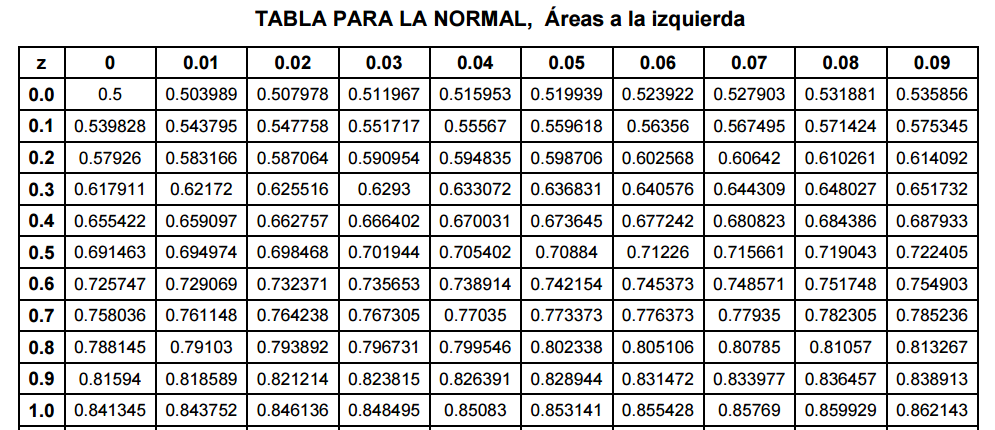

```{r setup, include=FALSE}
knitr::opts_chunk$set(echo = TRUE,
                      fig.align = "center",
                      message = FALSE,
                      error = FALSE,
                      warning = FALSE,
                      cache = FALSE)
```

## Técnicas de Conteo

Para calcular las probabilidades de varios eventos es necesario contar el número de resultados posibles de un experimento, o contal el número de resultados favorables en un evento dado. el proceso de conteo puede simplificarse mediante el empleo de dos técnicas de conteo denominadas Permutaciones y combinaciones.

**Regla de la Multiplicación**

$$\prod_{i=1}^k n_i$$

**Regla de la Adición**

$$\sum_{i=1}^k n_i$$

**Muestreo con reemplazo**: es el procedimiento de observar una unidad dentro de una población y retornarla al mismo conjunto. Entonces para $m$ muestras de $n$ objetos existen $n^m$ opciones de seleccionar una muestra.

**Muestreo sin reemplazo**: es el procedimiento de observar una unidad dentro de una población y extraerla del conjunto. Para seleccionar una muestra, es preciso preguntar ¿importa el orden?.

### Permutaciones

Se quiere seleccionar $r$ elementos de un conjunto de $n$ objetos, cuando importa el orden de selección.

$$n(n-1)(n-2)...(n-r+1)=\cfrac{n!}{(n-r)!}=P_{n}^{r}$$

Se tiene $n$ objetos, $n_1$ de tipo 1, $n_2$ de tipo 2, ..., $n_r$ de tipo $r$, talque $\sum_{i=1}^r=n$, entonces las formas de seleccionar los objetos en grupos es:

$$P_{n}^{n_1 n_2 ... n_r}=\cfrac{n!}{n_1!n_2!...n_r!}$$

### Combinatorias

Se quiere seleccionar $r$ elementos de $n$ objetos donde no importa el orden.

$$C_n^r={n\choose_r}=\cfrac{n!}{r!(n-r)!}$$
**Teorema: Coeficiente Binomial**
$$(x+y)^n=\sum_{r=0}^n={n\choose_r}x^r y^{n-r}$$

Si se consideran repeticiones en este esquema, entonces:

$$CR_n^r={n+r-1\choose_r}=\cfrac{(n+r-1)!}{r!(n-1)!}$$

> En una bodega hay 5 tipos diferentes de botellas, ¿cuántas formas existen de elegir 4 botellas?
$$CR_5^4={5+4-1\choose_4}=\cfrac{(5+4-1)!}{4!(5-1)!}=\cfrac{8!}{4!4!}=70$$

**Triángulo de Pascal**

$${n+1\choose_k}={n\choose_k}+{n\choose_k-1}$$

### Factoriales Generalizados

**Función Gamma**

$$\Gamma(n)=\int_0^\infty x^{n-1}e^{-x}dx$$

Propiedades:

1. Si $n \in \mathbb{Z}$, entonces $\Gamma(n)=(n-1)!$
2. Si $n>1$, entonces $\Gamma(n+1)=n\Gamma(n)=n!$
3. $\Gamma(1/2)=\pi$

**Función Beta**

$$Beta(x,y)=\cfrac{\Gamma(x)\Gamma(y)}{\Gamma(x+y)}$$

## Probabilidad

Los posibles resultados de un experimento son llamados eventos simples. Un experimento se dice "*aleatorio*" si proporciona diferentes resultados, aún cuando se realiza en las mismas condiciones.

El conjunto de todos los posibles resultados de un experimento es llamado **Espacio Muestral** y se denota como $\Omega$.

> Evento Discreto <br>
Se lanza una moneada no cargada, e identifica los resultados como "cara" y "sello", entonces:
$$\Omega=\{s,c\}$$

> Evento Continuo <br>
Se selecciona una bombilla y se registra su duración en horas, entonces:
$$\Omega=[0,\infty)$$

Un *evento* es un subconjunto del espacio muestral $\Omega$, se dice que un evento $A$ ocurre si el resultado del experimento aleatorio pertenece a $A$

**Subconjunto**: Sean dos eventos $A$ y $B$. Si los elementos de un evento están contenidos en el otro, se llama subconjunto. $A \subset B$: *$A$ está contenido en $B$*, o $B \subset A$: *$B$ contiene $A$*.

**Conjuntos Equivalentes**: Si $A \subset B$ y $B \subset A$ entonces $A=B$.

**Conjunto Vacío**: Si $A$ no contienen elementos se llama vacío o nulo y se denota como $\emptyset$.

**Complemento**: El complemento de un evento $A$ respecto al espacio $\Omega$, son los elementos que están en $\Omega$ pero no en $A$, se denota como $\bar{A}$, $A^c$, $A^{\prime}$ o $\Omega - A$.

**Intersección**: Sean dos eventos $(A\wedge B) \in \Omega$, cuando todos los elementos están contenidos en $A$ y $B$ se le llama intersección de eventos $A \cap B$.

**Unión**: Sean dos eventos $(A\wedge B) \in \Omega$, cuando todos los elementos están contenidos en $A$ o $B$ o en ambos, se le llama unión de eventos. $A \cup B=A+B-A\cap B$

**Diferencia de Conjuntos**: Sean dos eventos $(A\wedge B) \in \Omega$, todos los elementos de $A$ que no se encuentran en $B$ determina la diferencia de conjutos $A-B$.

**Teoremas**

1. Ley conmutativa: $A \cup B=B\cup A$, $A \cap B = B \cap A$.
2. Ley asociativa: $A \cup (B \cup C)=(A \cup B) \cup C$, $A \cap (B \cap C)=(A \cap B) \cap C$.
3. Ley distributiva: $A \cap (B \cup C)=(A \cap B) \cup (A \cap C)$, $A \cup (B \cap C)=(A \cup B) \cap (A \cup C)$.
4. $\overline{(\bar{A})}=(A^\prime)^\prime=A$.
5. $A \Omega= A$, $A \cup \Omega = \Omega$, $A\emptyset=\emptyset$, $A \cup \emptyset=A$.
6. $A\bar{A}=\emptyset$, $A \cup \bar A=\Omega$, $A \cap A=A$, $A \cup A=A$.
7. $\overline{A\cup B}=\bar A \cap \bar B$, $\overline{A\cap B}=\bar A \cup \bar B$
8. $A-B=A\bar B$.
9. Ley de Morgan.
    * $\overline{\bigcup_{\lambda \in \Lambda}A_\lambda}=\bigcap_{\lambda\in\Lambda}\bar{A_\lambda}$.
    * $\overline{\bigcap_{\lambda \in \Lambda}A_\lambda}=\bigcup_{\lambda\in\Lambda}\bar{A_\lambda}$.
10. Si $(A\wedge B) \in \Omega$ entonces $A=AB \cup A\bar B$ y $AB \cap A\bar B=\emptyset$.
11. Si $A \subset B$ entonces $AB=A$ y $A\cup B=B$.

> Disyunción o Eventos Mutuamente Excluyentes <br>
Sean $(A\wedge B) \in \Omega$, los eventos son disjuntos si $A \cap B=\emptyset$. En general una colección de eventos $A_1, A_2,...$ son mutuamente excluyentes si $A_i \cap A_j = \emptyset, \: \forall i \neq j$.

### Probabilidad *a priori*

Sea $A \in \Omega$ la probabilidad de ocurrencia del evento $A$ se define como:

$$P(A)=\cfrac{\text{# Casos favorables}}{\text{# Casos posibles}}$$

> Don Ramiro todos los días juega chance, apuesta los número 8845, 1254 y 6743. Como hoy es Martes, él sabe que la semana pasada el número gandor fue 9654. ¿Cuál es la probabilidad de ganar el chance con sus números? Como "ya cayó" el 9654 ¿justifica no jugarlo?

**Axiomas**

1. Sea $A \in \Omega$ entonces $P(A) \ge 0$
2. $P(\Omega)=1$.
3. Sean $(A\wedge B) \in \Omega$ eventos mutuamente excluyentes, entonces $P(A \cup B)=P(A)+P(B)$.
4. Si $\Omega$ está compuesto de infinitos conjuntos o eventos.
    * Si $A_1 \supset A_2 \supset A_3 \supset ...$ y $\bigcap_{n=1}^{\infty} A_n =\emptyset$ entonces $\text{lim}_{n \to \infty} P(A_n)=0$.
    * Sean $A_1, A_2, A_3,... \in \Omega$ si $A_i \cap A_j = \emptyset, \: \forall i\neq j$ entonces $P(\bigcup_{i=1}^{\infty}A_i)=\sum_{i=1}^{\infty}P(A_i)$.

**Propiedades**

1. $P(A^\prime)=1-P(A)$
2. $P(\emptyset)=0$
3. Si $A \subset B \Rightarrow P(A) \le P(B)$
4. Para cualquier evento $A$, $P(A)\le 1$
5. $P(A\cup B)=P(A)+P(B)-P(A \cap B)$

> Se lanza un dado. ¿Cual es la probabilidad de el resultado sea 2 o 5? <br>
A: Evento que el resultado es 2<br>
B: Evento que el resultado es 5<br>
$$P(A \cup B)=P(A)+P(B)=\cfrac{1}{6}+\cfrac{1}{6}=\cfrac{1}{3}$$

> En un lote de 50 bombillas hay 2 bombillas que presentan fallas. Un inspector examina 5 bombillas, las cuales fueron seleccionadas al azar y sin reemplazo. ¿Cuál es la probabilidad de que al menos 1 de las bombillas es defectuosa entre las 5 examinadas?<br>
A: Evento de tener todas las bombillas nuevas<br>
$$P(A^\prime)=1-P(A)$$
$$P(A)=\cfrac{{48\choose 5} {2\choose 0}}{50 \choose 5}=0.8082$$
$$P(A^\prime)=1-P(A)=1-0.8082=0.1918$$

>Una mano de cartas consiste en 5 cartas elegidas al azar y sin reemplazo de una baraja de 52 cartas. ¿Cuál es la probabilidad de que en la mano resulten 3 corazones y 2 picas?<br>
A: Evento de obtener 3 corazones y 2 picas
$$P(A)=\cfrac{{13\choose 3} {13\choose 2}}{52 \choose 5}=0.0086$$

### Probabilidad Condicional

Algunas veces la ocurrencia de un envento $A$ puede afectar la ocurrencia posterior de otro evento $B$. Suponga un grupo de 20 artículos que contiene 10 defectuosos y 10 que no lo son. Una persona selecciona un artículo al azar y lo instala en un equipo

**A**: evento en que la selección del artículo resulte defectuoso
$$P(A)=\cfrac{10}{20}=0.5$$

Ahora bien, suponga que se selecciona otro artículo de los 19 restantes.

**B**: evento en que la selección del segundo artículo resulte defectuoso

<center>
| Si el primero es defectuoso | Si el primero no es defectuoso |
|:---------------------------:|:------------------------------:|
| $$P(B)=\cfrac{9}{19}$$      | $$P(B)=\cfrac{10}{19}$$        |
</center>

Sean $(A\wedge B) \in \Omega$, la probabilidad condicional $A$ dado $B$ denotado como $P(A|B)$ se define como:

$$P(A|B)=\frac{P(A \cap B)}{P(B)} \:\:\:\text{donde}\:P(B)>0$$
$$P(B|A)=\frac{P(A \cap B)}{P(A)} \:\:\:\text{donde}\:P(A)>0$$

>En un grupo de estudiante, el 40% de los alumnos juega al fútbol, el 30% al baloncesto y el 10% practica ambos deportes: Si juega fútbol, ¿cuál es la probabilidad de que juegue baloncesto?<br>
$$P(B|F)=\frac{P(B \cap F)}{P(F)}=\frac{0.1}{0.4}=0.25$$

**Regla Multiplicativa**
$$P(A \cap B)=P(A)P(B|A)=P(B)P(A|B)$$

**Teorema Probabilidad Total**
$$P(A)=\sum_{j=1}^{n}P(A \cap B_j)=\sum_{j=1}^{n}P(B_j)P(A|B_j)$$

### Teorema de Bayes

Sea $\{A_i\}_{i=1}^{n}$ un conjunto de $n$ eventos cada uno con probabilidad positiva, además son mutuamente excluyentes. Para cualquier evento $B \in \Omega$ con $P(B)>0$ se cumple:

$$P(A_j|B)=\frac{P(B|A_j)P(A_j)}{\sum_{i=1}^{n}P(A_j)P(B|A_j)}=\frac{\text{Regla Multiplicativa}}{\text{Probabilidad Total}}$$

> [Ejemplos Teorema de Bayes](https://brilliant.org/wiki/bayes-theorem/)

## Variables Aleatorias

En la mayoría de problemas a los que comúnmente nos enfrentamos, la descripción del conjunto de posibles resultados de un experimento aleatorio puede ser complicado y por lo tanto el cálculo de probabilidades también se dificulta.

Por ejemplo, si una persona es seleccionada de una población, diversas características pueden ser de interés y cada una aporta al entendimiento de un fenómeno en especial, como son, el tiempo que emplea en transportarse de su casa al lugar de trabajo, que tan lejos está de su casa el sitio donde trabaja, cuantos hijos tiene, cuantas horas duerme, cuantas personas conforman su grupo familiar, cuanto gana, cuanto gasta, cuanto paga por servicios, cuantas llamadas hace diariamente, etc.

Una **Variable Aleatoria** es una función definida en un espacio Muestral que asigna a cada resultado de un experimento aleatorio un valor real. Usualmente son denotadas con letras mayúsculas como (X , Y , Z , T, etc). Al conjunto de todos los posibles resultados de una variable aleatoria se le llamará Rango de la variable ($A_X$).

### Variables Aleatorias Discretas

* Un grupo de $n$ sujetos es sometido a cierto tratamiento y después de un tiempo se registra cuantos logran mejorar con dicho tratamiento. Sea X la variable aleatoria que cuenta cuántos sujetos mejoran con el tratamiento. Entonces el rango de $X$ será $A_X = {0, 1, 2,..., n}$.

* En una gran población se encuestan de manera aleatoria sujetos hasta encontrar el primero que responde afirmativamente a una pregunta de interés. Si $X$ es la variable aleatoria que cuenta el número de sujetos encuestados hasta encontrar el primero que responde afirmativamente, entonces el rango de $X$ está dado por $A_X = {1, 2, 3,...}$.

Este tipo de variables se traducen en funciones matemáticas o valores tabulados, y la probabilidad se calcula através de la *función de masa de probabilidad* (fmp).

### Variables Aleatorias Continuas

* De la producción diaria de jabones se escoge uno al azar y se mide su PH. Sea $X$: el pH del jabón. El rango de la variable aleatoria $X$ es cualquier valor entre 0 y 14. Así: $A_X = [0 , 14]$.

* El desgaste de una llanta en un período de un año es una variable aleatoria. Si $X$ es la variable aleatoria que representa el desgaste en décimas de milímetros, $A_X = (0 , a)$, donde $a$ representa la profundidad mínima de la llanta estando nueva.

Este tipo de variables se caracteriza porque el rango es un intervalo real, y su comportamiento está determinado por una función matemática y la probabilidad se calcula através de la *función de densidad de probabilidad* (pdf).

> Tanto las fmp como las pdf cumplen con los mismos Axiomas de probabilidad

El paquete `IPSUR` fue diseñado para la enseñanza de estadística y probabilidad por el profesor G. Jay Kerns. En el siguiente enlace se encuentra el curso completo usando `R`.

[IPSUR: Introduction to Probability and Statistics Using R](https://cran.r-project.org/web/packages/IPSUR/vignettes/IPSUR.pdf)

## Distribuciones de Probabilidad

Por muchos años los matemáticos y estadísticos han establecido funciones de probabilidad a diversos fenómenos de la naturaleza y la sociedad. No obstante, en algunos casos se observa que se cumplen ciertos patrones, por lo tanto, el comportamiento de un fenómeno se puede modelar con la misma función de probabilidad de otro fenómeno. En este sentido, se establecen las distribuciones de probabilidad como funciones definidas para entender el comportamiento de fenómenos que tienen un patrón identificable.

### Distribuciones de Probabilidad Discretas

#### Distribución Binomial

La distribución binomial es una distribución de probabilidad discreta que cuenta el número de éxitos en una secuencia de *n* ensayos de Bernoulli independientes entre sí, con una probabilidad fija *p* de ocurrencia del éxito entre los ensayos. Para $n = 1$, la binomial se convierte, de hecho, en una distribución de *Bernoulli*.

$$p(x)={n \choose x}p^x(1-p)^{n-x}\quad x = \{0, 1, 2, \dots , n\}$$

##### Distribución binomial con n=10, p=0.1

```{r b1,fig.align='center',fig.height=6,fig.width=6}
# Semilla aleatoria
set.seed(999)

# Muestras binomiales de tamaño 10,50,100,1000
bin1<-list("N=10"=rbinom(10,10,0.1),"N=50"=rbinom(50,10,0.1),
        "N=100"=rbinom(100,10,0.1),"N=1000"=rbinom(1000,10,0.1))

# Clases del histogramas
b<-(-0.5:10.5)

# Múltiples gráficos
par(mfrow=c(2,2))
for(i in 1:4)
{
  hist(unlist(bin1[i]),freq=F,breaks=b,ylim=c(0,0.5),col='lightblue',xlab="X",
       ylab="Densidad",main=paste0("Binomial(10,0.1)\n",names(bin1)[i]))
  points(b+0.5,dbinom(b+0.5,10,0.1),col=2,pch=19)
  points(b+0.5,dbinom(b+0.5,10,0.1),col=2,type='h',lwd=2)
}
```

Se puede observar que para una distribución binomial con parámetro $p < 0.5$ la distribución presenta asimetría hacia la izquierda. Por otra parte la distribución empírica se ajusta a la distribución teórica para tamaños de muestra grandes; para el caso de la distribución con parámetro $p=0.1$, se observa que hay un buen ajuste para tamaños de muestra $N \geq 50$.

##### Distribución Binomial con n=10, p=0.5

```{r b2,fig.align='center',fig.height=5,fig.width=7}
# Semilla aleatoria
set.seed(999)
# Muestras binomiales de tamaño 10,50,100,1000
bin1<-list("N=10"=rbinom(10,10,0.5),"N=50"=rbinom(50,10,0.5),
        "N=100"=rbinom(100,10,0.5),"N=1000"=rbinom(1000,10,0.5))
# Clases del histogramas
b<-(-0.5:10.5)
# Múltiples gráficos
par(mfrow=c(2,2))
for(i in 1:4)
{
  hist(unlist(bin1[i]),freq=F,breaks=b,ylim=c(0,0.3),col='lightblue',xlab="X",
       ylab="Densidad",main=paste0("Binomial(10,0.5)\n",names(bin1)[i]))
  points(b+0.5,dbinom(b+0.5,10,0.5),col=2,pch=19)
  points(b+0.5,dbinom(b+0.5,10,0.5),col=2,type='h',lwd=2)
}
```

Se puede observar que para una distribución binomial con parámetro $p = 0.5$ la distribución teórica es simétrica. Por otra parte la distribución empírica se ajusta a la distribución teórica para tamaños de muestra muy grandes; contrario al caso anterior, el ajuste es más lento y se require tamaños de muestra $N \geq 1000$.

##### Distribución Binomial con n=10, p=0.9

```{r b3,fig.align='center',fig.height=5,fig.width=7}
# Semilla aleatoria
set.seed(999)
# Muestras binomiales de tamaño 10,50,100,1000
bin1<-list("N=10"=rbinom(10,10,0.9),"N=50"=rbinom(50,10,0.9),
        "N=100"=rbinom(100,10,0.9),"N=1000"=rbinom(1000,10,0.9))
# Clases del histogramas
b<-(-0.5:10.5)
# Múltiples gráficos
par(mfrow=c(2,2))
for(i in 1:4)
{
  hist(unlist(bin1[i]),freq=F,breaks=b,ylim=c(0,0.5),col='lightblue',xlab="X",
       ylab="Densidad",main=paste0("Binomial(10,0.9)\n",names(bin1)[i]))
  points(b+0.5,dbinom(b+0.5,10,0.9),col=2,pch=19)
  points(b+0.5,dbinom(b+0.5,10,0.9),col=2,type='h',lwd=2)
}
```

Se puede observar que para una distribución binomial con parámetro $p > 0.5$ la distribución presenta asimetría hacia la derecha. Por otra parte la distribución empírica se ajusta a la distribución teórica para tamaños de muestra grandes; para el caso de la distribución con parámetro $p=0.9$, se observa que hay un buen ajuste para tamaños de muestra $N \geq 50$.

#### Distribución Geométrica

La variable aleatoria geométrica representa el número de fallas que ocurren antes de que se presente el primer éxito. La función de masa de probabilidad está dada por:

$$p(x) = (1 - p)^{x-1}p$$

##### Distribución Geometrica con p=0.3

```{r g1,fig.align='center',fig.height=5,fig.width=7}
# Semilla Aleatoria
set.seed(999)

# Muestras Geométricas de tamaño 10, 50, 100 y 1000
geo<-list("N=10"=rgeom(10,0.3),"N=50"=rgeom(50,0.3),
          "N=100"=rgeom(100,0.3),"N=1000"=rgeom(1000,0.3))

# Clases del histograma
b<-seq(-0.5,max(geo[[4]])+0.5)

# Múltiples Gráficos
par(mfrow=c(2,2))
for(i in 1:4)
{
  hist(unlist(geo[i]),freq=F,breaks=b,ylim=c(0,0.3),col='lightgreen',xlab="X",
       ylab="Densidad",main=paste0("Geométrica(0.3)\n",names(geo)[i]))
  points(b+0.5,dgeom(b+0.5,0.3),col=2,pch=19,cex=0.8)
  points(b+0.5,dgeom(b+0.5,0.3),col=2,type='h',lwd=2)
}
```

Se observa que la distribución teórica es asimétrica hacia la izquierda, pues cuenta el número de ensayos antes de obtener el primer éxito, por otra parte el número de ensayos aumenta cuando el parámetro *p* es pequeño, además la distribución empírica se ajusta a la teórica para tamaños de muestra grandes; en este caso la distribución con $p=0.3$, el ajuste de la distribución se alcanza para tamaños de muestra $N \geq 1000$

##### Distribución Geometrica con p=0.5

```{r g2,fig.align='center',fig.height=5,fig.width=7}
# Semilla Aleatoria
set.seed(999)

# Muestras Geométricas de tamaño 10, 50, 100 y 1000
geo<-list("N=10"=rgeom(10,0.5),"N=50"=rgeom(50,0.5),
        "N=100"=rgeom(100,0.5),"N=1000"=rgeom(1000,0.5))

# Clases del histograma
b<-seq(-0.5,max(geo[[4]])+0.5)

# Múltiples Gráficos
par(mfrow=c(2,2))
for(i in 1:4)
{
  hist(unlist(geo[i]),freq=F,breaks=b,ylim=c(0,0.6),col='lightgreen',xlab="X",
       ylab="Densidad",main=paste0("Geométrica(0.5)\n",names(geo)[i]))
  points(b+0.5,dgeom(b+0.5,0.5),col=2,pch=19)
  points(b+0.5,dgeom(b+0.5,0.5),col=2,type='h',lwd=2)
}
```

Se observa que la distribución teórica es asimétrica hacia la izquierda, pues cuenta el número de ensayos antes de obtener el primer éxito, por otra parte el número de ensayos aumenta cuando el parámetro *p* es pequeño, además la distribución empírica se ajusta a la teórica para tamaños de muestra grandes; en este caso la distribución con $p=0.5$, el ajuste de la distribución se alcanza para tamaños de muestra $N \geq 100$

##### Distribución Geometrica con p=0.7

```{r g3,fig.align='center',fig.height=5,fig.width=7}
# Semilla Aleatoria
set.seed(999)

# Muestras Geométricas de tamaño 10, 50, 100 y 1000
geo<-list("N=10"=rgeom(10,0.7),"N=50"=rgeom(50,0.7),
        "N=100"=rgeom(100,0.7),"N=1000"=rgeom(1000,0.7))

# Clases del histograma
b<-seq(-0.5,max(geo[[4]])+0.5)

# Múltiples Gráficos
par(mfrow=c(2,2))
for(i in 1:4)
{
  hist(unlist(geo[i]),freq=F,breaks=b,ylim=c(0,0.8),col='lightgreen',xlab="X",
       ylab="Densidad",main=paste0("Geométrica(0.7)\n",names(geo)[i]))
  points(b+0.5,dgeom(b+0.5,0.7),col=2,pch=19)
  points(b+0.5,dgeom(b+0.5,0.7),col=2,type='h',lwd=2)
}
```

Se observa que la distribución teórica es asimétrica hacia la izquierda, pues cuenta el número de ensayos antes de obtener el primer éxito, por otra parte el número de ensayos disminuye cuando el parámetro *p* es grande, además la distribución empírica se ajusta a la teórica para tamaños de muestra grandes; en este caso la distribución con $p=0.7$, el ajuste de la distribución se alcanza para tamaños de muestra $N \geq 50$

#### Distribución Binomial Negativa

Esta distribución puede considerarse como una extensión o ampliación de la distribución *geométrica*. La distribución binomial negativa es un modelo adecuado para tratar aquellos procesos en los que se repite un determinado ensayo o prueba hasta conseguir un número determinado de resultados favorables (por vez primera) .Es por tanto de gran utilidad para aquellos muestreos que procedan de esta manera. Si el número de resultados favorables buscados fuera 1 estaríamos en el caso de la distribución geométrica.

$$p(x)= {x-1 \choose x-k}p^k(1-p)^{x-k} = {x-1 \choose k-1}p^k(1-p)^{x-k}$$

##### Distribución Binomial Negativa con k=3 y p=0.3

```{r nb1,fig.align='center',fig.height=5,fig.width=7}
# Semilla Aleatoria
set.seed(999)

# Muestras Geométricas de tamaño 10, 50, 100 y 1000
nbin<-list("N=10"=rnbinom(10,3,0.3),"N=50"=rnbinom(50,3,0.3),
        "N=100"=rnbinom(100,3,0.3),"N=1000"=rnbinom(1000,3,0.3))

# Clases del histograma
b<-seq(-0.5,max(nbin[[4]])+0.5)

# Múltiples Gráficos
par(mfrow=c(2,2))
for(i in 1:4)
{
  hist(unlist(nbin[i]),freq=F,breaks=b,ylim=c(0,0.15),col='moccasin',xlab="X",
       ylab="Densidad",main=paste0("Nbinomial(3,0.3)\n",names(nbin)[i]))
  points(b+0.5,dnbinom(b+0.5,3,0.3),col=2,pch=19,cex=0.8)
  points(b+0.5,dnbinom(b+0.5,3,0.3),col=2,type='h',lwd=1)
}
```

Se observa que la distribución empírica se ajusta a la teórica con tamaños de muestra grandes. En particular para un número de éxitos fijo $k=3$, se observa que la distribución es asimétrica hacia la izquierda y con $p=0.3$ la distribución empírica se ajusta con tamaños de muestra $N \geq 1000$. Por otra parte, a medida que aumenta el parámetro *p* el número de ensayos disminuyen y la densidad de probabilidad aumenta.

##### Distribución Binomial Negativa con k=3 y p=0.5

```{r nb2,fig.align='center',fig.height=5,fig.width=7}
# Semilla Aleatoria
set.seed(999)
# Muestras Geométricas de tamaño 10, 50, 100 y 1000
nbin<-list("N=10"=rnbinom(10,3,0.5),"N=50"=rnbinom(50,3,0.5),
        "N=100"=rnbinom(100,3,0.5),"N=1000"=rnbinom(1000,3,0.5))
# Clases del histograma
b<-seq(-0.5,max(nbin[[4]])+0.5)
# Múltiples Gráficos
par(mfrow=c(2,2))
for(i in 1:4)
{
  hist(unlist(nbin[i]),freq=F,breaks=b,ylim=c(0,0.3),col='moccasin',xlab="X",
       ylab="Densidad",main=paste0("Nbinomial(3,0.5)\n",names(nbin)[i]))
  points(b+0.5,dnbinom(b+0.5,3,0.5),col=2,pch=19)
  points(b+0.5,dnbinom(b+0.5,3,0.5),col=2,type='h',lwd=2)
}
```

Se observa que la distribución empírica se ajusta a la teórica con tamaños de muestra grandes. En particular para un número de éxitos fijo $k=3$, se observa que la distribución es asimétrica hacia la izquierda y con $p=0.5$ la distribución empírica se ajusta con tamaños de muestra $N \geq 1000$. Por otra parte, a medida que aumenta el parámetro *p* el número de ensayos disminuyen y la densidad de probabilidad aumenta.

##### Distribución Binomial Negativa con k=3 y p=0.7

```{r nb3,fig.align='center',fig.height=5,fig.width=7}
# Semilla Aleatoria
set.seed(999)
# Muestras Geométricas de tamaño 10, 50, 100 y 1000
nbin<-list("N=10"=rnbinom(10,3,0.7),"N=50"=rnbinom(50,3,0.7),
        "N=100"=rnbinom(100,3,0.7),"N=1000"=rnbinom(1000,3,0.7))
# Clases del histograma
b<-seq(-0.5,max(nbin[[4]])+0.5)
# Múltiples Gráficos
par(mfrow=c(2,2))
for(i in 1:4)
{
  hist(unlist(nbin[i]),freq=F,breaks=b,ylim=c(0,0.5),col='moccasin',xlab="X",
       ylab="Densidad",main=paste0("Nbinomial(3,0.7)\n",names(nbin)[i]))
  points(b+0.5,dnbinom(b+0.5,3,0.7),col=2,pch=19)
  points(b+0.5,dnbinom(b+0.5,3,0.7),col=2,type='h',lwd=2)
}
```

Se observa que la distribución empírica se ajusta a la teórica con tamaños de muestra grandes. En particular para un número de éxitos fijo $k=3$, se observa que la distribución es asimétrica hacia la izquierda y con $p=0.7$ la distribución empírica se ajusta con tamaños de muestra $N \geq 1000$. Por otra parte, a medida que aumenta el parámetro *p* el número de ensayos disminuyen y la densidad de probabilidad aumenta.

##### Distribución Binomial Negativa con k=30 y p=[0.3,0.5,0.7]

```{r nb4,fig.align='center',fig.height=3.5,fig.width=8}
# Semilla Aleatoria
set.seed(999)

# Muestras Geométricas de tamaño 1000
nbin<-list("N=1000"=rnbinom(1000,30,0.3),"N=1000"=rnbinom(1000,30,0.5),
        "N=1000"=rnbinom(1000,30,0.7))

# Clases del histograma
b<-list(seq(-0.5,max(nbin[[1]])+0.5),seq(-0.5,max(nbin[[2]])+0.5),
     seq(-0.5,max(nbin[[3]])+0.5))
p<-c(0.3,0.5,0.7)

# Múltiples Gráficos
par(mfrow=c(1,3))
for(i in 1:3)
{
  hist(unlist(nbin[i]),freq=F,breaks=b[[i]],col='moccasin',xlab="X",
       ylab="Densidad",main=paste0("Nbinomial(30,",p[i],")\n",names(nbin)[i]))
  points(b[[i]]+0.5,dnbinom(b[[i]]+0.5,30,p[i]),col=2,pch=19,cex=0.7)
  points(b[[i]]+0.5,dnbinom(b[[i]]+0.5,30,p[i]),col=2,type='h',lwd=1)
}
```

Se observa que la distribución empírica se ajusta a la teórica con tamaños de muestra grandes. Se puede observar que a medida que el parámetro *p* aumenta, disminuye el número de ensayos antes de obtener los *k* éxitos y aumenta la densidad de probabilidad; por otra parte cuando el parámetro *k* aumenta se observa la distribución tiende a ser simétrica.

#### Distribución Hipergeométrica

La distribución hipergeométrica es una distribución discreta que modela el número de eventos en una muestra de tamaño fijo cuando se conoce el número total de elementos en la población de la cual proviene la muestra. Las muestras no tienen reemplazo, por lo que cada elemento de la muestra es diferente. Cuando se elige un elemento de la población, no se puede volver a elegir. Por lo tanto, la probabilidad de que un elemento en particular sea seleccionado aumenta con cada ensayo, suponiendo que aún no ha sido seleccionado.

$$P(X=x)=\frac{{k \choose x}{{N-k \choose n-x}}}{{N \choose n}} \quad x=0,1,...,k$$

Donde $N$ es el tamaño de población, $n$ es el tamaño de la muestra extraída, $k$ es el número de elementos en la población original que pertenecen a la categoría deseada y $x$ es el número de elementos en la muestra que pertenecen a dicha categoría.

##### Distribución hipergeométrica $N=80$ $k=10$ $n=10$

```{r hyp1,fig.align='center',fig.height=6,fig.width=7}
# Semilla aleatoria
set.seed(999)

# Muestras Hipergeométricas de tamaño 30,100,300,1000
N<-80; k<-10; n<-10
hyp<-list("Tamaño=30"=rhyper(30,n,N-n,k),"Tamaño=100"=rhyper(100,n,N-n,k),
          "Tamaño=300"=rhyper(300,n,N-n,k),"Tamaño=1000"=rhyper(1000,n,N-n,k))

# Clases del histogramas
b<-seq(-0.5,max(hyp[[4]])+0.5)

# Múltiples gráficos
par(mfrow=c(2,2))
for(i in 1:4)
{
   hist(unlist(hyp[i]),freq=F,breaks=b,ylim=c(0,0.45),col='lightblue',xlab="X",
        main=paste0("Hipergeométrica k = ",k,' N = ',N,' n = ',n,'\n',names(hyp)[i]),
        cex.main=0.8,ylab="Densidad")
   points(b+0.5,dhyper(b+0.5,n,N-n,k),col=2,pch=19,cex=0.8)
   points(b+0.5,dhyper(b+0.5,n,N-n,k),col=2,type='h',lwd=2)
}
```

En el gráfico se ve que cuando el parámetro que denota el número de elementos de interés en la población original ($k$) es pequeño e igual a la muestra extraída ($n$), la distribución es asimétrica hacia la derecha, además a medida que el tamaño de muestra aumenta la distribución muestral se ajusta a la función de densidad con tamaños superiores a $100$.

##### Distribución hipergeométrica $N=60$ $k=10$ $n=25$

```{r hyp2,fig.align='center',fig.height=5,fig.width=7}
# Semilla aleatoria
set.seed(999)
# Muestras Hipergeométricas de tamaño 30,100,300,1000
N<-60; k<-10; n<-25
hyp<-list("Tamaño=30"=rhyper(30,n,N-n,k),"Tamaño=100"=rhyper(100,n,N-n,k),
          "Tamaño=300"=rhyper(300,n,N-n,k),"Tamaño=1000"=rhyper(1000,n,N-n,k))
# Clases del histogramas
b<-seq(-0.5,max(hyp[[4]])+0.5)
# Múltiples gráficos
par(mfrow=c(2,2))
for(i in 1:4)
{
   hist(unlist(hyp[i]),freq=F,breaks=b,ylim=c(0,0.35),col='lightblue',xlab="X",
        main=paste0("Hipergeométrica k = ",k,' N = ',N,' n = ',n,'\n',names(hyp)[i]),
        cex.main=.8,ylab="Densidad")
   points(b+0.5,dhyper(b+0.5,n,N-n,k),col=2,pch=19,cex=0.8)
   points(b+0.5,dhyper(b+0.5,n,N-n,k),col=2,type='h',lwd=2)
}
```

En el gráfico se ve que cuando el parámetro que denota el número de elementos de interés en la población original ($k$) es menor a la muestra extraída ($n$), la distribución tiende a ser simétrica, además a medida que el tamaño de muestra aumenta la distribución muestral se ajusta a la función de densidad con tamaños superiores a $300$.

##### Distribución hipergeométrica $N=60$ $k=35$ $n=25$

```{r hyp3,fig.align='center',fig.height=5,fig.width=7}
# Semilla aleatoria
set.seed(999)
# Muestras Hipergeométricas de tamaño 30,100,300,1000
N<-60; k<-35; n<-25
hyp<-list("Tamaño=30"=rhyper(30,n,N-n,k),"Tamaño=100"=rhyper(100,n,N-n,k),
          "Tamaño=300"=rhyper(300,n,N-n,k),"Tamaño=1000"=rhyper(1000,n,N-n,k))
# Clases del histogramas
b<-seq(-0.5,max(hyp[[4]])+0.5)
# Múltiples gráficos
par(mfrow=c(2,2))
for(i in 1:4)
{
   hist(unlist(hyp[i]),freq=F,breaks=b,ylim=c(0,0.25),col='lightblue',xlab="X",
        main=paste0("Hipergeométrica k = ",k,' N = ',N,' n = ',n,'\n',names(hyp)[i]),
        cex.main=.8,ylab="Densidad")
   points(b+0.5,dhyper(b+0.5,n,N-n,k),col=2,pch=19,cex=0.5)
   points(b+0.5,dhyper(b+0.5,n,N-n,k),col=2,type='h',lwd=1)
}
```

En el gráfico se ve que cuando el parámetro que denota el número de elementos de interés en la población original ($k$) es mayor a la muestra extraída ($n$), la distribución es asimétrica hacia la derecha, además a medida que el tamaño de muestra aumenta la distribución muestral se ajusta a la función de densidad con tamaños superiores a $1000$.

#### Distribución Poisson

La distribución de *Poisson* es una distribución de probabilidad discreta que expresa, a partir de una frecuencia de ocurrencia media, la probabilidad de que ocurra un determinado número de eventos durante cierto período de tiempo. Concretamente, se especializa en la probabilidad de ocurrencia de sucesos con probabilidades muy pequeñas, o sucesos "raros".

$$p(x;\lambda)=\frac{e^{-\lambda} \lambda^x}{x!}$$

##### Distribución Poission $\lambda=2$

```{r pois1,fig.align='center',fig.height=6,fig.width=7}
# Semilla aleatoria
set.seed(999)

# Muestras poisson de tamaño 30,100,300,1000
pois<-list("N=30"=rpois(30,2),"N=100"=rpois(100,2),
        "N=300"=rpois(300,2),"N=1000"=rpois(1000,2))

# Clases del histogramas
b<-seq(-0.5,max(pois[[4]])+0.5)

# Múltiples gráficos
par(mfrow=c(2,2))
for(i in 1:4)
{
  hist(unlist(pois[i]),freq=F,breaks=b,ylim=c(0,0.3),col='lemonchiffon',xlab="X",
       ylab="Densidad",main=paste0("Poisson (2)\n",names(pois)[i]))
  points(b+0.5,dpois(b+0.5,2),col=2,pch=19)
  points(b+0.5,dpois(b+0.5,2),col=2,type='h',lwd=2)
}
```

En el gráfico se evidencia que la distribución *Poisson* es asimétrica hacia la izquerda para valores del parámetro $\lambda$ pequeños, además la distribución muestral se ajusta a la distribución teórica para tamaños de muestra $N \geq 300$. 

##### Distribución Poission $\lambda=5$

```{r pois2,fig.align='center',fig.height=6,fig.width=7}
# Semilla aleatoria
set.seed(999)
# Muestras poisson de tamaño 30,100,300,1000
pois<-list("N=30"=rpois(30,5),"N=100"=rpois(100,5),
        "N=300"=rpois(300,5),"N=1000"=rpois(1000,5))
# Clases del histogramas
b<-seq(-0.5,max(pois[[4]])+0.5)
# Múltiples gráficos
par(mfrow=c(2,2))
for(i in 1:4)
{
  hist(unlist(pois[i]),freq=F,breaks=b,ylim=c(0,0.20),col='lemonchiffon',xlab="X",
       ylab="Densidad",main=paste0("Poisson (5)\n",names(pois)[i]))
  points(b+0.5,dpois(b+0.5,5),col=2,pch=19)
  points(b+0.5,dpois(b+0.5,5),col=2,type='h',lwd=2)
}
```

En el gráfico se evidencia que la distribución *Poisson* es asimétrica hacia la izquierda para valores del parámetro $\lambda$ pequeños, sin embargo, a medida que aumenta el valor del parámetro, la distribución presenta cola hacia la izquierda, además la distribución muestral se ajusta a la distribución teórica para tamaños de muestra $N \geq 300$. 

##### Distribución Poission $\lambda=10$

```{r pois3,fig.align='center',fig.height=6,fig.width=7}
# Semilla aleatoria
set.seed(999)
# Muestras poisson de tamaño 30,100,300,1000
pois<-list("N=30"=rpois(30,10),"N=100"=rpois(100,10),
        "N=300"=rpois(300,10),"N=1000"=rpois(1000,10))
# Clases del histogramas
b<-seq(-0.5,max(pois[[4]])+0.5)
# Múltiples gráficos
par(mfrow=c(2,2))
for(i in 1:4)
{
  hist(unlist(pois[i]),freq=F,breaks=b,ylim=c(0,0.15),col='lemonchiffon',xlab="X",
       ylab="Densidad",main=paste0("Poisson (10)\n",names(pois)[i]))
  points(b+0.5,dpois(b+0.5,10),col=2,pch=19,cex=0.5)
  points(b+0.5,dpois(b+0.5,10),col=2,type='h',lwd=1)
}
```

En el gráfico se evidencia que para valores grandes del parámetro $\lambda$ la distribución *Poisson* se hace simétrica presentando colas hacia ambos lados de la distribución, además la distribución muestral se ajusta a la distribución teórica para tamaños de muestra $N \geq 1000$.

#### Distribución Multinomial

```{r,message=FALSE,warning=FALSE}
require(mvtnorm)
require(plot3D)
require(scatterplot3d)
```

La distribución multinomial es una generalización de la distribución binomial, la cual es la probabilidad de un número de éxitos en $N$ sucesos de *Bernoulli* independientes, con la misma probabilidad de éxito en cada suceso. En una distribución multinomial, el análogo a la distribución de Bernoulli es la distribución categórica, donde cada suceso concluye en únicamente un resultado de un número finito $K$ de los posibles, con probabilidades $p_1,  \dots , p_k$ (tal que $p_i \geq 0$ para $i$ entre $1$ y $K$ y $\sum_{i=1}^k p_i = 1$) y con $n$ sucesos independientes.

Entonces sea la variable aleatoria  $x_i$, que indica el número de veces que se ha dado el resultado $i$ sobre los n sucesos. El vector  $x=(x_1,..., x_k)$ sigue una distribución multinomial con parámetros $n$ y $p$, donde  $p=(p_1,...,p_k)$ la distribución multinomial es una generalización de la distribución binomial.

Para el caso de la *distribución trinomial*, la función de masa de probabilidad es:

$$
p(x,y) = { \displaystyle {n! \over x!y!(n-x-y)!}p_1^{x}p_2^{y}(1-p_1-p_2)^{n-x-y}}, \quad \mbox{cuando } x+y \leq n
$$

##### Distribución Trinomial $p_1=0.1$ $p_2=0.8$ $n=10$

```{r mult1,fig.align='center',fig.height=5,fig.width=5}
# Semilla aleatoria
set.seed(999)

# Vector de probablidades
p<-c(0.1,0.8);p[3]<-1-sum(p)

# Número de ensayos
n<-10

# Muestra aleatoria multinomial de tamaño 1000
x<-t(rmultinom(10000,n,p))

# Matriz de densidades
d<-table(x[,1],x[,2])/100

# Histograma 3D
par(mar=c(2,2,2,2))
hist3D(z=d,col='aquamarine',border=1,phi = 30,theta=-25,d=2,bty='g',
       shade = .35, zlab = "Densidad",space = 0.1,cex.axis = 1e-9)
```

Por la ley de los grandes números se sabe que a medida que el tamaño de muestra aumenta la distribución empírica se ajusta a la distribución teórica. Para la distribución trinomial se evidencia que a medida que la probabilidad $p_2$ aumenta, la densidad se recarga en valores altos para el eje $y$ y en valores bajos para el eje $x$.

##### Distribución Trinomial $p_1=0.45$ $p_2=0.45$ $n=10$

```{r mult2,fig.align='center',fig.height=5,fig.width=5}
# Semilla aleatoria
set.seed(999)

# Vector de probablidades
p<-c(0.45,0.45);p[3]<-1-sum(p)

# Número de ensayos
n<-10

# Muestra aleatoria multinomial de tamaño 1000
x<-t(rmultinom(10000,n,p))

# Matriz de densidades
d<-table(x[,1],x[,2])/100

# Histograma 3D
par(mar=c(2,2,2,2))
hist3D(z=d,col='aquamarine',border=1,phi = 30,theta=-25,d=2,bty='g',
       shade = .35, zlab = "Densidad",space = 0.1,cex.axis = 1e-9)
```

Por la ley de los grandes números se sabe que a medida que el tamaño de muestra aumenta la distribución empírica se ajusta a la distribución teórica. Para la distribución trinomial se evidencia que a medida que cuando la probabilidad $p_2=p_1$, la densidad se recarga en el centro del plano $(x,y)$.

##### Distribución Trinomial $p_1=0.8$ $p_2=0.1$ $n=10$

```{r mult3,fig.align='center',fig.height=5,fig.width=5}
# Semilla aleatoria
set.seed(999)

# Vector de probablidades
p<-c(0.8,0.1);p[3]<-1-sum(p)

# Número de ensayos
n<-10

# Muestra aleatoria multinomial de tamaño 1000
x<-t(rmultinom(10000,n,p))

# Matriz de densidades
d<-table(x[,1],x[,2])/100

# Histograma 3D
par(mar=c(2,2,2,2))
hist3D(z=d,col='aquamarine',border=1,phi = 30,theta=-25,d=2,bty='g',
       shade = .35, zlab = "Densidad",space = 0.1,cex.axis = 1e-9)
```

Por la ley de los grandes números se sabe que a medida que el tamaño de muestra aumenta la distribución empírica se ajusta a la distribución teórica. Para la distribución trinomial se evidencia que a medida que la probabilidad $p_1$ aumenta, la densidad se recarga en valores altos para el eje $x$ y en valores bajos para el eje $y$.

### Distribuciones de Probabilidad Continuas

#### Distribución Uniforme

Sea $X$ una v.a continua definida en el intervalo $(a,b)$ tal que $\forall_I \subset (a,b)$ la $P(X \in I)$ es proporcional a la longitud del intervalo.

Entonces se dice que $X$ tiene una distribución uniforme en el intervalo $(a,b)$. Para hallar la p.d.f. de X, como la probabilidad de que X pertenezca a cualquier subintervalo de $(a,b)$ es proporcional a su longitud, necesariamente la p.d.f. de X es una función constante;

$$
f(x) =
  \begin{cases}
    k       & ; \quad a<x<b\\
    0  & ; \quad \text{en otro caso}\\
  \end{cases}
$$

$$P(X \in (a,b))=k(b-a)=1 \Rightarrow k=\cfrac{1}{b-a}$$

De esta manera, la p.d.f. de la variable aleatoria X es de la forma:

$$
f(x) =
  \begin{cases}
    \cfrac{1}{b-a}   & ; \quad a<x<b\\
    \\
    0  & ; \quad \text{en otro caso}\\
  \end{cases}
$$


$$
F(x) =
  \begin{cases}
    0 & ; \quad x<a \\\\
    \cfrac{x-a}{b-a}   & ; \quad a \leq x \leq b \\\\
    1  & ; \quad x>b\\
  \end{cases}
$$

Entonces $X \sim U(a,b)$, además:

$$M_X(t)=
\begin{cases}
\cfrac{\large e^{tb}-\large e^{ta}}{t(a-b)} \quad t \neq 0 \\ \\
\quad  \quad 1 \quad \quad \quad t=0 \\
\end{cases}$$

Así, $E[X]=\cfrac{a+b}{2}$ y $\text{Var}[X]=\cfrac{(b-a)^2}{12}$

```{r,fig.align='center', echo=FALSE, fig.align='center', fig.height=6, fig.width=10}
par(mfrow=c(1,2))
curve(dunif(x),from = -0.5,to = 1.5,main="Distribución Probabilidad\nUniforme[0,1]",
      ylab="Densidad",xlab="x",ylim=c(0,1.2),col=2,lwd=2,las=1)
curve(punif(x),from = -0.5,to = 1.5,main="Distribución Acumulada\nUniforme[0,1]",
      ylab="Densidad",xlab="x",ylim=c(0,1.2),col=2,lwd=2,las=1)
```


#### Distribución Normal

La _Distribución Normal_ o _Gaussiana_ es indudablemente la más importante y la de mayor uso de todas las distribuciones de probabilidad continua. Es la piedra angular en la aplicación de la inferencia estadística en el analisis de datos, puesto que las distribuciones de muchas _estadísticas muestrales_ tienden hacia la distribución normal conforme crece el tamaño de muestra.

Algunos fenómenos presentan este tipo de distribución:

* Precipitación pluvial
* Temperaturas
* Mediciones en organismos vivos
* Calificaciones de pruebas de actitud
* Mediciones físicas en manufactura
* __Errores de instrumentación__

Debe tenerse mucho cuidado al suponer para una situación dada un modelo de probabilidad normal sin previa comprobación. si bien es cierto que esta distribución es la de mayor uso, también es de la que más se abusa. Quizás por la mala interpretación de la palabra "normal", especialmente si se aplica su significado literal de "patrón o estándar aceptado". Es posible que una distribución normal proporcione de manera razonable una aproximación alrededor de una media de una variable aleatoria; sin embargo, puede resultar que para valores extremos se encuentren en cualquier dirección.

La apariencia gráfica de la distribución normal es una curva simétrica con forma de campana, que se extiende sin límite tanto en dirección positiva como negativa.


##### Definición

Sea $X$ una v.a continua; se dice que $X$ tiene una distribución normal si su f.d.p es de la forma:

$$f(x)=\cfrac{1}{\sigma\sqrt{2 \pi}} \large e^{- \frac{(x-\mu)^2}{2\sigma^2}}; \quad \small -\infty< x <\infty; \quad \mu \in \mathit{R}; \quad \sigma^2>0$$

Por notación $X \sim N(\mu,\sigma^2)$. Los parámetros $\mu$ y $\sigma^2$ se les conoce de localización y escala, respectivamente.

$$M_X(t)=E[e^{tX}]=\large e^{\mu t+\frac{\sigma^2 t^2}{2}}$$

#### Propiedades

Sea $X$ una variable aleatoria tal que que $X \sim N(\mu,\sigma^2)$. Las siguientes afirmaciones se cumplen para la variable aleatoria $X$.

- El área abajo la curva de una distribución normal comprendida entre $(- \infty ; \infty)$ es igual a 1.
- La normal es simétrica respecto a $\mu$. Como consecuencia de esto, el área bajo de la curva en el intervalo $[\mu, \infty)$ es igual a 0.5.
- La distribución normal tiene forma de campana.
- La normal queda completamente caracterizada con el conocimiento de sus parámetros de localización y de escala.
- _En la práctica la normalidad se alcanza de manera aproximada_.
- $E[X]=\mu$ y $Var[X]=\sigma^2$.
- Cuanto más grande es el parámetro $\sigma^2$ el gráfico de la función es mas "achatada" y de colas más largas.

```{r,echo=FALSE,fig.align='center', echo=FALSE, fig.align='center', fig.height=6, fig.width=10}
curve(dnorm(x, mean=0, sd=1), from=-5, to=10, xlab = "x",col=1,lwd=2,
      main="Distribuciones Normal con diferentes medias y misma desviación", ylab='Densidad')
curve(dnorm(x, mean=1, sd=1), from=-5, to=10, xlab = "x",col=2,lwd=2,add=T)
curve(dnorm(x, mean=3, sd=1), from=-5, to=10, xlab = "x",col=3,lwd=2,add=T)
curve(dnorm(x, mean=5, sd=1), from=-5, to=10, xlab = "x",col=4,lwd=2,add=T)

abline(v=c(0,1,3,5),lty=2,col=1:4)

legend("topleft",lwd=2,col=1:4,legend = c(as.expression(bquote(mu==0)),
                                          as.expression(bquote(mu==1)),
                                          as.expression(bquote(mu==3)),
                                          as.expression(bquote(mu==5))))
```


```{r,echo=FALSE,fig.align='center', echo=FALSE, fig.align='center', fig.height=6, fig.width=10}
curve(dnorm(x, mean=0, sd=1), from=-10, to=10, xlab = "x",col=1,lwd=2,
      main="Distribuciones Normal con diferentes desviaciones y misma media", ylab='Densidad')
curve(dnorm(x, mean=0, sd=1.5), from=-10, to=10, xlab = "x",col=2,lwd=2,add=T)
curve(dnorm(x, mean=0, sd=2), from=-10, to=10, xlab = "x",col=3,lwd=2,add=T)
curve(dnorm(x, mean=0, sd=3), from=-10, to=10, xlab = "x",col=4,lwd=2,add=T)

abline(v=c(-1,1),lty=2)
abline(v=c(-1.5,1.5),lty=2,col=2)
abline(v=c(-2,2),lty=2,col=3)
abline(v=c(-3,3),lty=2,col=4)

legend("topleft",lwd=2,col=1:4,legend = c(as.expression(bquote(sigma==1)),
                                          as.expression(bquote(sigma==1.5)),
                                          as.expression(bquote(sigma==2)),
                                          as.expression(bquote(sigma==3))))
```

##### Normal Estándar

Cuando $\mu=0$ y $\sigma^2=1$, se obtiene una distribución normal especial, conocida como _Normal Estándar_ y usualmente es denotada cola letra $Z$ y se escribe $Z \sim N(0,1)$.

$$P(x_1 < X < x_2)= \int\limits_{x_1}^{x_2} \cfrac{1}{\sqrt{2 \pi} \sigma} \large e^{- \frac{1}{2} \frac{(x-\mu)^2}{\sigma^2}} \small dx$$

Esta probabilidad no puede ser resuelta de manera explícita, además cada vez que se modifique $\mu$ o $\sigma^2$, se debe calcular de nuevo la integral.

###### Normalización

Para evitar este problema, se utiliza el cambio de variable $Z=\cfrac{X-\mu}{\sigma}$, del cual se obtiene que $dz=\cfrac{1}{\sigma}dx$.

$$
\begin{aligned}
P(x_1 < X < x_2) &= \int\limits_{z_1}^{z_2} \cfrac{1}{\sqrt{2 \pi}} \mathit{e}^{- \cfrac{z^2}{2}} dz \\
&= P(z_1 < Z < z_2)\\
\end{aligned}
$$

donde $z_1=\cfrac{x_1-\mu}{\sigma}$ y $z_2=\cfrac{x_2-\mu}{\sigma}$. Esto indica que cualquier cálculo de probabilidades para una variable aleatoria $N(\mu, \sigma^2)$ puede reducirse al cálculo de probabilidades con una variable aleatoria $N(0,1)$. El proceso de transformar una v.a normal en una normal estándar se conoce como _Estandarización_ o _Normalización_.

Para el cálculo de probabilidades con una variable $N(0, 1)$, la c.d.f. estará dada por:

$$\Phi(z)=P(Z \leq z)=\int\limits_{-\infty}^{z} \cfrac{1}{\sqrt{2 \pi}} \large e^{- \frac{z^2}{2}} \small dz$$

De esta manera se tiene que:

$$P(x_1 < X < x_2)=P(z_1 < Z < z_2)=\Phi(z_2)-\Phi(z_1)$$

Los valores de la función $\Phi(z)$ están tabulados en casi todos los textos de estadística.



##### Cálculo de probabilidades

Sea $Z$ una v.a tal que $Z \sim N(0,1)$

- $P(Z = z) = 0$

- $P(Z>z)=1-P(Z \leq z)$

- $P(Z<-z)=P(Z>z)$

- $P(-z < Z < 0) = P(0 < Z < z)$

- $P(Z < 0) = P(Z > 0) = \cfrac{1}{2}$

- $P(-z_1 < Z < -z_2)=P(z_2 < Z < z_1)$

##### Características Distribución Normal

```{r, echo=FALSE, fig.align='center',fig.height=6, fig.width=10}

cols <- c("#2171B5", "#6BAED6", "#BDD7E7", "#EFF3FF")
x <- seq(-4, 4, 0.1)
plot(x, type="n", xaxs="i", yaxs="i", xlim=c(-4, 4), ylim=c(0, 0.4),
     bty="l", xaxt="n", xlab="", ylab="")
polysection <- function(a, b, col, n=11){
    dx <- seq(a, b, length.out=n)
    polygon(c(a, dx, b), c(0, dnorm(dx), 0), col=col, border=NA)
    segments(a, 0, a, dnorm(a), col="white")
}
for(i in 0:3){
    polysection(     i, i + 1, col=cols[i + 1])
    polysection(-i - 1,    -i, col=cols[i + 1])
}
lines(x, dnorm(x))
axis(1, at=-3:3, labels=expression(mu - 3 * sigma, mu - 2 * sigma, mu - sigma, mu,
                                   mu + sigma, mu + 2 * sigma, mu + 3 * sigma))
text(c((0:3) + 0.5, (0:-3) - 0.5), c(0.16, 0.05, 0.04, 0.02),
     sprintf("%.1f%%", 100 * (pnorm(1:4) - pnorm(0:3))),
     col=c("white", "white", "black", "black"))
segments(c(-2.5, -3.5, 2.5, 3.5), dnorm(c(2.5, 3.5)),
         c(-2.5, -3.5, 2.5, 3.5), c(0.03, 0.01))
```

##### Percentiles en una Normal Estándar

Sea $0 < \alpha < 1$ y suponga que $Z \sim N(0,1)$. El valor de $Z$ que deja un área $\alpha$ a la derecha se denota $z_{\alpha}$. Es decir,

$$P(Z>z_{\alpha})=\alpha$$

$z_{\alpha}$ es llamado percentil $100(1-\alpha)\%$ de la distribución de $Z$.

```{r, echo=FALSE, fig.align='center', fig.height=3, fig.width=6}
x <- seq(-4,4,length=1000)
hx <- dnorm(x)
par(mar=c(2,2,2,2))
curve(dnorm(x),from = -5,to=5,axes=F,ylab='',xlab='z')
i <- x >= 1.5 & x <= 4
polygon(c(1.5,x[i],4), c(0,hx[i],0), col="lightblue")
axis(1, at=-4:4, pos=0,labels = F,col.ticks = 0)
axis(1,at=1.5,label=expression(Z[alpha]),pos=0)
text(1.8,0.03,expression(alpha),cex=1.5)
```

##### Aproximación Normal de la Binomial

Suponga que $X \sim bin(n,p)$. Si $n$ es muy grande, entonces las probabilidades para esta v.a pueden ser aproximadas usando la distribución normal. Esta aproximación implica el uso de un _factor de corrección_, ya que el rango de una variable Binomial es un subconjunto de los enteros no-negativos. Debido a eso, las probabilidades de _valores no enteros_ con una distribución Binomial, son calculados al redondear al entero más cercano, según el caso. El factor de correción más usado es $\frac{1}{2}$.

Ahora suponga que $X \sim bin(n, p)$. Si $A_X \in \{0, 1, 2, \ldots , n\}$, y $n_1,n_2 \in A_X$ , entonces se verifica que:

$$P(X=n_1)=P \left(n_1 - \frac{1}{2} < X < n_1 + \frac{1}{2} \right) \quad P(n_1 < X < n_2)=P \left(n_1 - \frac{1}{2} < X < n_2 + \frac{1}{2} \right)$$

Entonces si $n$ es grande, se tiene que:

$$P(X \leq x)=P \left(X<x+\frac{1}{2} \right) \approx P \left(Z \leq \cfrac{x+\frac{1}{2}-np}{\sqrt{np(1-p)}}\right)$$

$$P(X < x)=P \left(X<x-\frac{1}{2} \right) \approx P \left(Z \leq \cfrac{x-\frac{1}{2}-np}{\sqrt{np(1-p)}}\right)$$

En la práctica estas aproximaciones son buenas cuando: $np \geq 10$ y $n(1-p) \geq 10$.

#### Distribución Exponencial

La distribución exponencial tiene una gran utilidad práctica ya que podemos considerarla como un modelo adecuado para la distribución de probabilidad del tiempo de espera entre dos hechos que sigan un proceso de Poisson. De hecho la distribución exponencial puede derivarse de un proceso experimental de Poisson con las mismas características que las que enunciábamos al estudiar la distribución de Poisson, pero tomando como variable aleatoria, en este caso, el tiempo que tarda en producirse un hecho.

Sea $X$ una v.a continua. $X \sim Exp(\lambda)$.

$$f(x) =
  \begin{cases}
    \lambda \mathit{e}^{-\lambda x} &;\qquad x > 0\\
    0  &;\qquad \text{en otro caso}\\
  \end{cases}$$

La función generadora de momentos está dada por:

$$M_X(t)=E\left[ e^{tx}\right]=\cfrac{\lambda}{\lambda-t}$$

Así,$E[X]=\frac{1}{\lambda}$ y $\text{Var}[X]=\frac{1}{\lambda^2}$.

La función acumulada está dada por:

$$F(x) =
  \begin{cases}
    1 - \mathit{e}^{-\lambda x} &;\qquad x \geq 0\\
    0  &;\qquad x < 0\\
  \end{cases}$$

Por lo general en la distribución exponencial se da el tiempo promedio hasta la ocurrencia de un evento Poisson, es útil igualar el promedio a $E[X]$ para hallar el parámetro $\lambda$ despejando de la ecuación.


```{r,fig.align='center', echo=FALSE, fig.align='center', fig.height=6, fig.width=10}
curve(dexp(x,1/1),from=0,to=15,col=1,lwd=3,
      ylab='Densidad',main='Función Densidad Exponencial')
curve(dexp(x,1/1.5),from=0,to=15,col=2,lwd=3,add=T)
curve(dexp(x,1/2),from=0,to=15,col=3,lwd=3,add=T)
curve(dexp(x,1/3),from=0,to=15,col=4,lwd=3,add=T)
legend('topright',col=1:4,lwd=3,cex=2,
     legend = c(as.expression(bquote(lambda==1)),as.expression(bquote(lambda==1.5)),
                as.expression(bquote(lambda==2)),as.expression(bquote(lambda==3))))
```

##### Relación Exponencial–Poisson

Suponga que el número de eventos que ocurren en un intervalo de tiempo de longitud $t$, tiene una distribución de Poisson con parámetro $\alpha$ y que el número de ocurrencias en intervalos que no se translapan son independientes entre sí. Entonces, la distribución del tiempo transcurrido entre la presentación de 2 eventos sucesivos es _exponencial_ con parámetro $\lambda=\alpha$.

En otras palabras, suponga que $X \sim pois(\lambda)$ donde $\lambda$ es el número promedio de ocurrencias por unidad de tiempo. Sea $T$ la variable aleatoria que representa el tiempo entre ocurrencias de este proceso Poisson. Entonces $T \sim Exp(\lambda)$. Para mostrar este resultado, se hallará la c.d.f de $T$, es decir, calcular $F(t) = P(T \leq t)$. Por facilidad se calculará primero $P(T > t)$. Para ello se define la variable aleatoria $Y$: número de ocurrencias en un intervalo de longitud $t$. Entonces $Y \sim pois(\lambda^*)$. En este caso $\lambda^* = \lambda t$.

Así, $Y \sim pois(\lambda t)$. De esta manera:

$$F(t)=1-P(T>t)=1-P(Y=0)=1-\mathit{e}^{-\lambda t}$$

La cual corresponde a la acumulada de una exponencial con parámetro $\lambda$.

##### Propiedad de carencia de memoria

Suponga que $X$ es una variable aleatoria tal que $X \sim Exp(\lambda)$. Sean $t_1$ y $t_2$ reales positivos. Entonces:

$$P(X < t_1+ t_2 |X \geq t_1) = P (X < t_2)$$

#### Distribución Log-Normal

Una variable aleatoria $X$, no negativa, tiene una p.d.f Lognormal si $Y = ln(X)$ es una v.a con p.d.f normal. Haciendo $\mu = E[Y]$ y $\sigma^2 = Var[Y]$, la p.d.f de $X$ es de la forma


$$f(x)=\cfrac{1}{x\sigma \sqrt{2 \pi}} \large e^{- \frac{1}{2} \frac{(\text{ln}(x)-\mu)^2}{\sigma^2}}; \quad \small \forall_x >0$$

$\mu$ y $\sigma^2$ <b>NO</b> son la media y varianza de $X$. Son la media y varianza de $\text{ln}(X)$.

$$E[X]=\mathit{e}^{\mu+\frac{\sigma^2}{2}} \quad\quad Var[X]=\mathit{e}^{2\mu+\sigma^2}\Big(\mathit{e}^{\sigma^2}-1\Big)$$

El cálculo de probabilidades con una p.d.f Lognormal es algo complicado. Pero debido al hecho de que _el logaritmo natural de un v.a Lognormal es una v.a normal_, podemos usar las tablas para una normal estándar para calcular dichas probabilidades. Como $\text{ln}(X)$ es una función estrictamente creciente, entonces:

$$
\begin{aligned}
P(X \leq a) &= P\left(\text{ln}[X] \leq \text{ln}[a]\right)=P\left(\cfrac{\text{ln}[X]-\mu}{\sigma} \leq \cfrac{\text{ln}[a]-\mu}{\sigma}\right) \\\\
&= P\left(Z \leq \cfrac{\text{ln}[a]-\mu}{\sigma}\right)= \Phi\left(\cfrac{\text{ln}[X]-\mu}{\sigma}\right)
\end{aligned}
$$

Así, la f.d.a de $X$ es de la forma:

$$F(X)=P(X \leq x)=\Phi\left(\cfrac{\text{ln}[X]-\mu}{\sigma}\right); \quad \forall_x >0$$

```{r,fig.align='center', echo=FALSE, fig.align='center', fig.height=6, fig.width=10}
par(mfrow=c(1,2))
curve(dlnorm(x,log(1),log(7)),lwd=2,ylab = "Densidad",
      main=bquote("Distribución LogNormal con "*mu*" = 1"),xlim=c(0,4))
curve(dlnorm(x,log(1),log(5)),col=2,lwd=2,ylab = "Densidad",
      main=bquote("Distribución LogNormal con "*mu*" = 1"),xlim=c(0,4),add=T)
curve(dlnorm(x,log(1),log(3)),col=4,lwd=2,ylab = "Densidad",
      main=bquote("Distribución LogNormal con "*mu*" = 1"),xlim=c(0,4),add=T)
curve(dlnorm(x,log(1),log(2)),col=3,lwd=2,ylab = "Densidad",
      main=bquote("Distribución LogNormal con "*mu*" = 1"),xlim=c(0,4),add=T)
legend("topright",lwd=2,col=c(1,2,4,3),legend=c(expression(sigma*" = 7"),
                                                bquote(sigma*" = 5"),
                                                bquote(sigma*" = 3"),
                                                bquote(sigma*" = 2")))

curve(dlnorm(x,log(2),log(2)),lwd=2,ylab = "Densidad",
      main=bquote("Distribución LogNormal con "*sigma*" = 2"),xlim=c(0,15))
curve(dlnorm(x,log(3),log(2)),col=2,lwd=2,ylab = "Densidad",
      main=bquote("Distribución LogNormal con "*sigma*" = 2"),xlim=c(0,15),add=T)
curve(dlnorm(x,log(4),log(2)),col=4,lwd=2,ylab = "Densidad",
      main=bquote("Distribución LogNormal con "*sigma*" = 2"),xlim=c(0,15),add=T)
curve(dlnorm(x,log(5),log(2)),col=3,lwd=2,ylab = "Densidad",
      main=bquote("Distribución LogNormal con "*sigma*" = 2"),xlim=c(0,15),add=T)
legend("topright",lwd=2,col=c(1,2,4,3),legend=c(expression(mu*" = 2"),
                                                bquote(mu*" = 3"),
                                                bquote(mu*" = 4"),
                                                bquote(mu*" = 5")))
```

#### Distribución Gamma

En distintos ámbitos interesa modela fenomenos que involucren conteos y tiempos al mismo tiempo. Hasta ahora hemos visto una aproximación con las distribuciones Exponencial y Poisson, siempre y cuando los parámetros sean proporcionales. ¿Qué pasaría si esto no se cumple?

Conocer el comportamiento de muchos fenómenos que relacionen el tiempo supervivencia (vida util) entre un número de ocurrencias de un evento, se de gran interés. En este caso es muy importante conocer una distribución que nos permita conocer las probabilidades, un valor esperado y una variabilidad de la ocrurrencia de el evento de interés y para ello vamos a considerar la siguiente distribución.

Esta distribución es usualmente usada en el análisis de superivencia, en confiabilidad y demás áreas que tienen un enfoque relacionado en observar el tiempo de falla o de vida de una persona, duración de productos industriales, tiempo que transcurre un número de personas en una fila.

Recuerde que la función Gamma está dada por:

$$\Gamma(\alpha)=\int_{0}^{\infty}x^{\alpha-1}e^{-x}dx \qquad x>0,\quad a>0 $$

Sea $X$ una variable aletoria continua tal que $X\sim Gamma(\alpha,\beta)$. Así la f.d.p está dada por:

$$f_{(\alpha,\beta)}(x)= \frac{1}{\Gamma(\alpha)\beta^{\alpha}}x^{\alpha-1}e^{-x/\beta} \quad \alpha,\beta,x>0$$

- El parámetro $\alpha$ se le conoce como de <i>escala</i> y se puede interpretar como el número necesario de veces que se debe realizar un experimento hasta observar el evento de interés hasta un tiempo $t$, por ejemplo se requieren 2 ciclos de un proceso para que una pieza falle.

- Por otro lado $\beta$ se le conoce como un parámetro de forma y se interpreta como el número de ocurrencias en una unidad de tiempo o intervalo específico, por ejemplo 3 piezas falla cada 100 horas.

La probabilidad de llegar hasta un valor de x $P(X<x)$ es decir, la f.d.a es:

$$P(X<x)=\int_{0}^{x}\frac{1}{\Gamma(\alpha)\beta^{\alpha}}t^{\alpha-1}e^{-t/\beta}dt \quad \alpha,\beta,t>0$$

$$M_{x}(t)=(1-\beta t)^{-\alpha}, \quad t< \frac{1}{\beta}$$

Entonces $E[x]=\alpha \beta$ y $\text{Var}[X]=\alpha\beta^{2}$.

```{r, fig.align='center',fig.height=6,fig.width=9}
par(mfrow=c(2,3))
curve(dgamma(x,shape=2,scale=1/4),xlim=c(0,5),lwd=2,ylab='Densidad',
     main=expression("Distribución Gamma "*alpha==2))
curve(dgamma(x,shape = 2,scale = 1/2),lty=2,lwd=2,add=T)
curve(dgamma(x,shape = 2,scale = 1),lty=4,lwd=2,add=T)
legend('topright',col=1,lty=c(1,2,4),lwd=2,legend=c(expression(beta==1/4),
                                                    expression(beta==1/2),
                                                    expression(beta==1)))

curve(dgamma(x,shape=3,scale=1/4),xlim=c(0,5),col=2,lwd=2,ylab='Densidad',
     main=expression("Distribución Gamma "*alpha==3))
curve(dgamma(x,shape = 3,scale = 1/2),lty=2,col=2,lwd=2,add=T)
curve(dgamma(x,shape = 3,scale = 1),lty=4,col=2,lwd=2,add=T)
legend('topright',col=2,lty=c(1,2,4),lwd=2,legend=c(expression(beta==1/4),
                                                    expression(beta==1/2),
                                                    expression(beta==1)))

curve(dgamma(x,shape = 4,scale = 1/4),xlim=c(0,6),col=4,lwd=2,ylab='Densidad',
     main=expression("Distribución Gamma "*alpha==4))
curve(dgamma(x,shape = 4,scale = 1/2),lty=2,col=4,lwd=2,add=T)
curve(dgamma(x,shape = 4,scale = 1),lty=4,col=4,lwd=2,add=T)
legend('topright',col=4,lty=c(1,2,4),lwd=2,legend=c(expression(beta==1/4),
                                                    expression(beta==1/2),
                                                    expression(beta==1)))

curve(dgamma(x,shape = 2,scale = 1/4),xlim=c(0,4),lwd=2,ylab='Densidad',
     main=expression("Distribución Gamma "*beta==1/4))
curve(dgamma(x,shape = 3,scale = 1/4),col=2,lwd=2,add=T)
curve(dgamma(x,shape = 4,scale = 1/4),col=4,lwd=2,add=T)
legend('topright',col=c(1,2,4),lty=1,lwd=2,legend=c(expression(alpha==2),
                                                    expression(alpha==3),
                                                    expression(alpha==4)))

curve(dgamma(x,shape = 2,scale = 1/2),xlim=c(0,5),lwd=2,lty=2,ylab='Densidad',
     main=expression("Distribución Gamma "*beta==1/2))
curve(dgamma(x,shape = 3,scale = 1/2),col=2,lwd=2,lty=2,add=T)
curve(dgamma(x,shape = 4,scale = 1/2),col=4,lwd=2,lty=2,add=T)
legend('topright',col=c(1,2,4),lty=2,lwd=2,legend=c(expression(alpha==2),
                                                    expression(alpha==3),
                                                    expression(alpha==4)))

curve(dgamma(x,shape = 2,scale = 1),xlim=c(0,7),lwd=2,lty=4,ylab='Densidad',
     main=expression("Distribución Gamma "*beta==1))
curve(dgamma(x,shape = 3,scale = 1),col=2,lwd=2,lty=4,add=T)
curve(dgamma(x,shape = 4,scale = 1),col=4,lwd=2,lty=4,add=T)
legend('topright',col=c(1,2,4),lty=4,lwd=2,legend=c(expression(alpha==2),
                                                    expression(alpha==3),
                                                    expression(alpha==4)))
```

#### Distribución Beta

En muchos casos no es posble encontrar proporciones constantes en un fenómeno como el caso de una distribución uniforme, sin embargo hay una distribución que nos permite darle forma y controlar ciertos parámetros para obtener una f.d.p que es "conocida" y tiene una forma matematicamente cerrada, a esta distribución se le conoce como la distribución Beta.

Hoy en día la distribución *beta* ha tomado mucha importancia en el campo de la estadística bayesiana tomándose como distribución a priori para modelar proporciones por ejemplo de una distribución binomial, realizar estimaciones de una prevalencia o para modelar índices de riesgos.

Sea $X$ una v.a continua tal que $X\sim Beta(\alpha,\beta)$ con dominio solo para $x\in[0,1]$

Cuya f.d.p viene dada por:

$$f_{(\alpha,\beta)}(x)= \frac{\Gamma(\alpha+\beta)}{\Gamma(\alpha)\beta^{\alpha}}x^{\alpha-1}(1-x)^{\beta-1} \quad \alpha,\beta>0; \quad 0<x<1$$

La probabilidad de estar entre $a$ y $b$ con $0<a<b<1$ será:

$P(a<X<b)= \int_{a}^{b} \frac{\Gamma(\alpha+\beta)}{\Gamma(\alpha)\beta^{\alpha}}x^{\alpha-1}(1-x)^{\beta-1}dt \quad \alpha,\beta>0; \quad 0<x<1$

La probailidad de llegar hasta un valor x $P(X<x)$ la f.d.a se calcula como:

$P(X<x)= \int_{0}^{x} \frac{\Gamma(\alpha+\beta)}{\Gamma(\alpha)\beta^{\alpha}}t^{\alpha-1}(1-t)^{\beta-1}dt \quad \alpha,\beta>0; \quad 0<t<1$

$$M_{x}(t)=1+\sum_{k=1}^{\infty}\left(\prod_{r=0}^{k-1}\frac{\alpha+r}{\alpha+\beta+r}\right)\frac{t^{k}}{k!} $$

Entonces $E[X]=\frac{\alpha}{\alpha+\beta}$ y $\text{Var}[X]=\frac{\alpha \beta}{(\alpha+\beta)^{2}(\alpha+\beta+1)}$.


```{r, fig.align='center',fig.height=5,fig.width=10}
par(mfrow=c(1,3))
curve(dbeta(x,1,1),xlim=c(0,1),ylim=c(0,3),ylab='Densidad',lwd=2,
      main=expression('Distribución Beta '*alpha==beta))
curve(dbeta(x,2,2),col=2,lwd=2,add=T)
curve(dbeta(x,4,4),col=3,lwd=2,add=T)
curve(dbeta(x,7,7),col=4,lwd=2,add=T)
curve(dbeta(x,0.5,0.5),col=6,lwd=2,add=T)
legend(x=0.3,y=0.6,lty=1,col=c(1:4,6),lwd=2,
       legend=c(expression(alpha*'='*beta==1),expression(alpha*'='*beta==2),
                expression(alpha*'='*beta==4),expression(alpha*'='*beta==7),
                expression(alpha*'='*beta==0.5)))

curve(dbeta(x,2,2),xlim=c(0,1),ylim=c(0,4),ylab='Densidad',lwd=2,
      main=expression('Distribución Beta '*alpha<=beta))
curve(dbeta(x,2,4),col=2,lwd=2,add=T)
curve(dbeta(x,2,7),col=3,lwd=2,add=T)
curve(dbeta(x,2,9),col=4,lwd=2,add=T)
legend('toprigh',lty=1,col=1:4,lwd=2,title=expression(alpha==2),
       legend=c(expression(beta==2),expression(beta==4),
                expression(beta==7),expression(beta==9)))

curve(dbeta(x,2,2),xlim=c(0,1),ylim=c(0,4),ylab='Densidad',lwd=2,
      main=expression('Distribución Beta '*alpha>=beta))
curve(dbeta(x,4,2),col=2,lwd=2,add=T)
curve(dbeta(x,7,2),col=3,lwd=2,add=T)
curve(dbeta(x,9,2),col=4,lwd=2,add=T)
legend('topleft',lty=1,col=1:4,lwd=2,title=expression(beta==2),
       legend=c(expression(alpha==2),expression(alpha==4),
                expression(alpha==7),expression(alpha==9)))
```

#### Distribución $\chi^2$

La distribución de *Pearson*, llamada también *ji cuadrada(o)* o *chi cuadrado(a)* ($\chi^2$), es una distribución de probabilidad continua con un parámetro $r$ que representa los grados de libertad de la variable aleatoria.

$$
f(x)=
\begin{cases}\displaystyle
\frac{1}{2^{r/2}\Gamma(r/2)}\,x^{(r/2) - 1} e^{-x/2}&\text{para }x>0,\\
0&\text{en otro caso}
\end{cases}
$$

```{r chi,fig.align='center',fig.height=5,fig.width=7}
curve(dchisq(x,2),lwd=2,ylab='Densidad',xlim=c(0,25),ylim=c(0,0.3),col='salmon',
     main = expression('Distribución '*chi[(r)]^2))
curve(dchisq(x,3),col=1,lwd=2,add=T)
curve(dchisq(x,5),col=2,lwd=2,add=T)
curve(dchisq(x,7),col=3,lwd=2,add=T)
curve(dchisq(x,9),col=4,lwd=2,add=T)
curve(dchisq(x,11),col=6,lwd=2,add=T)
legend('topright',legend=c('r = 2','r = 3','r = 5','r = 7','r = 9','r = 11'),
       col=c('salmon',1:4,6),lty=1,lwd=2,title='Grados de Libertad')
```

#### Distribución *t-student*

La distribución *t-de Student* es una distribución de probabilidad que surge del problema de estimar la media de una población normalmente distribuida cuando el tamaño de la muestra es pequeño. Su *f.d.p* está dada por:

$$f(x) = \frac{\Gamma\left(\dfrac{\nu + 1}{2}\right)}{\Gamma\left(\dfrac{\nu}{2}\right)\sqrt{\pi\nu}\sigma} \left[1+\frac{1}{\nu}\left(\frac{x-\mu}{\sigma}\right)^2\right]^{-\tfrac{\nu+1}{2}}$$

```{r t,fig.align='center',fig.height=6,fig.width=6}
curve(dnorm(x),xlim=c(-5,5),main='Distribución t-Student',ylab='Densidad',lwd=2)
curve(dt(x,df = 1),col=2,add=T,lwd=2)
curve(dt(x,df = 2),col=3,add=T,lwd=2)
curve(dt(x,df = 5),col=4,add=T,lwd=2)

legend('toprigh',lty=1,col=1:4,lwd=2,cex=0.9,
       legend=c('Normal (0,1)','Cauchy','t(v=2)','t(v=5)'))
```

En esta gráfica podemos apreciar la realción que existe entre las distribuciones *Cauchy*, *t-de Student* y la *Normal Estandarizada*. Se observa que la distribución *t-de Student* con $v = 1$ grado de libertad es una *distribución Cauchy* la cual es la más achatada y presenta las colas mas pesadas en comparación las demás distribuciones presentes en la gráfica. Además se puede evidenciar que a medida que aumentan los grados de libertad en la *distribución t*, ésta tiende a la *Normal*.

#### Distribución Normal Bivariada

Una *distribución normal multivariante*, también llamada distribución gaussiana multivariante, es una generalización de la distribución normal unidimensional a dimensiones superiores.

Para el caso bivariado el vector aleatorio $(X,Y)$, que toma todos lo valores en el plano euclidiano, tiene la siguiente función de distribución de probabilidad:

$$f(x,y)=\frac{1}{2 \pi \sigma_x \sigma_y \sqrt{1-\rho^2}}
  \exp 
  \left\{
    -\frac{1}{2 (1-\rho^2)}
    \left[
      \left(\frac{x-\mu_x}{\sigma_x} \right)^2 -
    2 \rho \frac{(x-\mu_x)(y-\mu_y)}{\sigma_x \sigma_y}+
    \left(\frac{y-\mu_y}{\sigma_y} \right)^2
  \right]
\right\}$$

##### Distribución Normal Bivariada $\mu=[0,0]$ $\sigma=[5,5]$ $cov=0$ $\rho=0$

```{r mbnorm1,fig.align='center',fig.height=6,fig.width=7}
x<-seq(-6,6,length=40);y<-x

# Función Normal Bivariada
f<-function(x,y,mu=c(0,0),s=c(1,0,1))
{
  mu1<-mu[1];mu2<-mu[2]
  s11<-s[1];s12<-s[2];s22<-s[3];rho<-s12/(s11*s22)
  term1<-1/(2*pi*sqrt(s11*s22*(1-rho^2)))
  term2<--1/(2*(1-rho^2))
  term3<-(x-mu1)^2/s11
  term4<-(y-mu2)^2/s22
  term5<--2*rho*((x-mu1)*(y-mu2))/(sqrt(s11)*sqrt(s22))
  term1*exp(term2*(term3+term4-term5))
} 

z<-outer(x,y,f,s=c(5,0,5)) # matriz de densidades

persp(x, y, z,col="lightsalmon",theta=30, phi=20,r=50,d=0.1,expand=0.5,ltheta=90,
      main="Distribución Normal Bivariada",lphi=180,shade=0.3,ticktype="detailed",
      nticks=5,cex.axis=0.7,zlab = 'Densidad')
mtext(expression(list(mu[x]==0,mu[y]==0,sigma[x]==5,sigma[y]==5,
                      sigma[xy]==0,rho==0)), side=3)
```

En este gráfico se puede observar que la distribucíon normal bivariada cuando la correlación entre las variables $x$ y $Y$ es cero $(\rho=0)$, la superficie dibuja la clásica campana de gauss, en la posición marcada por el vector de medias de la distribución.

##### Distribución Normal Bivariada $\mu=[0,0]$ $\sigma=[5,5]$ $cov=12.5$ $\rho=0.5$

```{r mbnorm2,fig.align='center',fig.height=6,fig.width=7}
x<-seq(-6,6,length=40);y<-x
z<-outer(x,y,f,s=c(5,12.5,5)) # matriz de densidades

persp(x, y, z,col="lightsalmon",theta=30,phi=20,r=50,d=0.1,expand=0.5,ltheta=90,
      main="Distribución Normal Bivariada",lphi=180,shade=0.3,ticktype="detailed",
      nticks=5,cex.axis=0.7,zlab = 'Densidad')
mtext(expression(list(mu[x]==0,mu[y]==0,sigma[x]==5,sigma[y]==5,
                      sigma[xy]==12.5,rho==0.5)), side=3)
```

En este gráfico se puede observar que en la distribucíon normal bivariada cuando la correlación entre las variables es $\rho=0.5$, la superficie dibuja la una cresta con un ángulo de 135° respecto al origen, es decir, la densidad de probabilidad aumenta a medida que los puntos críticos en $X$ aumentan y los de $Y$ disminuyen.

##### Distribución Normal Bivariada $\mu=[0,0]$ $\sigma=[5,5]$ $cov=-12.5$ $\rho=-0.5$

```{r mbnorm3,fig.align='center',fig.height=6,fig.width=7}
x<-seq(-6,6,length=40);y<-x
z<-outer(x,y,f,s=c(5,-12.5,5)) # matriz de densidades

persp(x, y, z,col="lightsalmon",theta=30, phi=20,r=50,d=0.1,expand=0.5,ltheta=90,
      main="Distribución Normal Bivariada",lphi=180,shade=0.3,ticktype="detailed",
      nticks=5,cex.axis=0.7,zlab = 'Densidad')
mtext(expression(list(mu[x]==0,mu[y]==0,sigma[x]==5,sigma[y]==5,
                      sigma[xy]==-12.5,rho==-0.5)), side=3)
```

En este gráfico se puede observar que en la distribucíon normal bivariada cuando la correlación entre las variables es $\rho=-0.5$, la superficie dibuja la una cresta con un ángulo de 90° respecto al origen, es decir, la densidad de probabilidad aumenta a medida que los puntos críticos en $X$ disminuyen y los de $Y$ aumentan.

##### Distribución Normal Bivariada $\mu=[0,0]$ $\sigma=[5,5]$ $cov=24$ $\rho=0.96$

```{r mbnorm4,fig.align='center',fig.height=6,fig.width=7}
x<-seq(-6,6,length=40);y<-x
z<-outer(x,y,f,s=c(5,24,5)) # matriz de densidades

persp(x, y, z,col="lightsalmon",theta=30, phi=20,r=50,d=0.1,expand=0.5,ltheta=90,
      main="Distribución Normal Bivariada",lphi=180,shade=0.3,ticktype="detailed",
      nticks=5,cex.axis=0.7,zlab = 'Densidad')
mtext(expression(list(mu[x]==0,mu[y]==0,sigma[x]==5,sigma[y]==5,
                      sigma[xy]==24,rho==0.96)), side=3)
```

En este gráfico se puede observar que en la distribucíon normal bivariada cuando la correlación entre las variables es es cercana a 1, la cresta de la superfice es más pronunciada limitando a que las densidades exitan en los puntos críticos donde se cumple $X=Y$.

## Ajustes de Distribuciones de Probabilidad en `R`

Esta es una guía en `R` para evaluar cómo distribuye un conjunto de datos, cuando no se conoce una distribución de probabilidad.

Para este fin es necesario instalar los paquetes `car` y `MASS` con el siguiente comando

```{r echo=TRUE,eval=FALSE}
install.packages(c("car","MASS"),
                 dependencies = TRUE)
```

Es posible que a medida que se vayan ejecutando los códigos para hacer los análisis, se presenten errores solicitando otros paquetes complementarios. Por fortuna, el `R` indicará qué paquetes harán falta y con el código anterior se pueden instalar.

#### Gráficos

Para determinar si un conjunto de datos tiene una distribución conocida, se realizan pruebas de bondad de ajuste las cuales son parte de los métodos estadísticos inferenciales y no son del alcance de este curso. Sin embargo, se pueden realizar análisis exploratorios con algunos gráficos que ayudan a apreciar de manera aproximada cómo podrían distribuir los datos.

```{r, echo=FALSE,warning=FALSE,message=FALSE,fig.align='center',fig.height=3,fig.width=8}
require(car)
require(MASS)
x <- rnorm(40)
par(mfrow=c(1,3))
plot(density(x),main="Density Plot")
plot(ecdf(x),main="Cumulative Plot",cex=1)
qqPlot(x,main = "QQ - Plot",pch=19,id=F,cex=1)
```

Estos tres gráficos nos ayudarán para explorar el comportamiento de los datos y se pueden combinar con los gráficos de las distribuciones teóricas para evaluar qué tanto se parecen.

El primer gráfico se llama **Gráfico de Densidad**, muestra cómo es la distribución empírica de probabilidad, a diferencia del *Histograma* es una buena aproximación de las distribuciones continuas.

El segundo gráfico se llama **Gráfico Densidad Acumulada Empírica**, este gráfico es muy útil cuando se compara con *La densidad acumulada* de las distribuciones teóricas. Además, el gráfico muestra el salto de cada muestra en la función de densidad acumulada empírica.

El tercer gráfico se llama **Gráfico de Comparación de Cuantiles**, contrasta las muestras con los cuantiles de la distribución teórica. La ventaja de este gráfico es que dibuja una recta en la cual se *espera* que el conjunto de datos se ajuste, además dibuja bandas de confianza para mostrar hasta dónde se puede considerar que los puntos se ajustan a la recta.

```{r,echo=FALSE,fig.align='center',fig.height=3,fig.width=8}
xx <- rnorm(50)
yy <- rgamma(50,1/6,6)
zz <- rexp(50,1)
par(mfrow=c(1,3))
qqPlot(xx,pch=19,main = "Buen Ajuste",id=F,col.lines = 2,cex=1)
qqPlot(yy,pch=19,main = "Mal Ajuste",id=F,cex=1)
qqPlot(zz,pch=19,main = "Mal Ajuste",id=F,cex=1)
```

La idea de este gráfico es que los puntos estén muy cercanos a la recta y entre los límites de confianza. Hay que tener cuidado en los extremos de las muestras, ya que algunos puntos pueden salir de las bandas pero esto no significa que no tengan la distribución que se está evaluando; si la mayoría de los puntos están ajustados a la recta y son muy pocos datos **en los extremos** que salen de las bandas, se puede considerar un buen ajuste.

#### Estimación de parámetros

Para estimar los parámetros de una distribución utilizaremos la función `fitdistr` del paquete `MASS`.

```{r,echo=FALSE}
str(fitdistr)
```

Esta función recibe el conjunto de datos, se establece la función de distribución de probabilidad y en algunos casos se establece los valores iniciales de los parámetros para que realice el ajuste. Para más información consulte la ayuda `?fitdistr`.

```{r}
x <- rnorm(n = 40,mean = 50,sd = 10)
fitdistr(x,"normal")
```

Al aplicar la función, estima los parámetros de la distribución teórica de la cual se tiene sospecha, junto con los errores de estimación. La idea de esta estimación, es usar esos estadísticos para hacer las evaluaciones gráficas para contrastar las muestras con las distribuciones teóricas.

<center>
**Los ejemplos que se presentarán a continuación son simulaciones de variables aleatorias, y los resultados ajustan a las distribuciones evaluadas.**
</center>

#### Distribución poisson

```{r,fig.align='center',fig.width=7,fig.asp=1}
x <- rpois(n = 40,lambda = 5)
(param <- fitdistr(x,densfun = "Poisson"))

par(mfrow=c(2,2))

hist(x,freq = F,col="gold",breaks = seq(-0.5+min(x),max(x)+0.5),
     main = "Histogrma Densidad vs\nDensidad Muestral")
lines(density(x),col=4,lwd=2)

hist(x,freq = F,col="lightblue",breaks = seq(-0.5+min(x),max(x)+0.5),
     main = "Histograma Densidad vs\nDensidad Teorica")
lines(seq(min(x),max(x)+0.5,by=1),
      dpois(seq(min(x),max(x)+0.5,by=1),lambda = param$estimate),
      col=2,lwd=2,type='h')
points(seq(min(x),max(x)+0.5,by=1),
       dpois(seq(min(x),max(x)+0.5,by=1),lambda = param$estimate)
       ,col=2,pch=19)

plot(ecdf(x),main="Distribución Acumulada\nMuestral vs Teorica")
curve(ppois(x,lambda = param$estimate),col=2,lwd=2,add=T)

qqPlot(x,distribution = "pois",lambda = param$estimate,pch=19,
       main="QQ-Plot Distribución")
```

#### Distribución Exponencial

```{r,fig.align='center',fig.width=7,fig.asp=1}
x <- rexp(n = 40, rate = 8)
(param <- fitdistr(x,densfun = "exponential"))

par(mfrow=c(2,2))
hist(x,freq = F,col="gold",main = "Histogrma Densidad vs\nDensidad Muestral")
lines(density(x),col=4,lwd=2)

hist(x,freq = F,col="lightblue",main = "Histograma Densidad vs\nDensidad Teorica")
curve(dexp(x,rate = param$estimate),col=2,lwd=2,add=T)

plot(ecdf(x),main="Distribución Acumulada\nMuestral vs Teorica")
curve(pexp(x,rate = param$estimate),col=2,lwd=2,add=T)

qqPlot(x,distribution = "exp",rate = param$estimate,pch=19,
       main="QQ-Plot Distribución")
```

#### Distribución Normal

```{r,fig.align='center',fig.width=7,fig.asp=1}
x <- rnorm(n = 50, mean = 8, sd = 5)
(param <- fitdistr(x,densfun = "normal"))

par(mfrow=c(2,2))
hist(x,freq = F,col="gold",main = "Histogrma Densidad vs\nDensidad Muestral")
lines(density(x),col=4,lwd=2)

hist(x,freq = F,col="lightblue",main = "Histograma Densidad vs\nDensidad Teorica")
curve(dnorm(x,mean = param$estimate[1], sd = param$estimate[2]),col=2,lwd=2,add=T)

plot(ecdf(x),main="Distribución Acumulada\nMuestral vs Teorica")
curve(pnorm(x,mean = param$estimate[1],sd = param$estimate[2]),col=2,lwd=2,add=T)

qqPlot(x,distribution = "norm",mean = param$estimate[1],sd = param$estimate[2],
       pch=19,main="QQ-Plot Distribución")
```

#### Distribución Log-Normal

```{r,fig.align='center',fig.width=7,fig.asp=1}
x <- rlnorm(n = 50, meanlog = 4, sdlog = 0.75)
(param <- fitdistr(x,densfun = "lognormal"))

par(mfrow=c(2,2))
hist(x,freq = F,col="gold",main = "Histogrma Densidad vs\nDensidad Muestral")
lines(density(x),col=4,lwd=2)

hist(x,freq = F,col="lightblue",main = "Histograma Densidad vs\nDensidad Teorica")
curve(dlnorm(x,meanlog = param$estimate[1], sdlog = param$estimate[2]),col=2,
      lwd=2,add=T)

plot(ecdf(x),main="Distribución Acumulada\nMuestral vs Teorica")
curve(plnorm(x,meanlog = param$estimate[1],sdlog = param$estimate[2]),col=2,
      lwd=2,add=T)

qqPlot(x,distribution = "lnorm",meanlog = param$estimate[1],
       sdlog = param$estimate[2],
       pch=19,main="QQ-Plot Distribución")
```

#### Distribución Gamma

```{r,fig.align='center',fig.width=7,fig.asp=1}
x <- rgamma(n = 50,shape = 2, rate = 1/4)
(param <- fitdistr(x,densfun = "gamma"))

par(mfrow=c(2,2))
hist(x,freq = F,col="gold",main = "Histogrma Densidad vs\nDensidad Muestral")
lines(density(x),col=4,lwd=2)

hist(x,freq = F,col="lightblue",main = "Histograma Densidad vs\nDensidad Teorica")
curve(dgamma(x,shape = param$estimate[1], rate = param$estimate[2]),col=2,
      lwd=2,add=T)

plot(ecdf(x),main="Distribución Acumulada\nMuestral vs Teorica")
curve(pgamma(x,shape = param$estimate[1],rate = param$estimate[2]),col=2,
      lwd=2,add=T)

qqPlot(x,distribution = "gamma",shape = param$estimate[1],rate = param$estimate[2],
       pch=19,main="QQ-Plot Distribución")
```

#### Distribución Beta

Para la distribución beta, es necesario establecer los valores iniciales para estimar los parámetros con la función `fitdistr`, esto se hace en el argumento `start` ingresando una lista con los parámetros de la distribución.

```{r,fig.align='center',fig.width=7,fig.asp=1,warning=FALSE}
x <- rbeta(n = 50,shape1 = 9,shape2 = 2)
(param <- fitdistr(x,densfun = "beta",
                   start = list(shape1=0.1,shape2=0.1)))

par(mfrow=c(2,2))
hist(x,freq = F,col="gold",main = "Histogrma Densidad vs\nDensidad Muestral")
lines(density(x),col=4,lwd=2)

hist(x,freq = F,col="lightblue",main = "Histograma Densidad vs\nDensidad Teorica")
curve(dbeta(x,shape1 = param$estimate[1], shape2 = param$estimate[2]),col=2,
      lwd=2,add=T)

plot(ecdf(x),main="Distribución Acumulada\nMuestral vs Teorica")
curve(pbeta(x,shape1 = param$estimate[1],shape2 = param$estimate[2]),col=2,
      lwd=2,add=T)

qqPlot(x,distribution = "beta",shape1 = param$estimate[1],shape2 = param$estimate[2],
       pch=19,main="QQ-Plot Distribución")
```

#### Comentario final

Tengan en cuenta que para cada ajuste es necesario trabajar con todos los parámetros y argumentos de las funciones de distribución. En particular la función `qqPlot` no trae por defecto valores para los parámetros de las funciones, es necesario ingresarlas y **deben tener los mismos nombres** de los argumentos que reciben las funciones básicas de las distribuciones (`rnorm`, `rbeta`, `rgamma`, etc...).

## Estimación

```{r echo=FALSE}
NormCI<-function(n=30,replica=100,mu=0,sigma=1,conf.level=0.95,seed=NULL)
{
   if(!is.null(seed)) set.seed(seed)
   Adkblue <- "#0080FF"
   Aorange <- "#FF4C0C"
   alpha <- 1 - conf.level
   CL <- conf.level * 100
   N <- replica
   if (N <= 1 || n <= 1)
      stop("Número de réplicas de CIs y tamaños de muestra deben ser al menos 2")
   if (!missing(conf.level) && (length(conf.level) != 1 || !is.finite(conf.level) ||
                                conf.level <= 0 || conf.level >= 1))
      stop("'conf.level' debe estar entre 0 y 1")
   if (sigma <= 0)
      stop("La varianza debe ser un número positivo")

   muestras <- rnorm(N * n, mu, sigma)
   Mtrx <- matrix(muestras,n)
   xbar <- apply(Mtrx, 2, mean)
   ll <- xbar - qnorm(1 - alpha/2) * sigma/sqrt(n)
   ul <- xbar + qnorm(1 - alpha/2) * sigma/sqrt(n)
   fuera <- sum((ll > mu) + (ul < mu))
   percentage <- round((fuera/N) * 100, 2)
   plot(ll,type="n", ylim=c(floor(min(ll)),ceiling(max(ul))),xlab="",
        ylab="")
   title(sub = bquote(paste("Nota: ", .(percentage), "% de los CI no contienen el valor de ",
                            mu, "=", .(mu))))
   title(main = bquote(paste(.(N)," IC del ",.(CL),"% para N(",
                             .(mu),",",.(sigma),")"," y n=",.(n))))
   for (i in 1:N) {
      low <- ll[i]
      high <- ul[i]
      if (low < mu & high > mu) {
         segments(i, low, i, high)
      }
      else if (low > mu & high > mu) {
         segments(i, low, i, high, col = Aorange, lwd = 3)
      }
      else {
         segments(i, low, i, high, col = Adkblue, lwd = 3)
      }
   }
   abline(h = c(mu,mu+sigma,mu-sigma),lty=c(1,3,3))
}

```


En la práctica, cuando se estiman parámetros a través de los datos es necesario tener un rango de posibles valores para el parámetro de interés, es decir, un intervalo real donde se cree que estará el valor del parámetro con una alta confianza.

Sea $X$ una variable aleatoria con función de densidad $f(X;\theta)$ con $\theta \in \Omega$, ahora $\theta$ es desconocido y se puede estimar por medio de un estadístico $T=T(X_1,X_2,...,X_n)$ donde $X_1,X_2,...,X_n$ es una muestra de la distribución de $X$. Cuando la muestra es extraída, es poco probable que el valor de $T$ sea el verdadero valor del parámetro. 

Supongamos que $\theta_0$ denota el verdadero valor del parámetro desconocido $\theta$ y $T$ es un estimador de $\theta_0$ tal que:

$$\sqrt{n}(T-\theta_0) \quad \xrightarrow[   ]{D} \quad N(0,\sigma_T^{2})$$

El parámetro $\sigma_T^{2}$ es la varianza asintótica de $\sqrt{n}T$ y en la práctica, éste es usualmente desconocido. Por el momento, supondremos que $\sigma_T^{2}$ es conocido.

Sea $Z=\sqrt{n}(T-\theta_0)/\sigma_T$ una variable aleatoria estandarizada, entonces $Z$ es asintóticamente una $N(0,1)$. Por lo tanto:

$$\begin{aligned}
0.95 =& P(-1.96<Z<1.96) \\
     =& P\left( -1.96< \cfrac{\sqrt{n}(T-\theta_0)}{\sigma_T}<1.96\right) \\
     =& P\left( T-1.96\cfrac{\sigma_T}{\sqrt{n}}<\theta_0<T+1.96\cfrac{\sigma_T}{\sqrt{n}}\right)
\end{aligned}$$

Se tiene que $(T-1.96(\sigma_T/\sqrt{n});T+1.96(\sigma_T/\sqrt{n}))$ es una función de la variable aleatoria $T$ y se le conoce como **intervalo aleatorio**, y de este resultado se obtiene que la probabilidad de que el intervalo contenga el verdadero valor de $\theta$ es aproximadamente $0.95$.

Sea $t$ el valor del estadístico $T$ cuando se obtiene la muestra, entonces el intervalo aleatorio está dado por:

$$\left(t-1.96\cfrac{\sigma_T}{\sqrt{n}};t+1.96\cfrac{\sigma_T}{\sqrt{n}}\right)$$

Este intervalo puede o no contener el valor del parámetro $\theta_0$.
En la práctica $\sigma_T$ a menudo es desconocido, supongamos que el estadístico $S_t$ es un estimador consistente de $\sigma_T$.

$$\frac{\sqrt{n}(T-\theta_0)}{s_t} \xrightarrow[   ]{D} N(0,1)$$

Entonces el intervalo queda de la siguiente manera:

$$\left(T-1.96\cfrac{S_T}{\sqrt{n}};T+1.96\cfrac{S_T}{\sqrt{n}}\right)$$

Luego de extraida la muestra un intervalo de confianza al 95$\%$ para $\theta_0$ es:

$$\left(t-1.96\cfrac{S_T}{\sqrt{n}};t+1.96\cfrac{S_T}{\sqrt{n}}\right)$$

Nota: $\frac{S_T}{\sqrt{n}}$ es llamado error estandar de $T$.

### Intervalo de confianza para $\mu$

Sean $X_1,X_2,...,X_n$ una muestra aleatoria para la variable $X$, donde $\mu$ y $\sigma^2$ son desconocidos. Sean $\overline{X}$ y $S^2$ las estimaciones de la media y la varianza respectivamente. Sabemos que $\frac{\sqrt{n}(\overline{X}-\mu)}{S}$ es aproximadamente una N(0,1).

Un I.C del 95$\%$ para $\mu$ está dado por:

$$\left(\overline{X}-1.96\frac{S}{\sqrt{n}},\overline{X}+1.96\frac{S}{\sqrt{n}}\right)$$

Ahora consideremos un coeficiente de confianza de $(1-\alpha)100\%$ para $\mu$ donde $0<\alpha<1$. Se define $z_{\frac{\alpha}{2}}$ como el cuantil superior $\frac{\alpha}{2}$ de una variable aleatoria normal estandar; es decir, $1-\Phi(z_{\frac{\alpha}{2}})=\frac{\alpha}{2}$, donde $\Phi(z)$ es la función de distribución de una normal estandar. Entonces un I.C del $(1-\alpha)100\%$ para $\mu$ es:

$$\left(\overline{X}-Z_{\frac{a}{2}}\frac{S_T}{\sqrt{n}},\overline{X}+Z_{\frac{a}{2}}\frac{S_T}{\sqrt{n}}\right)$$

Vía simulación, se plantean los siguientes pasos para obtener intervalos de confianza aleatorios para una distribución normal estándar:

1. Se genera muestras aleatorias de una distribución normal con $\mu = 0$ y $\sigma=1$, con tamaños de muestra $n=[50,80,100,1000]$.
2. Se establece un nivel de significancia $\alpha=0.05$, es decir una confianza del 95%.
3. Se calcula el promedio para cada $n$.
4. Se calcula el intervalo de confianza para $\mu$ para cada $n$.
5. Se chequea si el intervalo contiene o no el verdadero valor del parámetro y se colorea de acuerdo al caso.
 - Si contiene el parámetro el color será negro.
 - Si el intervalo no contiene el parámetro y el lado inferior está por encima de $\mu$ se pinta de naranjado.
 - Si el intervalo no contiene el parámetro y el lado superior está por debajo de $\mu$ se pinta de azul.
6. Se repite el procedimiento 100 veces, para calcular 100 intervalos.
7. Se grafican los resultados.

```{r fig.align='center',fig.height=7,echo=FALSE}
par(mfrow=c(2,2))
NormCI(n=50,replica=100,mu=0,sigma=1,conf.level=0.95,seed=12)
NormCI(n=80,replica=100,mu=0,sigma=1,conf.level=0.95,seed=12)
NormCI(n=100,replica=100,mu=0,sigma=1,conf.level=0.95,seed=12)
NormCI(n=1000,replica=100,mu=0,sigma=1,conf.level=0.95,seed=12)
```

Notas:

1) Dado que $a<a^*$ implica que $z_{\frac{a}{2}}>z_{\frac{a^*}{2}}$, selecionar valores grandes para el coeficiente de confianza conduce a grandes términos de error y por lo tanto, intervalos de confianza amplios, suponiendo que todo lo demás permace igual.

2) Seleccionar un tamaño de muestra grande, decrece el término de error, conduce a intervalos de confianza más precisos, suponiendo que todo lo demás permace igual.

3) Usualmente el parámetro $\sigma_T$ es un tipo de parámetro de escala subyacente a la distribución y del cual depende la amlitud del intervalo. Para valores grandes de $\sigma_T$ se obtienen intervalos poco precisos y viceversa. 

```{r message=FALSE,warning=FALSE,fig.align='center',echo=FALSE}
NormCover<-function(n=30,mu=0,sigma=1,conf.level=0.95,seed=NULL)
{
   require(ggplot2)
   require(gridExtra)
   require(scales)
   if(!is.null(seed)) set.seed(seed)
   Nsim<-12800
   alpha<-1-conf.level
   CL <- conf.level * 100
   x<-50
   for(i in 1:9) ifelse(x[i]<Nsim,x[i+1]<-x[i]*2,break)
   if (n <= 1)
      stop("Número de tamaños de muestra deben ser al menos 2")
   if (!missing(conf.level) && (length(conf.level) != 1 || !is.finite(conf.level) ||
                                conf.level <= 0 || conf.level >= 1))
      stop("'conf.level' debe estar entre 0 y 1")
   if (sigma <= 0)
      stop("La varianza debe ser un número positivo")

   #cover<-NULL
   muestras <- rnorm(Nsim * n, mu, sigma)
   Mtrx <- matrix(muestras,n)
   xbar <- apply(Mtrx, 2, mean)
   ll <- xbar - qnorm(1 - alpha/2) * sigma/sqrt(n)
   ul <- xbar + qnorm(1 - alpha/2) * sigma/sqrt(n)
   fuera<-unlist(lapply(1:Nsim,function(x) sum((ll[1:x] > mu) + (ul[1:x] < mu))))
   cover<-c(round((1-fuera/1:Nsim),6))
   titulo<-bquote(paste("IC de la Media al ",
                        .(conf.level*100),"% de Confianza N(",
                        .(mu),",",.(sigma),") con n=",.(n)))
   qplot(1:Nsim,cover[1:Nsim],geom = "line")+
      scale_x_sqrt("Número de Simulaciones",label=comma,breaks=x)+
      scale_y_continuous("Proporción de Intervaros\nque contienen le verdadero valor",label=percent)+
      geom_hline(yintercept = conf.level,colour=2)+ggtitle(titulo)+
      theme(axis.text.x=element_text(angle = 45,hjust=1))
   
}
a<-NormCover(n=50,mu=0,sigma=1,conf.level=0.95,seed=12)
b<-NormCover(n=80,mu=0,sigma=1,conf.level=0.95,seed=12)
c<-NormCover(n=100,mu=0,sigma=1,conf.level=0.95,seed=12)
d<-NormCover(n=1000,mu=0,sigma=1,conf.level=0.95,seed=12)
theme_set(theme_gray(base_size = 7))
grid.arrange(a,b,c,d)
```

### Intervalo de confianza para $p$

Sea $X$ una $v.a$ Bernoulli con probabilidad de suceso $p$. Suponga que $X_1,X_2,...,X_n$ es una muestra aletoria para la distribución de $X$. Sea $\hat{p}=\overline{X}$ la proporción de muestras de éxitos. Por TLC $\hat{p}$ tiene una distribución aproximadamente $N(p,p(1-p)/n)$. Por la ley débil de los grandes números $\hat{p}$ es un estimador consistente para $p$. Además $\hat{p}(1-\hat{p})$ es un estimador consistente para $p(1-p)$. Por tanto una aproximación para un intervalo de confianza para $p$ al $(1-\alpha)100\%$ esta dado por:

$$(\hat{p}-z_{\frac{\alpha}{2}}\sqrt{\hat{p}(1-\hat{p})/n},\hat{p}+z_{\frac{\alpha}{2}}\sqrt{\hat{p}(1-\hat{p})/n})$$

Donde $\sqrt{\hat{p}(1-\hat{p})/n}$ es llamado el error estandar de $\hat{p}$.

```{r fig.align='center',fig.height=7,echo=FALSE}
PropCI<-function(replicas=100,n=15,p=0.5,conf.level=0.95,arcsin=F)
{
   q<-1-p
   Adkblue <- "#0080FF"
   Aorange <- "#FF4C0C"
   alpha <- 1 - conf.level
   CL <- conf.level * 100
   N<-replicas
   if (N <= 1 || n <= 1)
      stop("Número de réplicas de CIs y tamaños de muestra deben ser al menos 2")
   if (!missing(conf.level) && (length(conf.level) != 1 || !is.finite(conf.level) ||
                                conf.level <= 0 || conf.level >= 1))
      stop("'conf.level' debe estar entre 0 y 1")
   if (p<0 || p>1)
      stop("'p' debe estar entre 0 y 1")
   muestras <- rbinom(N*n,1,p)
   Mtrx <- matrix(muestras,n)
   xbar <- apply(Mtrx, 2, mean)
   if(arcsin)
   {
      ap<-asin(sqrt(p))
      arc<-asin(sqrt(xbar))
      ll <- sin(arc - qnorm(1-alpha/2)/sqrt(n))^2
      ul <- sin(arc + qnorm(1-alpha/2)/sqrt(n))^2
      fuera <- sum((ll > p) + (ul < p))
      percentage <- round((fuera/N) * 100, 2)
   }else{
      ll <- xbar - qnorm(1 - alpha/2) * sqrt((p*q)/n)
      ul <- xbar + qnorm(1 - alpha/2) * sqrt((p*q)/n)
      fuera <- sum((ll > p) + (ul < p))
      percentage <- round((fuera/N) * 100, 2)
   }

   plot(ll,type="n", ylim=c(min(ll),max(ul)),xlab="",
        ylab="")
   title(sub = bquote(paste("Nota: ",.(percentage),"% de los CI no contienen el valor de p=",
                            .(p))))
   if(arcsin)
   {
      title(main = bquote(paste(.(N)," Intervalos de confianza del ",.(CL),
                                "% para arcsin=",.(round(ap,4))," con n=",.(n))))
   }else{
      title(main = bquote(paste(.(N)," IC del ",.(CL),"% para p=",.(p)," con n=",.(n))))
   }
   if(arcsin)
   {
      for (i in 1:N) {
         low <- ll[i]
         high <- ul[i]
         if (low < p & high > p)
         {
            segments(i, low, i, high)
         }
         else if (low > p & high > p) {
            segments(i, low, i, high, col = Aorange, lwd = 3)
         }
         else {
            segments(i, low, i, high, col = Adkblue, lwd = 3)
         }
      }
   }else{
      for (i in 1:N) {
         low <- ll[i]
         high <- ul[i]
         if (low < p & high > p)
         {
            segments(i, low, i, high)
         }
         else if (low > p & high > p) {
            segments(i, low, i, high, col = Aorange, lwd = 3)
         }
         else {
            segments(i, low, i, high, col = Adkblue, lwd = 3)
         }
      }
   }
   abline(h = ifelse(arcsin,ap,p))
}

par(mfrow=c(2,2))
PropCI(replicas=100,n=30,p=0.2,conf.level=0.95,arcsin=F)
PropCI(replicas=100,n=30,p=0.4,conf.level=0.95,arcsin=F)
PropCI(replicas=100,n=30,p=0.6,conf.level=0.95,arcsin=F)
PropCI(replicas=100,n=30,p=0.8,conf.level=0.95,arcsin=F)
```

```{r fig.align='center',fig.height=7,echo=FALSE}
coverProp <- function(p,n,conf.level) {
    stopifnot(is.numeric(p))
    stopifnot(length(p) == 1)
    stopifnot(0 <= p & p <= 1)
    x <- 0:n
    fpx <- dbinom(x, n, p)
    phat <- x / n
    crit.val <- qnorm((1 + conf.level) / 2)
    low <- phat - crit.val * sqrt(phat * (1 - phat) / n)
    hig <- phat + crit.val * sqrt(phat * (1 - phat) / n)
    inies <- as.numeric(low <= p & p <= hig)
    sum(inies * fpx)
}

p <- seq(0.001, 0.999, 0.001)
par(mfrow=c(2,2))
plot(p, sapply(p,coverProp,30,.95),type="l",ylab="Probabilidad Covertura",
     main="Covertura del IC al 95% y n=30")
abline(h = .95, lty = 2)

plot(p, sapply(p,coverProp,50,.95),type="l",ylab="Probabilidad Covertura",
     main="Covertura del IC al 95% y n=50")
abline(h = .95, lty = 2)

plot(p, sapply(p,coverProp,30,.8),type="l",ylab="Probabilidad Covertura",
     main="Covertura del IC al 80% y n=30")
abline(h = .8, lty = 2)

plot(p, sapply(p,coverProp,50,.8),type="l",ylab="Probabilidad Covertura",
     main="Covertura del IC al 80% y n=50")
abline(h = .8, lty = 2)
```


### Intervalo de confiaza para $\mu$ bajo normalidad

Sunponga que $X_1,X_2,...,X_n$ es una $m.a$ de una $N(\mu,\sigma^2)$. Si $\sigma^2$ en conocido se sabe que:

$$\frac{\overline{X}-\mu}{\frac{\sigma}{\sqrt{n}}} ~ N(0,1)$$

Pero si $\sigma$ es desconocida, la distribución de $\overline{X}$ estandarizada NO es normal. Si en la expresión anterior, reemplazamos $\sigma$ por $S$, el estadítstico resultante es:

$$T=\frac{\overline{X}-\mu}{\frac{S}{\sqrt{n}}}~t(n-1)$$

cuya distribución tiene propiedades similares a la de la normal estándar,
pero con colas más pesadas ó más alargadas. Por tanto una aproximación para un intervalo de confianza para $\mu$ al $(1-\alpha)100\%$ esta dado por:

$$(\overline{X}-t_{\frac{\alpha}{2},n-1}\frac{S}{\sqrt{n}}, \overline{X}+t_{\frac{\alpha}{2},n-1}\frac{S}{\sqrt{n}})$$

[Resumen de Intervalos de Confianza](Resumen_IC.pdf)

## Pruebas de Hipótesis

Además de la estimación puntual y los intervalos de confianza, la prueba de hipótesis es otro método de inferencia estadística. Supongamos que nuestro interés está sobre la $v.a$ $X~f(x,\theta)$, $\theta \in \Omega$. ($\theta$ desconocido), y según experimentos previos $\theta \in W_0$ o $\theta \in W_1$, donde $W_0$ $U$ $W_1$= $\Omega$. Planteamos las siguientes hipotesis:

$$H_0: \theta \in W_o$$ 
$$vs$$
$$H_1: \theta \in W_1$$

$H_0$ y $H_a$ se conocen como hipótesis nula y alternativa respectivamente. La decisión de aceptar $H_o$ ó
$H_1$ se basa en una $m.a$ $X_1,X_2,...,X_n$ de la distribución de $X$, por tanto la decisión podría ser equivocada. Los errores que se pueden cometer son:

- Aceptar $H_o$ siendo falsa.

- Rechazar $H_o$ siendo verdadera.

<center>
|    Decisión    | $H_0$ es Verdadera |   $H_0$ es Falsa  |
|:--------------:|:------------------:|:-----------------:|
| Rechazar $H_0$ |  **Error Tipo I**  | Decisión Correcta |
|  Aceptar $H_0$ |  Decisión Correcta | **Error Tipo II** |
</center>

Es lógico que se desea minimizar las probabilidades de cometer los errores en la decisión (tipo 1 ó 2), pero esto depende de la m.a $X_1,X_2,...,X_n$. Sin embargo, si P(cometer error tipo 1)=0, entonces P(cometer error tipo 2)=1. 
Pero, la prueba $H_0$ vs $H_1$ se basa en un subconjunto $c$ de $D=(X_1,X_2,...,X_n)$ conjunto de todas las posibles muestras de tamaño n. Este conjunto $c$ se llama región crítica y su regla de decisión es:

- Rechazar $H_0$ si $(X_1,X_2,...,X_n) \in C$

- Rechazar $H_0$ si $(X_1,X_2,...,X_n) \in C^c$

Decimos que una región crítica $C$ es de tamaño $\alpha$ si:

$$\alpha=max P_{\theta}[(X_1,X_2,...,X_n) \in C]$$ con $\theta \in W_0$. Así, sobre todas las regiones críticas de tamaño $\alpha$, queremos considerar aquella la cual tenga la menor probabilidad de cometer el error tipo 2.

Minimizar P[error tipo 2] equivale a minimizar  $P_{\theta}[(X_1,X_2,...,X_n) \in C]$ = 1-$P_{\theta}$[error tipo 2], que es la potencia de la prueba. Así, podemos definir con mas detalle la potencia de una región crítica como:

$\gamma_c(\theta)=P_{\theta}[(X_1,X_2,...,X_n) \in C]$, $\theta \in W_1$

```{r fig.align='center',echo=FALSE}
x <- seq(-4, 4, length=1000)
hx <- dnorm(x, mean=0, sd=1)

plot(x, hx, type="n", xlim=c(-4, 8), ylim=c(0, 0.5), 
     ylab = "",
     xlab = "",
     main= expression(paste("Type II (", beta, ") error")), axes=FALSE)
axis(1, at = c(-qnorm(.025), 0, -4), 
     labels = expression("p-value", 0, -infinity ))

shift = qnorm(1-0.025, mean=0, sd=1)*1.7
xfit2 <- x + shift
yfit2 <- dnorm(xfit2, mean=shift, sd=1)

# Print null hypothesis area
col_null = "grey20"
polygon(c(min(x), x,max(x)), c(0,hx,0), col=col_null, lwd=2, density=c(20, 40), angle=45, border=0)
lines(x, hx, lwd=2, lty=2, col=col_null)

# The alternative hypothesis area

## The red - underpowered area
lb <- min(xfit2)
ub <- round(qnorm(.975),2)
col1 = rgb(1,0,0,0.5)

i <- xfit2 >= lb & xfit2 <= ub
polygon(c(lb,xfit2[i],ub), c(0,yfit2[i],0), col=col1)

## The green area where the power is
col2 = rgb(0,1,0,0.5)
i <- xfit2 >= ub
polygon(c(ub,xfit2[i],max(xfit2)), c(0,yfit2[i],0), col=col2)

# Outline the alternative hypothesis
lines(xfit2, yfit2, lwd=2)

axis(1, at = (c(ub, max(xfit2))), labels=c("", expression(infinity)), 
     col="green", lwd=1, lwd.tick=FALSE)


legend("topright", inset=.015, title="Color",
       c("Null hypoteses","Type II error", "True"), fill=c(col_null, col1, col2), 
       angle=-45,
       density=c(20, 1000, 1000), horiz=FALSE)

abline(v=ub, lwd=2, col="#000088", lty="dashed")

arrows(ub, 0.45, ub+1, 0.45, lwd=3, col="#008800")
arrows(ub, 0.45, ub-1, 0.45, lwd=3, col="#880000")
```

[Resumen de Pruebas de Hipótesis](Resumen_PH.pdf)

## <a href="../EAFIT.html" class="btn" role="button">Regresar</a>