## Introducción

El software `R` contiene una batería de gráficos en su paquete `base`, con el cual es posible realizar la mayoría de gráficos estadísticos conocidos. Existen muchos paquetes adicionales que contienen gráficos más complejos para soluciones específicas, sin embargo, con las funciones del `base` es posible realizar muchas personalizaciones.


```r
?plot
```

La función `plot` es la que se usa para graficar objetos de `R`, como el software es orientado a objetos (OOP), entonces los gráficos interpretan las clases a las que pertenecen los objetos creados en `R`.


```r
methods(plot)
```

```
##  [1] plot.acf*           plot.data.frame*    plot.decomposed.ts*
##  [4] plot.default        plot.dendrogram*    plot.density*      
##  [7] plot.ecdf           plot.factor*        plot.formula*      
## [10] plot.function       plot.hclust*        plot.histogram*    
## [13] plot.HoltWinters*   plot.isoreg*        plot.lm*           
## [16] plot.medpolish*     plot.mlm*           plot.ppr*          
## [19] plot.prcomp*        plot.princomp*      plot.profile.nls*  
## [22] plot.R6*            plot.raster*        plot.spec*         
## [25] plot.stepfun        plot.stl*           plot.table*        
## [28] plot.ts             plot.tskernel*      plot.TukeyHSD*     
## see '?methods' for accessing help and source code
```

Todos los gráficos están compuestos de las siguientes partes:


```r
args(plot.default)
```

```
## function (x, y = NULL, type = "p", xlim = NULL, ylim = NULL, 
##     log = "", main = NULL, sub = NULL, xlab = NULL, ylab = NULL, 
##     ann = par("ann"), axes = TRUE, frame.plot = axes, panel.first = NULL, 
##     panel.last = NULL, asp = NA, ...) 
## NULL
```

La función `plot()` recibe dos vectores `x` e `y` (también puede ser `matrix`, `table` o `data.frame`) que deben tener el mismo tamaño y por defecto grafica su representación por puntos.


```r
set.seed(2019)
x <- 1:10
y <- x + runif(10,-2,2)
plot(x,y)
```


```r
plot(y~x)
```

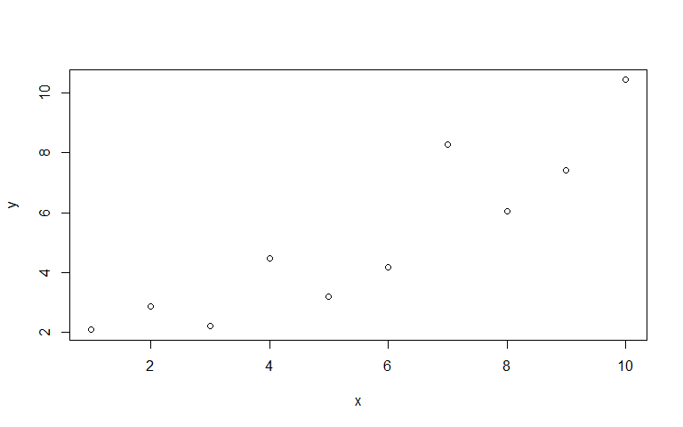

```r
plot(x,y,main = "Título gráfico")
```

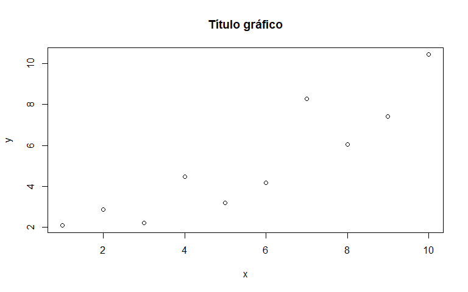

```r
plot(x,y,main = "Título gráfico", type="l")
```


```r
plot(x,y,main = "Título gráfico", type="p", pch=19)
```

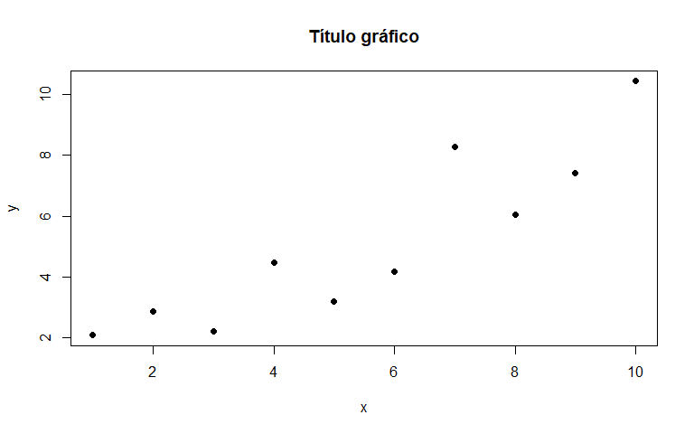

```r
plot(x,y,main = "Título gráfico", type="p", pch=19,col="red")
```

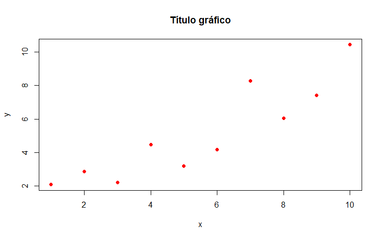

```r
plot(x,y,main = "Título gráfico", type="b", pch=19,lty=2,col="red")
```

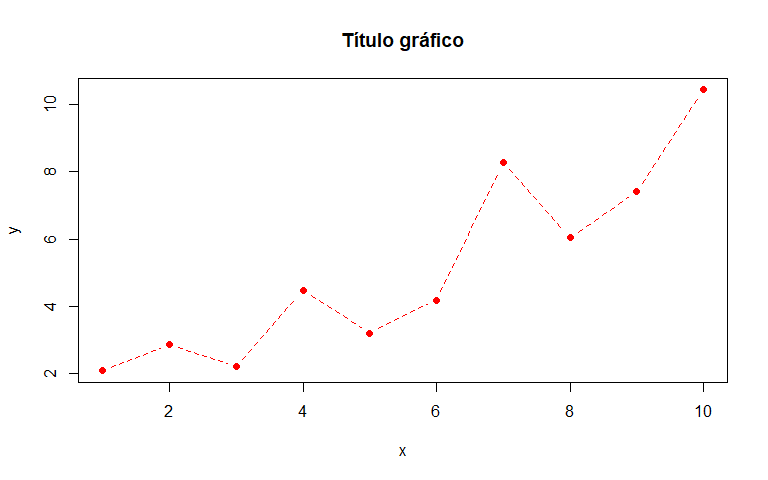

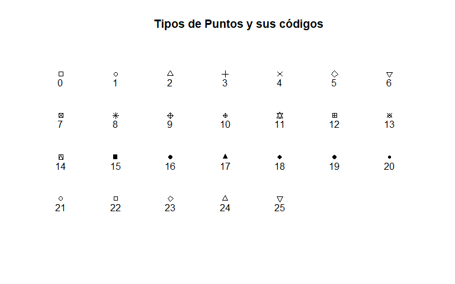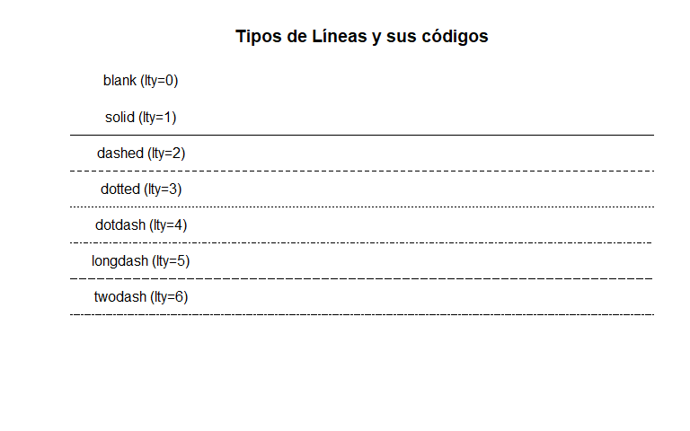

Después de llamar un `plot` puedes incluir elementos adicionales al gráfico, como líneas (`lines`, `abline`), puntos (`points`) o texto (`text`). Cada instrucción ingresa una capa adicional al gráfico en el orden de entrada.


```r
plot(y~x,pch=19,main="Ejemplo Rectas")
lines(x,y,lwd=2,lty=2)
points(x,y+2,pch=19,col=2)
lines(x,y+2,lwd=2,lty=2,col=2)
abline(lm(y~x))
abline(lm(I(y+2)~x),col=2)
text(2,8,labels = "Recta 1")
text(2,9,labels = "Recta 2",col=2)
```

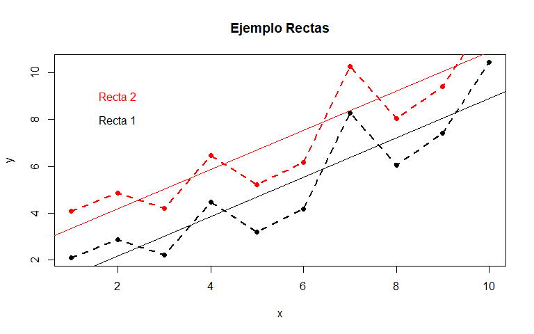

El comando `legend` permite agregar leyendas a los gráficos, para instruir su lectura.


```r
plot(mpg~disp,col=factor(gear),data=mtcars,pch=19,
     main="Desplazamiento vs Consumo Gasolina")
legend("topright",pch=19,col=1:3,legend = levels(factor(mtcars$gear)),
       title = "Número de Cambios")
```

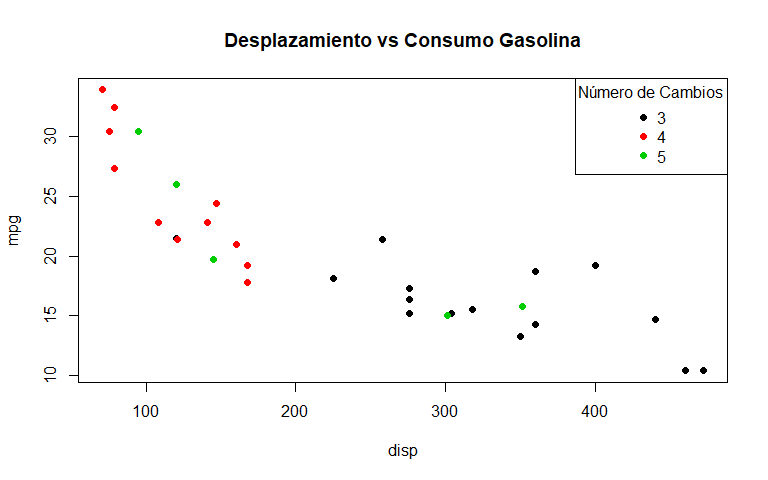


```r
plot(mpg~disp,data=mtcars,type="n",
     main="Desplazamiento vs Consumo Gasolina")
text(mpg~disp,data=mtcars,labels=rownames(mtcars),cex=0.6,
     col=gear-2,adj=c(0,0.5))
legend("topright",fill=1:3,legend = levels(factor(mtcars$gear)),
       title = "Número de Cambios",horiz = T)
```


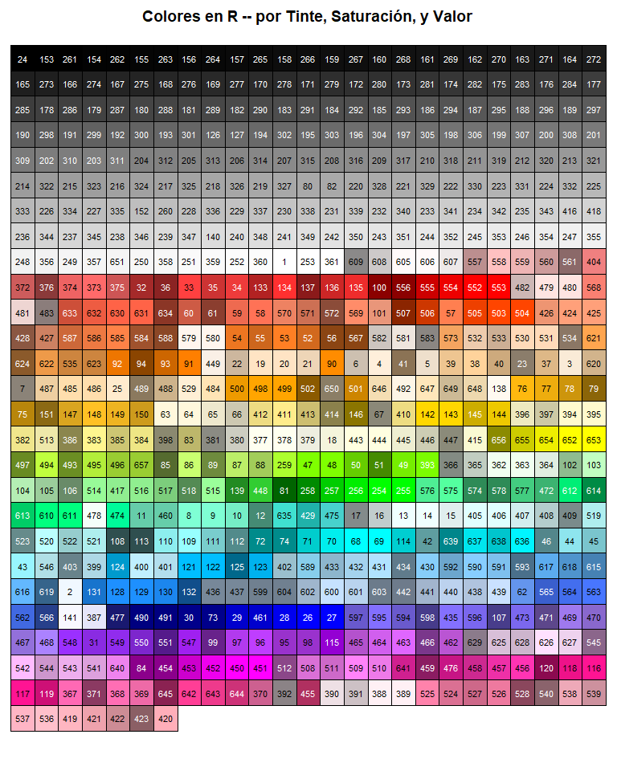

## Demostraciones

Una buena colección de paquetes incluyen demostraciones de uso, con el comando `demo` se puede mostrar la lista de demostraciones del paquete `base`. Si se desea conocer todas as demostraciones disponibles en el CRAN el comando `demo(package = .packages(all.available = TRUE)` es muy útil.


```r
demo()
```

De la lista anterior, interesa la demostración `graphics`, en la cual se explican varios conceptos del uso de gráficos del paquete `base`, para correr la demostración se ejecuta el comando `demo(graphics)`.

## Gráficos Estadísticos

`R` es un software de estadística, como tal su entorno está desarrollado para realizar análisis estadísticos y esto no es ajeno a los gráficos.

### Barras `barplot`

El gráfico de barras sirve para evidenciar las frecuencias absolutas, o relativas de una variable categórica.


```r
set.seed(2019)
ciudades <- sample(5,300,replace = T,
                   prob = c(0.1,0.4,0.2,0.3,0.1))
ciudades <- factor(ciudades,
                   labels = c("Cali","Medellín","Bogotá",
                              "Barranquilla","Cartagena"))
plot(ciudades,main="Distribución de las Ciudades")
```

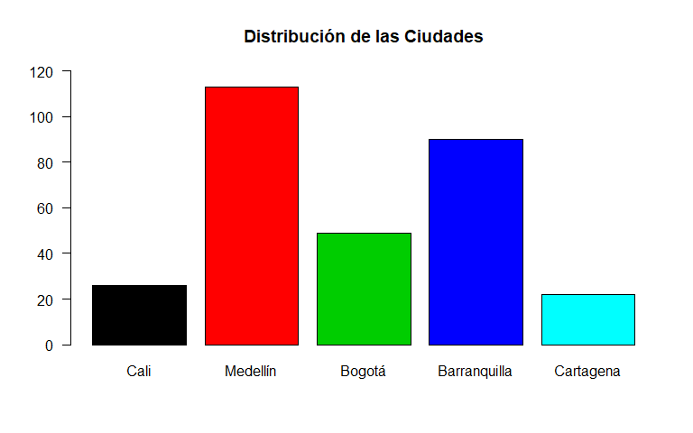

En el gráfico anterior `plot` reconoce que `ciudades` es un factory realiza el grafico de barras.


```r
table(ciudades)
```

```
## ciudades
##         Cali     Medellín       Bogotá Barranquilla    Cartagena 
##           26          113           49           90           22
```

```r
barplot(table(ciudades),col=1:5,las=1,ylim = c(0,120),
        main = "Distribución de las Ciudades")
```

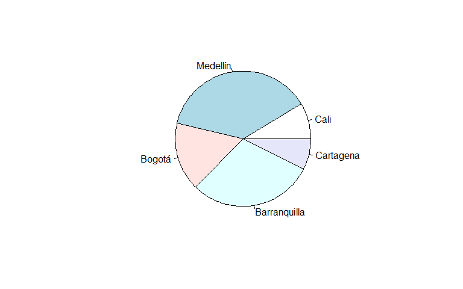

### Gráfico Tortas o secciones `pie`

El gráfico de secciones permite evidenciar proporcionalmente cómo se distribuyen proporcionalmente las frecuencias de una variable categórica en un círculo.


```r
pie(table(ciudades))
```


### Gráfico de mosaico `mosaicplot`

El gráfico de mosaico sirve para comparar dos variables categóricas.


```r
impacto <- gl(3,100,labels = c("Bajo","Mediano","Alto"))
table(ciudades,impacto)
```

```
##               impacto
## ciudades       Bajo Mediano Alto
##   Cali           12       6    8
##   Medellín       41      34   38
##   Bogotá         17      14   18
##   Barranquilla   26      37   27
##   Cartagena       4       9    9
```

```r
mosaicplot(table(ciudades,impacto),col=c("green","yellow","red"),
           main="Impacto por Ciudad")
```

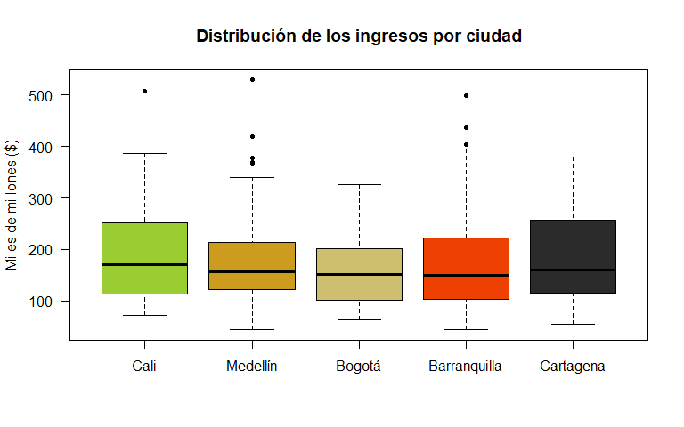

### Gráfico cajas y bigotes `boxplot`

Los gráficos de cajas y bigotes permiten analizar el comportamiento de una variable cuantitativa, se compone de una caja que continene el 50% de la información la cual está dividida en dos por la mediana y se extiende de cada extremo de la caja unos bigotes que muestra la longitud de la distribución. Es una buena forma de evdenciar datos extremos o atípicos, ya que, muestra los puntos que potencialmente no pertenecen a la distribución de la variable por fuera de los bigotes.


```r
set.seed(4321)
ingresos <- ceiling(rlnorm(300,5,0.5))
colores <- colors()[sample(675,5)]
boxplot(ingresos~ciudades,pch=20,col=colores,
        main="Distribución de los ingresos por ciudad",
        ylab="Miles de millones ($)",las=1)
```

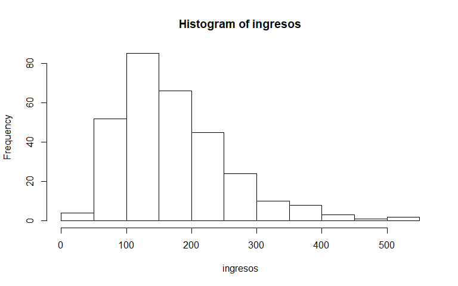

```r
boxplot(ingresos~ciudades,pch=20,col=colores,horizontal=T,
        main="Distribución de los ingresos por ciudad",
        xlab="Miles de millones ($)",las=1,cex.axis=0.7,lty=1)
```

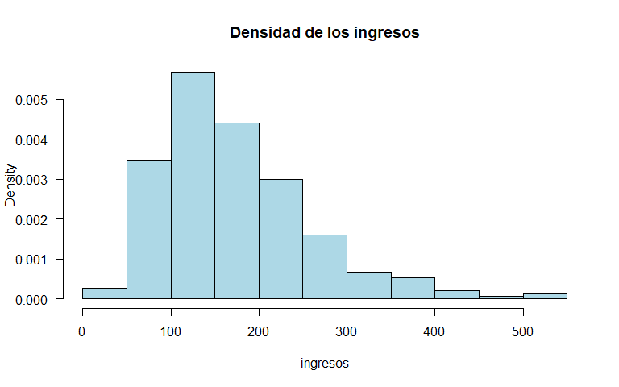

```r
boxplot(ingresos~ciudades,pch=20,col=colores,
        main="Distribución de los ingresos por ciudad",
        ylab="Miles de millones ($)",las=1,notch=T)
```


### Histogramas


```r
hist(ingresos)
```

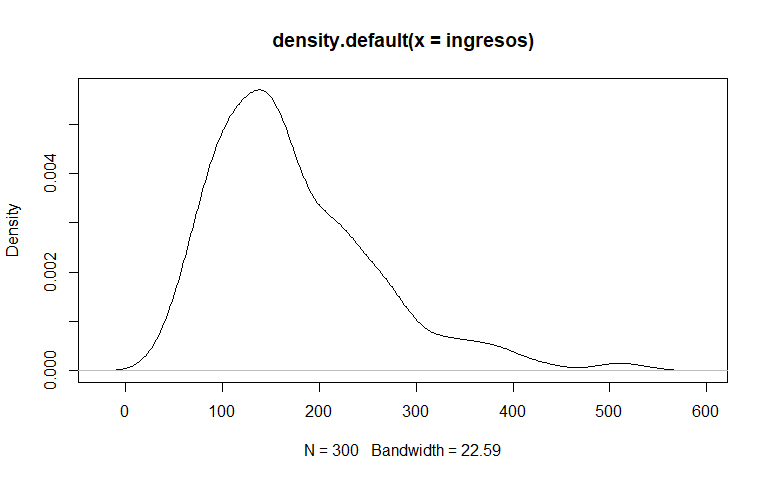

```r
hist(ingresos, main="Densidad de los ingresos",las=1,
     col="lightblue",freq=F)
```


```r
hist(ingresos, main="Distribución de los ingresos",las=1,
     col="lightblue")
hist(ingresos, main="Distribución de los ingresos",las=1,
     col="lightblue")
rug(ingresos,col=2)
```


### Densidades


```r
(dening <- density(ingresos))
```

```
## 
## Call:
## 	density.default(x = ingresos)
## 
## Data: ingresos (300 obs.);	Bandwidth 'bw' = 22.59
## 
##        x                y            
##  Min.   :-23.77   Min.   :6.960e-07  
##  1st Qu.:131.36   1st Qu.:1.256e-04  
##  Median :286.50   Median :6.503e-04  
##  Mean   :286.50   Mean   :1.610e-03  
##  3rd Qu.:441.64   3rd Qu.:2.899e-03  
##  Max.   :596.77   Max.   :5.697e-03
```

```r
plot(dening)
```


```r
plot(dening,col=2,lwd=2,las=1,
     main="Densidad de los ingresos")
```


```r
hist(ingresos, main="Densidad de los ingresos",las=1,
     col="lightblue",freq=F)
rug(ingresos,col=2)
lines(dening,col=2,lwd=2)
```


```r
# Resaltando una sección en particular
x1 <- min(which(dening$x >= 150))  
x2 <- max(which(dening$x < 370))
plot(dening,col=2,lwd=2,las=1,
     main="Densidad de los ingresos")
with(dening,
     polygon(x=c(x[c(x1,x1:x2,x2)]), y=c(0, y[x1:x2], 0),
             col=rgb(1,0,0,alpha = 0.5),border = NA))
```

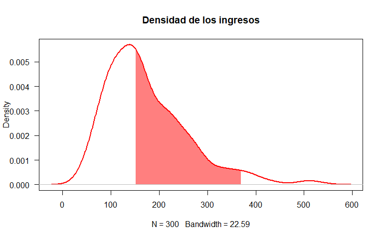

### Dispersiones y dispersiones múltiples


```r
pairs(iris)
```

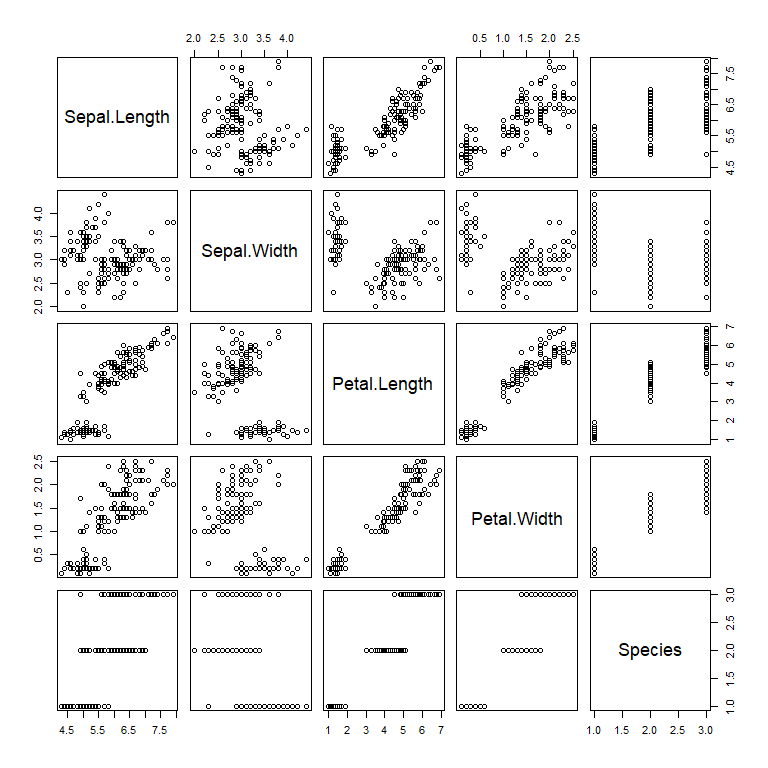

```r
pairs(iris,col=iris$Species,pch=19)
```

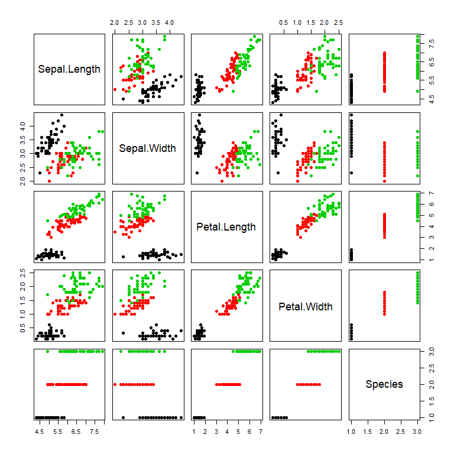


## <a href="../EAFIT.html" class="btn" role="button">Regresar</a>
