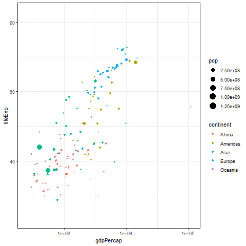

```{r setup, include=FALSE}
knitr::opts_chunk$set(echo = TRUE,
                      fig.align = "center",
                      message = FALSE,
                      error = FALSE,
                      warning = FALSE,
                      cache = TRUE)
```

## Introducción

Existe varios paquetes en `R` exclusivos para generar gráficos estadísticos, así como existen paquetes de análisis de datos en los cuales los desarrolladores personalizan sus gráficos utilizando `base` u otros paquetes de graficación. En este módulo veremos algunos de estos paquetes para este fin.

## ggplot

El paquete `ggplot2` es un sistema declarativo para construir gráficos basado en el libro *The Grammar of Graphics*. Hace parte de la colección `tidyverse` diseñado para Data Science, la cual es una modificación del legueje `R` con la filosofía de hacer más simple la programación y la lectura de código.

```{r,eval=FALSE}
install.packages("tidyverse")
install.packages("ggplot2")
```

Para graficar con este paquete se requiere establecer qué es lo que se quiere graficar, es decir, cuáles argumentos y papel son los que se quiere visualizar. Luego se agregan las funciones `geom` que transforma los datos y genera los gráficos por capas.

```{r,message=FALSE,warning=FALSE}
library(ggplot2)
ggplot(mtcars)
```

Para agregar los argumentos se utiliza el comando `aes` que recibe las variables que se quieren graficar y el papel estético que cumple.

```{r}
ggplot(mtcars,aes(x=mpg,y=disp))
```

Para especificar el gráfico que se quiere, se utiliza la batería `geom` precedido de `+`.

```{r}
# Gráfico de dispersiones
ggplot(mtcars,aes(x=mpg,y=disp))+
  geom_point()
```

En la página de referencia de [ggplot](https://ggplot2.tidyverse.org/reference/index.html) pueden encontrar todas las capas disponibles en el paquete.

```{r,message=FALSE,warning=FALSE}
ggplot(mtcars,aes(x=mpg,y=disp,colour=drat))+
  geom_point(aes(size=hp))+
  ggtitle("Desplazamientos vs Consumo\ndado los caballos de fuerza y eje trasero")+
  theme_bw()

ggplot(mtcars,aes(x=mpg,y=disp,colour=drat))+
  geom_point(aes(size=hp))+
  ggtitle("Desplazamientos vs Consumo\ndado los caballos de fuerza y eje trasero")+
  theme_bw()+scale_color_gradient(low=c("red","gold"),high = c("forestgreen"))

ggplot(mtcars,aes(x=mpg,y=disp,colour=drat))+
  geom_point(aes(size=hp))+geom_smooth()+
  ggtitle("Desplazamientos vs Consumo\ndado los caballos de fuerza y eje trasero")+
  theme_bw()+scale_color_gradient(low=c("red","gold"),high = c("forestgreen"))

set.seed(1234)
wdata = data.frame(
        sex = factor(rep(c("F", "M"), each=200)),
        weight = c(rnorm(200, 55), rnorm(200, 58)))
head(wdata)

# Box-plot básico desde el data.frame
qplot(sex, weight, data = wdata, 
      geom= "boxplot", fill = sex)
# Violin plot
qplot(sex, weight, data = wdata, geom = "violin")
# Dot plot
qplot(sex, weight, data = wdata, geom = "dotplot",
      stackdir = "center", binaxis = "y", dotsize = 0.5)

# Histogramas
# Color por grupo (sexo)
qplot(weight, data = wdata, geom = "histogram",
      fill = sex)
# Density plot
# Color por grupo (sexo) cambiando el tipo de linea
qplot(weight, data = wdata, geom = "density",
    color = sex, linetype = sex)

# Se puede asignar la base del gráfico a una variable
a <- ggplot(wdata, aes(x = weight))
# gráfico área
a + geom_area(stat = "bin")
# Color por grupo
a + geom_area(aes(fill = sex), stat ="bin", alpha=0.6) +
  theme_classic()
# density plot
a + geom_density()
# color de líneas por grupos
a + geom_density(aes(color = sex)) 
# Color por grupo y transparencia
a + geom_density(aes(fill = sex), alpha=0.4)
# Media por grupos
# install.packages("plyr",dependencies = T)
library(plyr)
(mu <- ddply(wdata, "sex", summarise, grp.mean=mean(weight)))
# Agregar la media como línea con color manual
a + geom_density(aes(color = sex)) +
  geom_vline(data=mu, aes(xintercept=grp.mean, color=sex),
             linetype="dashed") +
  scale_color_manual(values=c("#999999", "#E69F00"))
# Dotplot
a + geom_dotplot()
# Color por grupo
a + geom_dotplot(aes(fill = sex)) 
# Color manual
a + geom_dotplot(aes(fill = sex)) +
  scale_fill_manual(values=c("#999999", "#E69F00"))
```

Pueden consultar la [Guía práctica ggplot2](http://www.sthda.com/english/wiki/be-awesome-in-ggplot2-a-practical-guide-to-be-highly-effective-r-software-and-data-visualization) que tiene una colección de gráficos `ggplot2` y los códigos para replicarlos.

## Gráficos interactivos

Este tipo de gráficos se emplean para aplicaciones web o dispositivos móviles. Existen varios paquetes en `R` que integran los métodos de visualización del software con `HTML` y `JavaScript`.

### plotly

Plot.ly es una empresa de computación técnica que ofrece soluciones gráficas para analítica, tienen sus propios software y productos, pero han contribuído al mundo de código abierto con implementaciones en `R`, `Python`, `JavaScript`, `MATLAB`, `Julia` o `Scala`.

Si bien **Plotly** tiene una versión empresarial paga, realmente lo que se paga son la herramientas desarrolladas por la empresa para construir dashboards y gráficos de manera más interactiva sin la necesidad de códigos. Por fortuna, es posible crear gráficos interactivos con el paquete `plotly`, los cuales se pueden guardar en `.html` para agregarlos posteriormente a las páginas web o aplicaciones.

```{r,eval=FALSE}
install.packages("plotly",dependencies = T)
```

Los gráficos se construyen similar a `ggplot2` agregando capas, y para guardar el archivo se emplea el comando `api_create`, sin embargo, el archivo se guarda en la nube de [Plotly](https://plot.ly/feed/#/). Para guardar el archivo como `HTML` sin necesidad de subirlo a la nube se emplea el paquete `htmlwidgets`.

```{r,warning=FALSE,message=FALSE}
library(plotly)
plot_ly(data = iris, x = ~Sepal.Length, y = ~Petal.Length)
plot_ly(data = iris, x = ~Sepal.Length, y = ~Petal.Length,
        marker = list(size = 10,color = 'rgba(255, 182, 193, .9)',
                      line = list(color = 'rgba(152, 0, 0, .8)',
                      width = 2))) %>%
  layout(title = 'Styled Scatter',
         yaxis = list(zeroline = FALSE),
         xaxis = list(zeroline = FALSE))
d <- diamonds[sample(nrow(diamonds), 1000), ]
plot_ly(d, x = ~carat, y = ~price,
        color = ~carat, size = ~carat)
plot_ly(d, x = ~carat, y = ~price,
  # Hover text:
  text = ~paste("Price: ", price, '$<br>Cut:', cut),
  color = ~carat, size = ~carat)

dens <- with(diamonds, tapply(price, INDEX = cut, density))
df <- data.frame(x = unlist(lapply(dens, "[[", "x")),
                 y = unlist(lapply(dens, "[[", "y")),
                 cut = rep(names(dens), each = length(dens[[1]]$x)))
p <- plot_ly(df, x = ~x, y = ~y, color = ~cut) %>%
  add_lines()

# Con ggplot2
library(ggplot2)
df <- diamonds[sample(1:nrow(diamonds), size = 1000),]

# Boxplot en ggplot
p <- ggplot(df, aes(cut, price, fill = cut)) +
  geom_boxplot()+
  ggtitle("Lineas horizonales en los bigotes (ggplot2)")
ggplotly(p)

# Gráfico de contornos
head(volcano)
plot_ly(z = ~volcano, type = "contour")
plot_ly(z = volcano, type = "contour", contours = list(showlabels = TRUE)) %>%
  colorbar(title = "Elevation \n in meters")

# Gráficos en 3D
mtcars$am[which(mtcars$am == 0)] <- 'Automatic'
mtcars$am[which(mtcars$am == 1)] <- 'Manual'
mtcars$am <- as.factor(mtcars$am)

plot_ly(mtcars, x = ~wt, y = ~hp, z = ~qsec,
        color = ~am, colors = c('#BF382A', '#0C4B8E')) %>%
  add_markers() %>%
  layout(scene = list(xaxis = list(title = 'Weight'),
                     yaxis = list(title = 'Gross horsepower'),
                     zaxis = list(title = '1/4 mile time')))
plot_ly(mtcars, x = ~wt, y = ~hp, z = ~qsec,
        marker = list(color = ~mpg,
                      colorscale = c('#FFE1A1', '#683531'),
                      showscale = TRUE)) %>%
  add_markers() %>%
  layout(scene = list(xaxis = list(title = 'Weight'),
                      yaxis = list(title = 'Gross horsepower'),
                      zaxis = list(title = '1/4 mile time')),
         annotations = list(x = 1.13,
                            y = 1.05,
                            text = 'Miles/(US) gallon',
                            xref = 'paper',
                            yref = 'paper',
                            showarrow = FALSE)
         )
# Gráficos de superficie
plot_ly(z = ~volcano) %>% add_surface()

# Usando botones HTML
p <- plot_ly(z = ~volcano, type = "heatmap", colorscale='Rainbow')
# Botón para tipo de gráfico
chart_types <- list(
  type = "buttons",
  direction = "right",
  xanchor = 'center',
  yanchor = "top",
  pad = list('r'= 0, 't'= 10, 'b' = 10),
  x = 0.5,
  y = 1.27,
  buttons = list(
    list(method = "restyle",
         args = list("type", "heatmap"),
         label = "Heatmap"),
    list(method = "restyle",
         args = list("type", "contour"),
         label = "Contour"),
    list(method = "restyle",
         args = list("type", "surface"),
         label = "Surface")
  ))

# Botón para tipo de color
color_types <- list(
  type = "buttons",
  direction = "right",
  xanchor = 'center',
  yanchor = "top",
  pad = list('r'= 0, 't'= 10, 'b' = 10),
  x = 0.5,
  y = 1.17,
  buttons = list(
    list(method = "restyle",
         args = list("colorscale", "Rainbow"),
         label = "Rainbow"),
    list(method = "restyle",
         args = list("colorscale", "Jet"),
         label = "Jet"),
    list(method = "restyle",
         args = list("colorscale", "Earth"),
         label = "Earth"),
    list(method = "restyle",
         args = list("colorscale", "Electric"),
         label = "Electric")
  ))

annot <- list(list(text = "Chart<br>Type", x=0.2, y=1.25, xref='paper', yref='paper', showarrow=FALSE),
              list(text = "Color<br>Type", x=0.2, y=1.15, xref='paper', yref='paper', showarrow=FALSE))

# Resultado
p %>% layout(xaxis = list(domain = c(0.1, 1)),
             yaxis = list(title = "y"),
             updatemenus = list(chart_types,color_types),
             annotations = annot)
# Animados
# install.packages("gapminder")
library(gapminder)

gapminder %>%  plot_ly(x = ~gdpPercap, y = ~lifeExp,
                       size = ~pop, color = ~continent, 
                       frame = ~year, text = ~country, 
                       hoverinfo = "text", type = 'scatter',
                       mode = 'markers') %>%
  layout(xaxis = list(type = "log"))
```

Para guardar los gráficos en `HTML` se emplea el siguiente código.

```{r,eval=FALSE}
install.packages("htmlwidgets",dependencies = T)

library(htmlwidgets)
saveWidget(as.widget(plotly),file="Plot_Adv.html",self)
```


### Gifs en R

Para crea gifs animados es necesario instalar el paquete `gganimate` desde el repositorio de GitHub.

```{r, eval=FALSE}
# paquete para acceder a las librerías de GitHub
install.packages("devtools",dependencies = T)

# instalar paquetes de GitHub
devtools::install_github('thomasp85/gganimate',force = T)

# También está en el CRAN
install.packages("gganimate",dependencies = T)
```

La idea de los gift es visualizar paso por paso las capas de un gráfico, el paquete `gganimate` es para construir este tipo de archivos para los gráficos construídos en `ggplot2`.

```{r,eval=FALSE,message=FALSE,warning=FALSE}
library(gapminder)
library(ggplot2)
library(gganimate)

p <- ggplot(gapminder,
            aes(x = gdpPercap, y = lifeExp,
                size = pop, color = continent,
                frame = year)) +
  geom_point() +
  scale_x_log10() +
  theme_bw()+
  transition_states(year)
 
# Realizar la animación
animate(p)

# Guardar el gif
anim_save("Mi_Animacion.gif")
```



## <a href="../EAFIT.html" class="btn" role="button">Regresar</a>